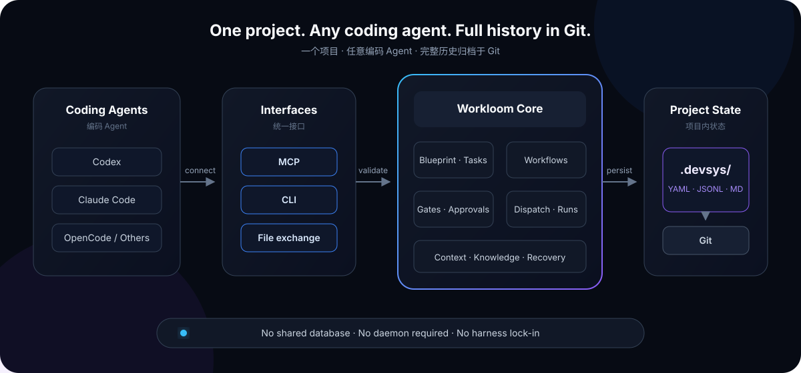

<div align="center">
  
  <h1>Workloom</h1>
  <p><strong>Weave your AI coding agents' project state back into Git.</strong></p>
  <p>Harness-independent, Git-native development infrastructure for multiple agents.</p>

  <p>
    <a href="#option-a-let-your-agent-set-it-up-recommended"><strong>Agent Quick Start</strong></a>
    ·
    <a href="../README.md">简体中文</a>
    ·
    <a href="使用手册.md">User guide (Chinese)</a>
    ·
    <a href="原始文档/独立于Harness的Agent开发基础设施方案.md">Design spec (Chinese)</a>
    ·
    <a href="M9-验收报告.md">Acceptance report (Chinese)</a>
  </p>

  <p>
    
    
    
    
  </p>
</div>

---

Workloom is harness-independent infrastructure for AI-assisted software development. It stores tasks, workflows, approvals, run records, decisions, findings, and knowledge context as readable files under the repository-local `.devsys/` directory. A shared application layer enforces validation, concurrency control, and recovery for both CLI and MCP clients.

You can switch between Codex, Claude Code, OpenCode, or another agent without losing project state, and without operating a cross-project database or resident daemon.

## Why Workloom

| Common problem | Workloom's approach |
|---|---|
| Project state is locked inside one harness | The state model is independent; agents connect through MCP or CLI |
| Context is difficult to recover on another device | `.devsys/` travels with Git clone, pull, and checkout |
| Automation edits files and bypasses project rules | Writes pass through application services, version guards, gates, and transactions |
| An agent reports completion without code evidence | Completion checks the worktree HEAD and routes insufficient evidence to human review |
| Project knowledge becomes stale quickly | Knowledge freshness is measurable, with protected pages and incremental refresh |
| A dashboard becomes a second source of truth | Dashboards and static sites are projections; `.devsys/` remains authoritative |

## Core Capabilities

- **Git-native state**: readable, auditable, and diffable YAML, JSONL, and Markdown.
- **Harness independence**: built-in adapters for Codex, Claude Code, OpenCode, and Shell.
- **Project planning context**: project blueprint references, goals, scope, constraints, milestones, and current state.
- **Dynamic task system**: agents can create tasks and subtasks from the plan, then maintain priorities and dependencies.
- **Complete workflows**: steps, conditions, gates, approvals, claims, leases, retries, and recovery.
- **Native MCP integration**: capabilities scoped by `session`, `executor`, `reviewer`, and `admin` profiles.
- **Reliable writes**: atomic replacement, optimistic concurrency, file locks, cross-file transactions, and crash recovery.
- **Context and knowledge**: task context assembly, scanning, validation, freshness, and incremental refresh.
- **Verifiable execution**: isolated worktrees, run event streams, completion checks, and explicit human overrides.
- **Read-only workspace views**: terminal summaries, offline static sites, and a local read-only server.
- **Cross-device handoff**: divergence checks, lease audits, conservative archives, and deterministic repair.

## From Project Blueprint to Delivery

Workloom manages more than an individual agent run. It preserves the complete project context from planning through delivery:

| Layer | What Workloom manages | What an agent can do |
|---|---|---|
| **Project blueprint** | Goals, scope, constraints, technology stack, and a blueprint Artifact reference | Read project direction and ask the user for clarification when no blueprint exists |
| **Milestones and state** | Current phase, milestones, risks, blockers, and next priorities | Summarize progress and decide whether to continue delivery or return to planning |
| **Dynamic tasks** | Tasks, subtasks, priorities, acceptance criteria, and dependencies | Break goals into work and create follow-up tasks discovered during execution |
| **Workflows** | Steps, conditions, stage gates, quality gates, and approval policies | Select an appropriate workflow and advance through its rules |
| **Execution and verification** | Agent claims, worktrees, Runs, logs, retries, and completion evidence | Make code changes and prove completion with Git and test evidence |
| **Project memory** | Decisions, findings, artifacts, events, and knowledge context | Leave traceable, recoverable context for the next agent |

```text
Project blueprint
   ↓
Goals / scope / milestones
   ↓
Dynamic tasks ── subtasks ── dependencies
   ↓
Workflows ── gates ── approvals
   ↓
Agent execution ── verification ── human review
   ↓
Project state and knowledge ──→ next planning cycle
```

## Architecture

<div align="center">
  
</div>

Every interface shares the business rules in `internal/app`. CLI and MCP are not separate implementations, so an agent cannot bypass gates, approvals, version guards, or transaction recovery by changing interfaces.

```text
Coding Agents
    │
    ├── MCP ──┐
    ├── CLI ──┼── Workloom Core ── .devsys/ ── Git
    └── Files ┘      │
                     ├── Workflows & approvals
                     ├── Dispatch & worktrees
                     ├── Context & knowledge
                     └── Transactions & recovery
```

## Quick Start

### Option A: Let Your Agent Set It Up (Recommended)

You do not need to learn the Workloom commands first. Open Codex, Claude Code, OpenCode, or another coding agent that can run terminal commands, then paste this prompt:

```text
Help me set up Workloom (https://github.com/JAYY513/Workloom) in the current
Git project.

Please complete these steps yourself:
1. Check whether devsys is installed. If it is not, follow the Workloom README
   to install the latest release or build it from source. Tell me what you will
   run before installing it.
2. Run devsys init at the project root.
3. Run devsys wire --skill and devsys wire so future agents can understand
   and use Workloom automatically.
4. Workflows: copy a suitable policy from docs/examples/workflows/ (quick-fix,
   feature-development, architecture-change, or the reference template) into
   .devsys/workflows/ and adapt it to this project. Tasks run without a
   workflow, but the prompt handed to an agent then carries no process rules.
5. Identify whether you are running as codex, claude, or opencode. Run the
   matching devsys wire --print-mcp <client> command and configure MCP when
   your permissions allow it.
6. Run devsys wire --check to verify the setup, then run devsys prime to load
   the project state.
7. Inspect the project blueprint, goals, scope, constraints, milestones,
   existing tasks, and workflows. If no blueprint is configured, tell me
   clearly and ask about the project goals instead of making assumptions.
8. Summarize in plain language whether setup succeeded, the current project
   state, and the recommended next action.

Do not edit managed files under .devsys directly. Perform all writes through
the devsys CLI or MCP. If one step requires manual action from me, give me that
single exact step, then continue with everything else you can complete.
```

After setup, you can work with your agent in plain language:

```text
Use Workloom to read the project blueprint, goals, scope, milestones, and
current state first. Then plan and implement user login: break the work into
tasks and subtasks with acceptance criteria, maintain their dependencies,
follow the appropriate workflow, and pause when you need my decision or approval.
```

```text
Continue the previous work. First load the current milestone, unfinished tasks,
related decisions, and risks from Workloom. Create follow-up tasks and connect
their dependencies when new work is discovered. Record verification evidence,
update project state, and summarize the result and remaining risks.
```

The agent learns the operating rules from `AGENTS.md` and `.agents/skills/devsys/`, then restores context through `devsys prime`. You can still review every state change in Git.

### Option B: Manual Setup

### 1. Install

Build from source. The repository includes `vendor/`, so the build can run offline:

```bash
git clone https://github.com/JAYY513/Workloom.git
cd Workloom
GOPROXY=off GOFLAGS=-mod=vendor go build -o bin/devsys ./cmd/devsys
```

> Note: release binaries are available starting from `v0.1.0` (Linux/macOS/Windows × amd64/arm64, SHA-256 verified).
> This repository is private: downloading release artifacts requires `gh auth login` first (or downloading in a logged-in browser).
> Without login, `install.sh` automatically falls back to `git clone --branch <tag> + go build` (requires Go + Git on your machine, and clone needs repository access too).
> From `v0.1.1` on, the binaries and `checksums.txt` are published by CI (GNU checksum format). From `v0.1.2` on, default MCP `--tier core`
> is strictly the 19-tool daily subset (`run_fail` / `run_cancel` no longer leak in with `run_complete`). For the behavior described here
> (`prime`, `--latest`, `--tier core` of 19 tools, the claim-aligned quality gate in `next`, `default_policy`, the installer fixes),
> use `v0.1.2` or newer, or build from source.

```bash
# Linux / macOS
bash scripts/install.sh --tag v0.1.2

# Windows PowerShell
powershell -NoProfile -ExecutionPolicy Bypass \
  -File scripts/install.ps1 -Tag v0.1.2 -AddToPath
```

Release builds target Linux, macOS, and Windows on `amd64` and `arm64`.

### 2. Initialize a Project

Run these commands at the root of any Git repository:

```bash
devsys init
devsys config check
devsys wire
devsys session start
```

`devsys init` creates `.devsys/` idempotently. `wire` adds concise collaboration rules to `AGENTS.md` while preserving hand-written content.

A fresh project has an empty `.devsys/workflows/`. Tasks run without a policy, but the round prompt handed to an agent then carries no process rules. Copy an example and adapt it:

```bash
cp docs/examples/workflows/quick-fix.md .devsys/workflows/            # minimal
cp docs/examples/workflows/reference-template.md .devsys/workflows/   # full template: posture, steps, evidence, stop conditions
devsys workflow check                                                 # validates every policy file
```

### 3. Create and Advance Work

```bash
devsys workitem create \
  --title "Add OAuth login" \
  --actor alice \
  --reason "Q4 roadmap" \
  --description "- context: … / - scope: … / - acceptance: …" \
  --acceptance "login redirects back,retry on failure"

devsys workitem transition \
  --id WLM-1 \
  --to ready \
  --actor alice \
  --reason "spec approved" \
  --latest

devsys workflow start --id WLM-1 --policy quick-fix --actor alice --reason "begin" --latest
devsys next
devsys dispatch --once --actor alice --reason "run ready work"
```

Quality and stage gates apply whenever a work item has an effective policy: a bound workflow instance (the `workflow start` above) or the project-level `default_policy` in `.devsys/config.yaml`. The `quick-fix` example asks for a description of at least 40 characters and acceptance criteria. `--acceptance` can be given at `create`, or added later with `workitem update --acceptance a,b`. With neither in place, `claim` prints a `warning:` line saying the gates did not run (only when the project declares policy files); `devsys next` judges ready work items with the same quality gate `claim` applies, reports a `quality_blocked` risk, and names the command that unblocks the claim.

`--latest` is intended for an operator explicitly requesting execution against the current version. Automated integrations should read the version hash first and then write with `--expect <hash>`.

### 4. Connect an MCP Client

Ask Workloom to print a stdio configuration for your client:

```bash
devsys wire --print-mcp codex
devsys wire --print-mcp claude
devsys wire --print-mcp opencode
```

The underlying server command is:

```bash
devsys mcp serve --profile session,executor --tier core
```

Default `--tier core` is the 19-tool daily subset. Progress, failure and block tools (`run_update`, `run_fail`, `workitem_block`) live at `--tier standard`. MCP-first agents should use the CLI for those steps, or serve `--tier standard`.

### 5. Inspect Project State

```bash
devsys workspace view
devsys workspace serve --port 8080
```

The local server binds to `127.0.0.1` by default. Both its pages and `/api/view` are read-only.

## A Typical Loop

```text
Define workflow → Create work item → Readiness check → Agent claim
       ↑                                             ↓
Human approval ← Review & verify ← Record evidence ← Isolated worktree
```

1. A workflow defines steps, conditions, gates, approvals, and execution limits.
2. `next` evaluates risk without writing and recommends a deterministic next action.
3. `dispatch` recovers interrupted state, plans capacity, claims work, and starts the selected harness.
4. The agent runs in an isolated worktree; logs, commands, and results enter the Run event stream.
5. `run complete` verifies that Git HEAD actually advanced; insufficient evidence fails closed.
6. Decisions and findings propagate by reference so later agents can recover context.

## State Model

```text
.devsys/
├── project.yaml          # Project identity and metadata
├── config.yaml           # Dispatch, knowledge, workspace, and default-policy settings
├── workitems/            # Work items and workflow instances
├── workflows/            # Markdown workflow policies
├── approvals/            # Approval requests and consumption state
├── runs/                 # Run summaries and JSONL event streams
├── decisions/            # Architecture and product decisions
├── findings/             # Research, risks, and findings
├── artifacts/            # Artifacts and immutable version chains
├── events/               # Monthly project event streams
├── knowledge/            # Knowledge snapshots and freshness state
└── archive/              # Auditable conservative archives
```

`.devsys/` is the only source of truth. Read-only tools may consume these files directly; all runtime writes should go through the CLI or MCP to retain concurrency and consistency guarantees.

## Design Principles

1. **Project autonomy**: state belongs to the project, not to one machine, agent, or SaaS.
2. **Evidence before status**: work cannot be marked complete without verifiable evidence.
3. **Fail closed**: version conflicts, broken policies, missing approvals, and incomplete recovery stop writes.
4. **Text first**: humans can read the data, Git can review it, and simple tools can exchange it.
5. **Projections are not facts**: dashboards, static sites, and Contrabass are execution or observation backends.
6. **Single-writer handoff**: cross-device operation uses explicit handoff, not concurrent multi-device writes.

## Documentation

The detailed project documentation is currently maintained in Chinese.

| Document | Purpose |
|---|---|
| [User guide](使用手册.md) | 15-minute setup, daily operations, and complete command paths |
| [Release runbook](发布流程.md) | Cutting a release: tag/Actions triggers, artifact verification, rollback, failure modes |
| [Migration guide](迁移指南.md) | Schema upgrades, binary replacement, and rollback |
| [Design specification](原始文档/独立于Harness的Agent开发基础设施方案.md) | Architecture principles, data model, and trade-offs |
| [Implementation plan](原始文档/实施计划.md) | M0–M9 implementation steps and acceptance criteria |
| [M9 acceptance report](M9-验收报告.md) | Reproducible evidence for all 17 success criteria |
| [M6 consistency review](M6-一致性自检.md) | Point-by-point comparison with the Symphony SPEC |
| [Development log](开发记录.md) | Decisions, deviations, issues, and evolution history |
| [RepoWiki](repowiki/index.md) | Generated module-level project knowledge |

## Development

Go 1.26 and Git are required:

```bash
make build
go test ./...
go vet ./...
```

The project includes layered unit tests, CLI/MCP integration tests, and `scripts/smoke-m*.{sh,ps1}` end-to-end scenarios. Tests prioritize behavior, boundaries, and regressions over coverage as a vanity metric.

## Status and Boundaries

Workloom has completed milestones M0–M9 and passed all 17 documented success criteria. It is still **pre-release** software.

- Core operation is local-first through the CLI, stdio MCP, and Git; no remote coordination service is provided.
- Cross-device collaboration uses a single-writer handoff. Concurrent writes are resolved manually through Git.
- The Contrabass fixture loop is verified, while fields from a real deployment remain marked `[UNVERIFIED]`.
- The repository does not yet include an open-source license. A `LICENSE` must be selected and committed before the public release; standard copyright restrictions apply until then.

## Contributing

Workloom is being prepared for a public open-source release. Before submitting a change:

1. Read the principles in the [design specification](原始文档/独立于Harness的Agent开发基础设施方案.md).
2. Add high-value tests for behavior changes, then run `go test ./...` and `go vet ./...`.
3. Keep `.devsys/` as the only source of truth; do not add write paths that bypass the application service.
4. Explain the motivation, compatibility impact, verification, and rollback path in the pull request.

---

<div align="center">
  <sub>Workloom keeps the project memory with the project.</sub>
</div>
