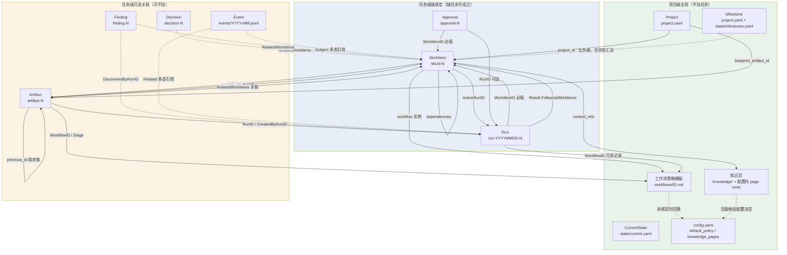

# 内容关系与归属

这张卡回答一个问题：**Workloom 里生成的各类内容，彼此之间是什么关系，哪些必须挂到任务上，哪些允许全局存在。**

结论先行——关系分三档，强度分三类：

| 档位 | 含义 | 实体 |
|---|---|---|
| **项目级全局** | 不属于任何任务，天然共享 | Project / CurrentState / Milestone / 工作流策略模板 / 知识页 / config |
| **任务级强绑定** | 缺任务不成立，命令层就拒绝 | Run、Approval |
| **任务级可选关联** | 可以不挂任务；挂了才进某个任务的证据/上下文 | Artifact、Decision、Finding、Event、ContextSnapshot |

强度上分**硬外键**、**软关联**、**状态汇总**三种。最容易被误解的是第三种：**Milestone 与 WorkItem 之间没有任何外键**（详见下文「六条容易搞错的关系」）。

## 全景图

图表来源：[internal/domain/models.go](file://internal/domain/models.go)（全部字段与 json tag）、[internal/view/build.go:33-115](file://internal/view/build.go#L33-L115)（磁盘布局的实际读取路径）。

## 逐实体关系表

「必填性」一列指**命令层校验**，不是数据库约束——所有文件都是 YAML/JSONL，没有外键约束，缺字段会被应用层挡下或被视图标为 `problems`。

| 实体 | 磁盘位置 | ID 格式 | 指向任务的字段 | 必填性 | 写入入口 |
|---|---|---|---|---|---|
| **Project** | `.devsys/project.yaml` | `id` 自由文本 | — | 全局 | `workloom init` |
| **CurrentState** | `.devsys/state/current.yaml` | 无 | — | 全局 | `project state-update` |
| **Milestone** | `project.yaml` + `.devsys/state/milestones.yaml` | `id` 自由文本 | **无字段** | 全局 | `project state-update` |
| **工作流策略** | `.devsys/workflows/<id>.md` | front matter `id` | 被 WorkItem 引用 | 全局模板 | `workflow init --template` |
| **知识页** | `.devsys/knowledge/` + `config.yaml` 的 `knowledge_pages` 根 | 路径 | 被 `context_refs` 引用 | 全局 | 知识层生成器 / `knowledge refresh` |
| **WorkItem** | `.devsys/workitems/<id>.yaml` | `WLM-<N>`（前缀须匹配 `^[A-Z][A-Z0-9_]*-[0-9]+$`） | 自身即任务 | — | `workitem create` / `workitem follow-up` |
| **Run** | `.devsys/runs/<id>.yaml` + `<id>.jsonl` | `run-YYYYMMDD-N` | `WorkItemID` | **必填** | `run exec` / `dispatch` |
| **Approval** | `.devsys/approvals/<id>.yaml` | `approval-N` | `WorkItemID` | **必填** | `approval request` |
| **Artifact** | `.devsys/artifacts/<id>.yaml` | `artifact-N` | `WorkItemID`（主）/ `RelatedWorkItems`（关联） | 均可选，只强制 `name` | `artifact register` / `artifact update` |
| **Decision** | `.devsys/decisions/<id>.yaml` | `decision-N` | **只有** `RelatedWorkItems` | 关联可选 | `decision create` |
| **Finding** | `.devsys/findings/<id>.yaml` | `finding-N` | **只有** `RelatedWorkItems` + `DiscoveredByRunID` | 均可选 | `finding create` |
| **Event** | `.devsys/events/<YYYY-MM>.jsonl` | 由时间派生 | `Subject`（多态）/ `Related`（多态） | `Subject` 必填 | 全流程自动写 + `event record` |

### 必填性的代码依据

- **Run 必须挂任务**：`run create` 要求 `workitem` + `actor` + `reason`，缺一即 usage 错误（[internal/app/run.go:80-81](file://internal/app/run.go#L80-L81)）。
- **Approval 必须挂任务**：`approval request` 要求 `workitem` + `stage` + `actor` + `reason`（[internal/app/approval.go:57](file://internal/app/approval.go#L57)），并立刻回读该工作项确认存在。
- **Artifact 几乎不强制归属**：`artifact register` 只要求 `name`（[internal/app/record.go:282-283](file://internal/app/record.go#L282-L283)）。`--workitem` / `--related` / `--run` / `--workflow` / `--stage` 全是可选，因此**存在大量项目级全局产物**（如架构决策文档、蓝图本身）。
- **Decision / Finding 不强制归属**：`decision create` 要求 title / decision / created_by / actor / reason（[internal/app/record.go:64](file://internal/app/record.go#L64)），`finding create` 要求 title / description / actor / reason（[internal/app/record.go:158](file://internal/app/record.go#L158)）——两者都**不要求**任何任务引用。设计意图是「先记录，事后关联」。
- **Event 的 Subject 是多态的**：`type` 实际取值在代码里出现 `workitem` / `run` / `artifact` / `decision` / `finding` / `approval` / `project`；`subject_id` 存在时 `subject_type` 必填（[internal/app/record.go:426-427](file://internal/app/record.go#L426-L427)）。`reply_to` 只允许出现在 `comment` 事件上，且只能引用**同 subject 的一级**评论（[internal/events/events.go:89-91](file://internal/events/events.go#L89-L91)、[internal/events/events.go:323-329](file://internal/events/events.go#L323-L329)）。

## 三类关系强度

### 1. 硬外键——缺了就无法创建

只有两个方向的硬外键，且都是**指向 WorkItem**：

- `Run.WorkItemID`
- `Approval.WorkItemID`

它们是「执行面」和「人工放行面」，语义上不可能脱离任务存在。注意 Run 上还有 `WorkflowID`（[internal/domain/models.go:153](file://internal/domain/models.go#L153)），但那是**记录用**的冗余字段，不是外键——真正决定这次运行受哪份策略约束的是 WorkItem 上的 `workflow` 实例。

### 2. 软关联——可挂可不挂，挂了才算证据

软关联集中在 Artifact / Decision / Finding 三类记录上，Workloom 用**两种写法**表达「与任务有关」：

| 写法 | 字段 | CLI | MCP | 语义 |
|---|---|---|---|---|
| **主归属** | `WorkItemID` | `--workitem` | `workitem_id` | 这个产物**属于**哪个任务 |
| **关联** | `RelatedWorkItems` | `--related`（可多次） | `related_workitems` | 这个产物**也关系到**哪些任务 |

关键规则：**阶段门禁两者都认**。`Artifact.BelongsTo(id)` 对主归属与关联一视同仁（[internal/domain/models.go:203-216](file://internal/domain/models.go#L203-L216)），门禁只按 `Name` 匹配（`require_artifacts` 比的是名字不是 type），主归属或关联任一命中即算证据（[internal/workflow/gate.go:71-77](file://internal/workflow/gate.go#L71-L77)）。门禁缺证据时的报错文案会把两种写法与可复制的命令一起打出来（[internal/workflow/gate.go:75](file://internal/workflow/gate.go#L75)）。

**Decision 与 Finding 只有「关联」这一种写法**——它们的结构体里根本没有 `workitem_id` 字段，只有 `RelatedWorkItems []string`。所以一条决策默认就是项目级的；要说清它服务于哪个任务，必须显式填 `related`。

**空 id 不匹配任何东西**：`BelongsTo("")` 恒为 false（[internal/domain/models.go:203-206](file://internal/domain/models.go#L203-L206)），所以「没填归属」不会被当成「对所有任务都成立」的万能证据。

### 3. 状态汇总——没有外键，只有状态

**Milestone 与 WorkItem 之间不存在任何外键。** `domain.WorkItem` 结构体里没有 milestone 字段（[internal/domain/models.go:60-94](file://internal/domain/models.go#L60-L94)），`domain.Milestone` 里也没有成员列表（[internal/domain/models.go:29-32](file://internal/domain/models.go#L29-L32)）。里程碑只存在于 `project.yaml` / `state/milestones.yaml`，`next.Evaluate` 读它只是为了判断「有没有未完成的里程碑」，进而给出 `milestone_review` 这条推荐动作（[internal/next/evaluate.go:376-380](file://internal/next/evaluate.go#L376-L380)）——它**不检查**哪个任务属于哪个里程碑。

所以里程碑是**时间/阶段维度的汇总视图**，不是任务的分组标签。想表达「这些任务属于 M3」，当前模型里只能写在任务描述或依赖图里，系统不会替你校验。

## 工作流：模板全局，绑定按任务

这是最容易搞混的一对关系，因为「工作流」在代码里指三个不同的东西：

| 概念 | 位置 | 归属 | 作用 |
|---|---|---|---|
| **策略模板**（`workflow.Policy`） | `.devsys/workflows/<id>.md` | **项目级全局** | 声明 steps / transitions / gates / hooks / concurrency / limits / quality gate / on_reject；正文同时是本轮 prompt 模板 |
| **实例**（`domain.WorkItem.Workflow`） | 内嵌在 WorkItem 里 | **每个任务一份** | 只存 `{ID, Step, StepEnteredAt, Paused}`——即「这个任务走到哪一步了」 |
| **Run 上的 `WorkflowID`** | `Run.WorkflowID` | 冗余记录 | 这次运行属于哪份策略，不参与判定 |

**绑定来源有两条**：

1. 工作项自己声明了工作流实例 → 用它；
2. 没声明 → 回落项目级 `config.yaml` 的 `default_policy`（[internal/view/build.go:408](file://internal/view/build.go#L408)）。回落值指向不存在的策略文件会被当成配置问题报出来（[internal/view/build.go:475](file://internal/view/build.go#L475)），并且**门禁 fail closed**——拿不到策略就不会放行。

策略里与关系相关的两套判定：

- **阶段门禁**（`CheckGate`，[internal/workflow/gate.go:53-97](file://internal/workflow/gate.go#L53-L97)）：按目标状态查 `gates.stages`，检查 `require_artifacts`（按名字）、`require_min_artifacts`、`require_comment`、`require_approval`。`gates.exempt_stages` 里的状态直接放行，没声明门禁的状态也放行；**永不 fail open**，每条未满足都进 `Missing`。
- **质量门**（`QualityGate.MinScore`）：领取时刻的确定性阈值。视图与 `next`、`claim` 共用同一份判定，所以「视图判能领」等于「claim 也会放行」。

## 任务之间的关系

WorkItem 内部有三种自引用，都是**可选**的：

| 字段 | 语义 | 写入入口 |
|---|---|---|
| `parent_id` | 父子任务（拆分/派生） | `workitem follow-up`（强制填父任务） |
| `created_from` | 来源引用，`Reference{Type, ID}`，多态 | `workitem follow-up` 固定写 `{workitem, parentID}` |
| `dependencies` | 前置任务 id 列表 | `workitem create` |

`dependencies` 参与派发排序与就绪判定（未完成的前置会挡住就绪）；`parent_id` **不参与**调度，只表达层级。

**follow-up 是本轮新增的受控派生路径**（[internal/app/followup.go:34-77](file://internal/app/followup.go#L34-L77)），五条硬约束：

1. 父任务必须存在（先 `WorkitemGet` 确认）；
2. 类型白名单只有 `research` / `decision` / `feature` / `bug` / `follow-up`（[internal/app/followup.go:12-18](file://internal/app/followup.go#L12-L18)）；
3. 新任务一律从 `draft` + `pending` 起步，**绝不改父任务、也不碰父任务的活跃 run**；
4. 只有 `decision` 类型的跟进任务自动带 `approval_required`（[internal/app/followup.go:62](file://internal/app/followup.go#L62)）；
5. 同时写一条 `follow_up_workitem_created` 事件，`Content` 记 `from <父id>: <原因>`（[internal/app/followup.go:69-76](file://internal/app/followup.go#L69-L76)）。

注意**它不携带工作流 YAML，也不携带可执行步骤**——跟进任务只是一个待办壳子，要执行仍需单独绑定策略。这与提示词协议里新增的「发现 → 需要行动时创建 follow-up work item」是同一件事的两端（[internal/prompt/prompt.go:157](file://internal/prompt/prompt.go#L157)）。

## 上下文与快照：谁引用了什么

任务与产物之间还有一层**指针**关系，区别于归属：

- `WorkItem.ArtifactRefs []string` —— 任务显式声明它依赖哪些产物
- `WorkItem.ContextRefs []string` —— 任务引用的知识页指针
- `Run.InputContextRefs []string` —— 本轮 prompt 实际装配进去的指针
- `Run.ContextSnapshot` —— 冻结本轮启动时看到的所有版本：`ProjectStateVersion` / `WorkItemVersion` / `ArtifactVersions` / `KnowledgeRevision` / `WorkspaceHead` / `DecisionIDs`（[internal/domain/models.go:140-147](file://internal/domain/models.go#L140-L147)）

**ContextSnapshot 是这套关系里唯一「按值冻结」的一环**。其余关系都是实时读当前文件；只有快照让事后能重建「当时看到的是什么」，用于追查陈旧上下文（方案 §11.3）。

`prompt.Ref` 有意**只带身份 + 标题，不带正文**（[internal/prompt/prompt.go:107-113](file://internal/prompt/prompt.go#L107-L113)），agent 需要正文时自己走工具面读——这样上下文装配不会随记录变长而膨胀。

## 六条容易搞错的关系

1. **Milestone ↔ WorkItem 没有外键。** 只有状态汇总，别把它当分组标签用。
2. **Decision / Finding 没有主归属字段。** 只能通过 `related_workitems` 关联；不填就是项目级。
3. **Artifact 的主归属与关联是等价的证据。** 门禁不区分「属于」和「关系到」，但语义上该用 `--workitem` 时不要图省事用 `--related`。
4. **`require_artifacts` 匹配的是 `Name` 不是 `Type`。** 产物类型（`spec` / `plan` / `decision` / `research` / `verification` / `review` / `finding-report`）不参与门禁判定。
5. **`Run.WorkflowID` 不决定策略。** 策略来自 WorkItem 的实例或 `default_policy` 回落。
6. **蓝图是项目级产物。** `Project.BlueprintArtifactID` 指向一条 Artifact，这条 Artifact 本身通常不挂任何任务——它是整个项目的入口而不是某个任务的交付物。

## 全局内容的边界：什么留在 `.devsys/` 之外

三类内容**不在** `.devsys/` 里，但与上面的实体有引用关系：

- **Agent Skill**（`AGENTS.md` + `.agents/skills/devsys/`）——纪律注入，由 `wire` 写入，**不受管文件**，不要手改；
- **工作区**（`.devsys/workspaces/`）——本地目录，`local/` / `.cache/` / `workspaces/` 三者都是本地态，从不入库（[internal/project/tree.go:34](file://internal/project/tree.go#L34)）；
- **锁与事务材料**（`.devsys/local/`）——`lock` / `journal.yaml` / `commit.yaml` / `payload/`，只服务于并发控制与崩溃恢复。

换句话说：**`.devsys/` 里能被 git 追踪的部分就是上表的实体**（除 `local/`），这也是「状态以文本保存在仓库内、靠 Git 在设备间接手」的实现方式。

## 相关卡片

- [可靠文本存储 · 领域记录与事件](../knowledge/可靠文本存储/领域记录与事件.md) —— 记录族（Decision / Finding / Artifact / Event）的持久化与 ID 分配
- [可靠文本存储 · 状态机与调度](../knowledge/可靠文本存储/状态机与调度.md) —— WorkItem 状态机与 `allowedTransitions`
- [共享应用与MCP · 执行命令族](../knowledge/共享应用与MCP/执行命令族.md) —— 记录族与运行族的 CLI / MCP 写入面
- [视图层 · 视图数据模型](../knowledge/视图层/视图数据模型.md) —— 视图如何按上述关系装配 `Model` 与 `Provenance.Sources`
- [项目总览](项目总览.md) —— 项目定位与全局能力清单
- [快速开始](快速开始.md) —— 上手路径
