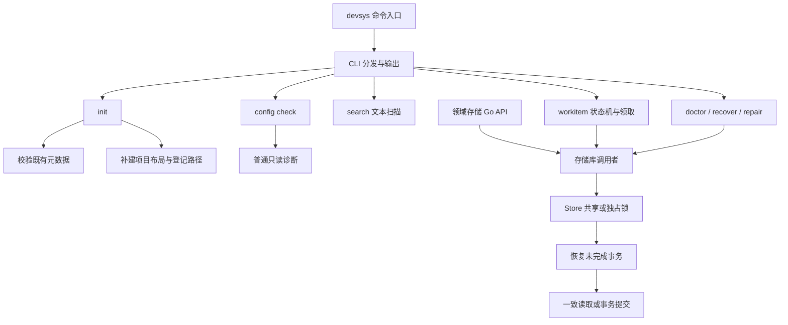

# 项目总览

<cite>
**本文引用的文件**
- [README.md:1-20](file://README.md#L1-L20)
- [internal/cli/cli.go:24-56](file://internal/cli/cli.go#L24-L56)
- [internal/project/init.go:41-123](file://internal/project/init.go#L41-L123)
- [internal/config/config.go:80-113](file://internal/config/config.go#L80-L113)
- [internal/storage/store.go:140-190](file://internal/storage/store.go#L140-L190)
- [internal/workitem/workitem.go:55-92](file://internal/workitem/workitem.go#L55-L92)
- [internal/record/record.go:280-325](file://internal/record/record.go#L280-L325)
</cite>

## 目录
1. [引言](#引言)
2. [项目结构](#项目结构)
3. [核心组件](#核心组件)
4. [架构总览](#架构总览)
5. [快速链接](#快速链接)

## 更新摘要

**变更内容**
- 基于 `4ad8f9e` 刷新：M1 命令与领域存储语义不变；搜索的千文件正确性测试不再按 2s 墙钟时间失败，性能由首次文件扫描与重复扫描两个独立 benchmark 场景记录（[internal/search/search_test.go:102-144](file://internal/search/search_test.go#L102-L144)）。
- 基于 `85b0de7` 刷新：M2 交付工作项九状态机、调度态与文件级领取、只读对账与摘要确认修复，命令面新增 `workitem` / `doctor` / `recover` / `repair`；新增知识卡[状态机与调度](../knowledge/可靠文本存储/状态机与调度.md)与[对账与修复](../knowledge/可靠文本存储/对账与修复.md)。

## 引言

Workloom 是独立于 Harness 的 Agent 开发基础设施，项目状态以文本存放在仓库内的 `.devsys/`，通过 Git 在设备间交接。当前实现截止 M2：M0/M1 交付命令入口、项目初始化、文本存储基元、严格配置校验与领域持久化（八类记录的版本化序列化，WorkItem/事件流/Run/记录存储，无数据库关键字检索）；M2 交付工作项状态机（九状态保守图、非法转换拒绝并列出允许的下一步、状态与事件同事务）、调度态与文件级领取租约（随机 token fencing、心跳、确定性重试），以及只读对账 `devsys doctor`、显式恢复 `devsys recover`、摘要确认的状态修复 `devsys repair`。领域写入已进入 CLI：`workitem create/get/transition/claim`；Decision/Finding/Artifact/Run/Event 仍以 Go API 与冒烟剧本提供。

章节来源：[README.md:13-32](file://README.md#L13-L32)、[internal/cli/cli.go:144-166](file://internal/cli/cli.go#L144-L166)。

## 项目结构

| 区域 | 当前职责 |
|---|---|
| `cmd/devsys/`、`internal/cli/` | 进程退出码、全局开关、命令分发与输出 |
| `internal/project/`、`internal/registry/` | 项目目录初始化与用户级项目路径登记 |
| `internal/config/` | 受管元数据文件的校验与问题定位（含嵌套 scope/current_state/milestones） |
| `internal/storage/` | 原子写、序列化、JSONL、锁、版本守卫与可恢复事务 |
| `internal/domain/` | 八类领域记录与版本化稳定 YAML/JSON 编解码；M2 起含工作项状态图与转换错误类型 |
| `internal/workitem/`、`internal/events/`、`internal/run/`、`internal/record/` | WorkItem（含状态机与文件级领取）、事件流、Run、决策/发现/工件的项目内存储与 ID 分配 |
| `internal/reconcile/` | 只读对账、显式恢复与摘要确认的状态修复（M2） |
| `internal/search/` | 无索引文本扫描检索 |
| `internal/version/` | 构建版本标识 |
| `docs/原始文档/` | 方案与实施计划，不作为当前实现清单 |

章节来源：[README.md:144-157](file://README.md#L144-L157)、[internal/reconcile/reconcile.go:1-19](file://internal/reconcile/reconcile.go#L1-L19)、[README.md:13-32](file://README.md#L13-L32)。

## 核心组件

**项目接入与配置。** `init` 要求当前目录为 Git 仓库根；先校验已有受管文件，再补建目录和缺失占位文件。`.devsys/.gitignore` 有特殊规则：保留原有行，补齐缺失忽略项。不能把初始化描述为一次跨文件存储事务。`config check` 是普通只读诊断，不加锁、不触发事务恢复。M1 起 `project.yaml` 使用完整 Project 模型（嵌套校验见 `internal/config/nested.go`），领域记录统一走 `internal/domain` 的严格编解码。

章节来源：[internal/project/init.go:41-123](file://internal/project/init.go#L41-L123)、[internal/config/config.go:104-113](file://internal/config/config.go#L104-L113)。

**领域存储（M1）。** WorkItem/Run/记录三类采用「一记录一文件 + CAS 分配 + 乐观并发更新」；事件流按月分片 JSONL 追加；Artifact 版本为不可变文件链（`previous_id` 回链）；`devsys search` 对 `.devsys/` 文本做大小写不敏感扫描，排除 `local/` 与 `.cache/`。

章节来源：[internal/workitem/workitem.go:55-92](file://internal/workitem/workitem.go#L55-L92)、[internal/events/events.go:53-84](file://internal/events/events.go#L53-L84)、[internal/record/record.go:280-325](file://internal/record/record.go#L280-L325)、[internal/cli/cli.go:274-313](file://internal/cli/cli.go#L274-L313)。

**状态机与调度（M2 新增）。** 状态写入只经 `Transition`/`ApplyRepair`：actor+reason 必填、旧快照拒绝、状态与事件（`status_changed`/`repair_applied`）同一事务；调度态与业务状态分离，领取用 `.devsys/scheduling/<id>.yaml` 租约与随机 token fencing，并发领取恰好一个胜者并在同一事务创建 Run。见[状态机与调度](../knowledge/可靠文本存储/状态机与调度.md)。

章节来源：[internal/workitem/claim.go:179-326](file://internal/workitem/claim.go#L179-L326)、[internal/workitem/state.go:46-59](file://internal/workitem/state.go#L46-L59)、[internal/domain/state.go:62-132](file://internal/domain/state.go#L62-L132)。

**对账与修复（M2 新增）。** `devsys doctor` 只读（不建锁、不自动恢复；待恢复事务优先报告且不输出业务事实）；`devsys recover` 先确定性恢复事务，再释放过期/孤儿领取并留事件；`devsys repair --dry-run/--apply` 以无墙钟摘要与写事务内证据复核执行「推断→确认→重写」。见[对账与修复](../knowledge/可靠文本存储/对账与修复.md)。

章节来源：[internal/reconcile/reconcile.go:155-214](file://internal/reconcile/reconcile.go#L155-L214)、[internal/reconcile/reconcile.go:367-380](file://internal/reconcile/reconcile.go#L367-L380)、[internal/cli/cli.go:511-660](file://internal/cli/cli.go#L511-L660)。

**可靠文本存储。** `Store.Read` 在共享锁下执行回调；发现未完成事务时释放共享锁、恢复后重试。`Store.Write` 在独占锁下先恢复，再提交回调收集的操作。此一致性边界适用于经 Store 协调的访问，不自动覆盖任意 `os.ReadFile` 或手工写入。

章节来源：[internal/storage/store.go:108-190](file://internal/storage/store.go#L108-L190)。

## 架构总览

图表来源：
- [cmd/devsys/main.go:12-14](file://cmd/devsys/main.go#L12-L14)
- [internal/cli/cli.go:144-166](file://internal/cli/cli.go#L144-L166)
- [internal/project/init.go:63-123](file://internal/project/init.go#L63-L123)
- [internal/cli/cli.go:274-360](file://internal/cli/cli.go#L274-L360)
- [internal/cli/cli.go:511-660](file://internal/cli/cli.go#L511-L660)
- [internal/storage/store.go:140-190](file://internal/storage/store.go#L140-L190)
- [internal/workitem/workitem.go:55-88](file://internal/workitem/workitem.go#L55-L88)

版本边界同样重要：M2 已实现工作项状态机与文件级领取/对账/修复；工作流门禁（M3）、知识（M5）与执行调度（M6）未实现，`config.yaml` 仍只有 `schema_version`。进程中断恢复不等于已证明断电持久性。

章节来源：[internal/config/config.go:81-104](file://internal/config/config.go#L81-L104)、[README.md:80-85](file://README.md#L80-L85)、[README.md:113-128](file://README.md#L113-L128)。存储保证的证据与限制见[可靠文本存储](../knowledge/可靠文本存储/概述.md)。

## 快速链接

- [快速开始](快速开始.md)：正确放置全局参数，初始化并检查配置。
- [开发与故障诊断](开发与故障诊断.md)：扩展约束、验证命令与已知限制。
- [项目接入与配置](../knowledge/项目接入与配置/概述.md)：命令与配置知识卡。
- [可靠文本存储](../knowledge/可靠文本存储/概述.md)：存储协议知识卡。
