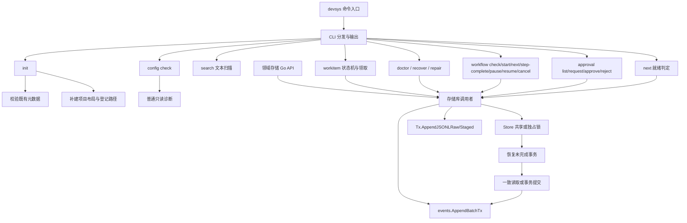

# 项目总览

<cite>
**本文引用的文件**
- [README.md:1-20](file://README.md#L1-L20)
- [internal/cli/cli.go:24-56](file://internal/cli/cli.go#L24-L56)
- [internal/cli/cli.go:144-180](file://internal/cli/cli.go#L144-L180)
- [internal/project/init.go:41-123](file://internal/project/init.go#L41-L123)
- [internal/config/config.go:80-113](file://internal/config/config.go#L80-L113)
- [internal/storage/store.go:140-190](file://internal/storage/store.go#L140-L190)
- [internal/workitem/workitem.go:55-92](file://internal/workitem/workitem.go#L55-L92)
- [internal/record/record.go:243-325](file://internal/record/record.go#L243-L325)
- [internal/workflow/policy.go:13-142](file://internal/workflow/policy.go#L13-L142)
- [internal/workflow/condition.go:57-103](file://internal/workflow/condition.go#L57-L103)
- [internal/workflow/gate.go:38-73](file://internal/workflow/gate.go#L38-L73)
- [internal/workflow/cache.go:47-73](file://internal/workflow/cache.go#L47-L73)
- [internal/approval/approval.go:101-176](file://internal/approval/approval.go#L101-L176)
- [internal/approval/approval.go:266-304](file://internal/approval/approval.go#L266-L304)
- [internal/approval/approval.go:485-533](file://internal/approval/approval.go#L485-L533)
- [internal/workitem/state.go:66-188](file://internal/workitem/state.go#L66-L188)
- [internal/workitem/propagate.go:28-99](file://internal/workitem/propagate.go#L28-L99)
- [internal/workitem/workflow_instance.go:108-381](file://internal/workitem/workflow_instance.go#L108-L381)
- [internal/next/evaluate.go:113-181](file://internal/next/evaluate.go#L113-L181)
</cite>

## 目录
1. [引言](#引言)
2. [项目结构](#项目结构)
3. [核心组件](#核心组件)
4. [架构总览](#架构总览)
5. [快速链接](#快速链接)

## 更新摘要

**变更内容**
- 基于 `4ad8f9e` 刷新：M1 命令与领域存储语义不变；搜索的千文件正确性测试不再按 2s 墙钟时间失败，性能由首次文件扫描与重复扫描两个独立 benchmark 场景记录（[internal/search/search_test.go:102-144](file://internal/search/search_test.go#L102-L144)）。
- 基于 `85b0de7` 刷新：M2 交付工作项九状态机、调度态与文件级领取、只读对账与摘要确认修复，命令面新增 `workitem` / `doctor` / `recover` / `repair`；新增知识卡[状态机与调度](../knowledge/可靠文本存储/状态机与调度.md)与[对账与修复](../knowledge/可靠文本存储/对账与修复.md)。
- 基于 `cf7b256` 刷新：M3 交付工作流策略（`internal/workflow`）、审批服务（`internal/approval`）与就绪判定（`internal/next`）三层应用逻辑，命令面新增 `workflow` / `approval` / `next`；存储新增 `Tx.AppendJSONLRaw`（多行 JSONL payload）与 `Tx.Staged(rel)`（事务内已暂存查询），`events.AppendBatchTx`（按 shard 分组一次 append）支撑状态/传播/失效事件同批提交；工作项转换事务的 `TransitionRequest.Guard` 在事务内复审证据并产出事件，`propagateRecordsTx` 完成事务内广播决策/发现引用到父与直接兄弟，`workflow_instance.go` 五类实例操作只动 `workflow` 字段（不动状态/调度/租约）；`record.ListArtifacts` 给门禁证据收集使用；工作流读取入口 `workflow.Resolve` 解析失败回退 last-known-good 缓存（`.devsys/.cache/workflows/<id>.md`）。既有知识卡全部刷新覆盖 M3 内容。

## 引言

Workloom 是独立于 Harness 的 Agent 开发基础设施，项目状态以文本存放在仓库内的 `.devsys/`，通过 Git 在设备间交接。当前实现截止 M3：M0/M1 交付命令入口、项目初始化、文本存储基元、严格配置校验与领域持久化（八类记录的版本化序列化，WorkItem/事件流/Run/记录/不可变 Artifact 版本链、无数据库关键字检索）；M2 交付工作项状态机（九状态保守图、非法转换拒绝并列出允许的下一步、状态与事件同事务）、调度态与文件级领取租约（随机 token fencing、心跳、确定性重试），以及只读对账 `devsys doctor`、显式恢复 `devsys recover`、摘要确认的状态修复 `devsys repair`。M3 交付三层应用逻辑：

- **工作流策略**（`internal/workflow`）：`.devsys/workflows/<id>.md`（YAML front matter + 提示词正文）严格 located 解析；条件白名单求值（7 字段、`==` `!=` `<` `>` `in` `exists`）；门禁（artifact 名集、min 数、comment、approval）与质量门（确定性文本评分，满分 100）；模板渲染与环境变量展开；last-known-good 缓存（`.devsys/.cache/workflows/<id>.md`，本地、可重建、不提交）。
- **审批服务**（`internal/approval`）：`.devsys/approvals/approval-<N>.yaml`；请求 → 决定（approved / rejected） → 消费生命周期；消费永远在 `workitem.changeStatus` 的 Guard 内完成（同事务内重读 + `ExpectHash`），离开状态未消费的同源审批自动失效；`scope=stage_gate` 拒绝走 `rejectStageGate` 在 `Transition` 的 Guard 内同时完成决定与状态变更。
- **就绪判定**（`internal/next`）：纯函数 `Evaluate(Input) Report` 输出 PASS/CONCERNS/FAIL 与 §7.4 唯一推荐动作；CLI `devsys next` 只读组装 Input，不可信状态不输出业务事实。

章节来源：[README.md:13-32](file://README.md#L13-L32)、[internal/cli/cli.go:144-180](file://internal/cli/cli.go#L144-L180)、[internal/next/evaluate.go:113-181](file://internal/next/evaluate.go#L113-L181)。

## 项目结构

| 区域 | 当前职责 |
|---|---|
| `cmd/devsys/`、`internal/cli/` | 进程退出码、全局开关、命令分发与输出 |
| `internal/project/`、`internal/registry/` | 项目目录初始化与用户级项目路径登记 |
| `internal/config/` | 受管元数据文件的校验与问题定位（含嵌套 scope/current_state/milestones） |
| `internal/storage/` | 原子写、序列化、JSONL、锁、版本守卫与可恢复事务；M3 新增 `Tx.AppendJSONLRaw` 与 `Tx.Staged` |
| `internal/domain/` | 受管领域记录与版本化稳定 YAML/JSON 编解码；含工作项状态图与转换错误类型；M3 起含 Approval 与 WorkflowInstance |
| `internal/workitem/`、`internal/events/`、`internal/run/`、`internal/record/` | WorkItem（含状态机、文件级领取、Guard、记录传播、工作流实例）、事件流（+ `AppendBatchTx`）、Run、决策/发现/工件的项目内存储与 ID 分配 |
| `internal/reconcile/` | 只读对账、显式恢复与摘要确认的状态修复（M2） |
| `internal/search/` | 无索引文本扫描检索 |
| `internal/workflow/`（M3） | 策略解析、条件求值、门禁/质量门、LKG、模板/环境变量 |
| `internal/approval/`（M3） | 审批生命周期 |
| `internal/next/`（M3） | 就绪判定 + §7.4 推荐 |
| `internal/version/` | 构建版本标识 |
| `docs/原始文档/` | 方案与实施计划，不作为当前实现清单 |
| `docs/examples/workflows/`（M3） | 三份示例策略（quick-fix / feature-development / architecture-change） |

章节来源：[README.md:144-157](file://README.md#L144-L157)、[internal/reconcile/reconcile.go:1-19](file://internal/reconcile/reconcile.go#L1-L19)、[README.md:13-32](file://README.md#L13-L32)。

## 核心组件

**项目接入与配置。** `init` 要求当前目录为 Git 仓库根；先校验已有受管文件，再补建目录和缺失占位文件。`.devsys/.gitignore` 有特殊规则：保留原有行，补齐缺失忽略项。不能把初始化描述为一次跨文件存储事务。`config check` 是普通只读诊断，不加锁、不触发事务恢复。M1 起 `project.yaml` 使用完整 Project 模型（嵌套校验见 `internal/config/nested.go`），领域记录统一走 `internal/domain` 的严格编解码。

章节来源：[internal/project/init.go:41-123](file://internal/project/init.go#L41-L123)、[internal/config/config.go:104-113](file://internal/config/config.go#L104-L113)。

**领域存储（M1）。** WorkItem/Run/记录三类采用「一记录一文件 + CAS 分配 + 乐观并发更新」；事件流按月分片 JSONL 追加；Artifact 版本为不可变文件链（`previous_id` 回链）；`devsys search` 对 `.devsys/` 文本做大小写不敏感扫描，排除 `local/` 与 `.cache/`。

章节来源：[internal/workitem/workitem.go:55-92](file://internal/workitem/workitem.go#L55-L92)、[internal/events/events.go:53-84](file://internal/events/events.go#L53-L84)、[internal/record/record.go:243-325](file://internal/record/record.go#L243-L325)、[internal/cli/cli.go:274-313](file://internal/cli/cli.go#L274-L313)。

**状态机与调度（M2 新增）。** 状态写入只经 `Transition`/`ApplyRepair`：actor+reason 必填、旧快照拒绝、状态与事件（`status_changed`/`repair_applied`）同一事务；调度态与业务状态分离，领取用 `.devsys/scheduling/<id>.yaml` 租约与随机 token fencing，并发领取恰好一个胜者并在同一事务创建 Run。见[状态机与调度](../knowledge/可靠文本存储/状态机与调度.md)。

章节来源：[internal/workitem/claim.go:179-326](file://internal/workitem/claim.go#L179-L326)、[internal/workitem/state.go:46-59](file://internal/workitem/state.go#L46-L59)、[internal/domain/state.go:62-132](file://internal/domain/state.go#L62-L132)。

**对账与修复（M2 新增）。** `devsys doctor` 只读（不建锁、不自动恢复；待恢复事务优先报告且不输出业务事实）；`devsys recover` 先确定性恢复事务，再释放过期/孤儿领取并留事件；`devsys repair --dry-run/--apply` 以无墙钟摘要与写事务内证据复核执行「推断→确认→重写」。见[对账与修复](../knowledge/可靠文本存储/对账与修复.md)。

章节来源：[internal/reconcile/reconcile.go:155-214](file://internal/reconcile/reconcile.go#L155-L214)、[internal/reconcile/reconcile.go:367-380](file://internal/reconcile/reconcile.go#L367-L380)、[internal/cli/cli.go:511-660](file://internal/cli/cli.go#L511-L660)。

**工作流策略、门禁与质量门（M3 新增）。** `.devsys/workflows/<id>.md` 解析为 `Policy`：front matter 行号定位、未知键 warning、结构/类型/必填/交叉引用 error；步骤序列、转换条件白名单（7 字段、`==` `!=` `<` `>` `in` `exists`）、门禁（artifact 名集、最小数量、comment、approval）、质量门（标题/描述/验收标准/引用/验收语言，满分 100）、hook 名枚举（`after_create/before_run/after_run/before_remove`）、`on_reject` ∈ {`block`, `regress:<status>`}、`quality_gate.min_score` 0–100；M3.7 起 `RequireApproval` 由 `approval.MatchingGate` 复核。详见[状态机与调度](../knowledge/可靠文本存储/状态机与调度.md)「M3 工作流实例操作」小节与[架构设计](../knowledge/可靠文本存储/架构设计.md)「workflow / approval / next」表。

章节来源：[internal/workflow/parse.go:40-769](file://internal/workflow/parse.go#L40-L769)、[internal/workflow/condition.go:57-128](file://internal/workflow/condition.go#L57-L128)、[internal/workflow/gate.go:38-73](file://internal/workflow/gate.go#L38-L73)、[internal/workflow/quality.go:33-86](file://internal/workflow/quality.go#L33-L86)。

**记录传播（M3 新增）。** 完成（进入 `done`）事务内 `propagateRecordsTx` 扫描 `decisions/` 与 `findings/` 中 `RelatedWorkItems` 命中的记录，把 `decision://<id>` / `finding://<id>` 追加到父与直接兄弟的 `context_refs`（同事务 CAS、不改对方状态、已存在则跳过 → 幂等）；无 parent 不广播；父子自环（`parent_id == self`）拒绝并回滚。`record_propagated` 事件与 `status_changed` 同批 `events.AppendBatchTx` 提交。

章节来源：[internal/workitem/propagate.go:28-225](file://internal/workitem/propagate.go#L28-L225)、[internal/workitem/state.go:175-181](file://internal/workitem/state.go#L175-L181)、[internal/events/events.go:108-144](file://internal/events/events.go#L108-L144)。

**last-known-good 策略缓存（M3 新增）。** `workflow.Resolve(ctx, root, id)` 是工作流读取统一入口：每次重新 `Parse`（不信 mtime），成功后 `refreshLastKnownGood` 通过 `storage.Write` best-effort 写 `.devsys/.cache/workflows/<id>.md`（同字节不写）；失败回退快照并携带当前 `Issue`；无快照或快照损坏 fail closed（损坏快照视为缺失，绝不作为回退候选）。`workflow check` 仍只读走 `Load`；`claim`（新派发）拒绝在当前策略非法/缺失时执行，即使快照可用；`transition` 门禁允许用快照评估既有任务（既有推进不被配置错误卡死）并打印 `warning: … using last-known-good`；`next` 增 `invalid_policy` 只读风险（含「工作项引用缺失策略」交叉核对）。

章节来源：[internal/workflow/cache.go:47-122](file://internal/workflow/cache.go#L47-L122)、[internal/cli/cli.go:493-506](file://internal/cli/cli.go#L493-L506)、[internal/cli/cli.go:1206-1224](file://internal/cli/cli.go#L1206-L1224)、[internal/next/evaluate.go:140-145](file://internal/next/evaluate.go#L140-L145)。

**工作流实例与 fencing（M3 新增）。** `workflow_instance.go` 五类操作（`start` / `step-complete` / `pause` / `resume` / `cancel`）共用 `workflowWrite`：写事务内 `ReadForExpect` → `bytes.Equal` 校验 `--expect` → 租约活跃时要求 `Owner` + `Token`（与 `UpdateClaimed` 同契约） → `mutate` 重写 `wi.Workflow` 字段 → `PutYAML(ExpectHash)` + `AppendTx` 事件。**不**写工作项状态、不写调度态/租约/`scheduling/` 目录；目标步骤声明 `status` 时当前状态不匹配即拒绝（不隐式改状态）；显式 `--to` 必须命中声明转换且条件成立，自环拒绝；`paused` 拒绝推进。

章节来源：[internal/workitem/workflow_instance.go:108-381](file://internal/workitem/workflow_instance.go#L108-L381)。

**审批服务（M3 新增）。** `.devsys/approvals/approval-<N>.yaml`，ID `^approval-[0-9]+$`；`Request` 写事务内 `findOpenApproval` 防同 (work item, stage, requested status) 重复请求 → `nextNumber` → `PutYAML(ExpectAbsent)` → `approval_requested` 事件；`DecideTx` 重读 + `ExpectHash`、pending → approved/rejected；`ConsumeTx` 仅在调用方写事务（典型是 `changeStatus` 的 Guard）内调用，校验 approved + 未消费 + 同 work item + 同 stage + 当前状态 = `requested_status`，任一不符 abort 整单，写 `consumed_at` + 返回 `approval_consumed` 事件；`InvalidateForStatusTx` 在 `changeStatus` 离开 `from` 状态时把同源未消费审批标记为 `invalidated_at` + 返回 `approval_invalidated` 事件，通过 `Tx.Staged(rel)` 跳过本事务已暂存文件。`scope=stage_gate` 拒绝走 `rejectStageGate` 在 `Transition` 的 Guard 内同时完成 `DecideTx(rejected)` 与状态变更（默认 `blocked`，`regress:<status>` 回退），失败整单回滚。

章节来源：[internal/approval/approval.go:101-533](file://internal/approval/approval.go#L101-L533)、[internal/cli/cli.go:822-976](file://internal/cli/cli.go#L822-L976)。

**就绪判定与 next（M3 新增）。** 纯函数 `next.Evaluate(Input)`：FAIL = 有待恢复事务（不输出业务事实、附 `devsys recover` 修复项）；CONCERNS = 任一风险信号；PASS = 无。风险八类顺序：过期租约 → 孤儿领取 → 不可读调度文件 → 滞留审查（review/verification 且 `updated_at ≤ now − 24h`）→ 阻塞 → 元数据非法 → 策略非法（含「工作项引用缺失策略」）→ 待决审批。推荐六优先级：recover_claim → review → start（dispatch 排序 priority 降序 → created_at 升序 → id）→ start_backlog → milestone_review → report_done。CLI `devsys next` 只读组装 Input（先 `reconcile.Doctor`，再 workitems / pending approvals / 策略与元数据问题），exit 恒 0。

章节来源：[internal/next/evaluate.go:113-316](file://internal/next/evaluate.go#L113-L316)、[internal/cli/cli.go:1323-1437](file://internal/cli/cli.go#L1323-L1437)。

**可靠文本存储。** `Store.Read` 在共享锁下执行回调；发现未完成事务时释放共享锁、恢复后重试。`Store.Write` 在独占锁下先恢复，再提交回调收集的操作。`Tx.AppendJSONLRaw` 把多行 JSONL payload 一次 append（同 shard 多个事件合并提交）；`Tx.Staged(rel)` 查询本事务是否已暂存 `rel`，供 `InvalidateForStatusTx` 跳过本事务已写的审批。此一致性边界适用于经 Store 协调的访问，不自动覆盖任意 `os.ReadFile` 或手工写入。

章节来源：[internal/storage/store.go:108-190](file://internal/storage/store.go#L108-L190)、[internal/storage/txn.go:179-247](file://internal/storage/txn.go#L179-L247)。

## 架构总览

图表来源：
- [cmd/devsys/main.go:12-14](file://cmd/devsys/main.go#L12-L14)
- [internal/cli/cli.go:144-180](file://internal/cli/cli.go#L144-L180)
- [internal/project/init.go:63-123](file://internal/project/init.go#L63-L123)
- [internal/cli/cli.go:274-360](file://internal/cli/cli.go#L274-L360)
- [internal/cli/cli.go:511-660](file://internal/cli/cli.go#L511-L660)
- [internal/cli/cli.go:388-735](file://internal/cli/cli.go#L388-L735)
- [internal/cli/cli.go:741-976](file://internal/cli/cli.go#L741-L976)
- [internal/cli/cli.go:1323-1437](file://internal/cli/cli.go#L1323-L1437)
- [internal/storage/store.go:140-190](file://internal/storage/store.go#L140-L190)
- [internal/storage/txn.go:179-247](file://internal/storage/txn.go#L179-L247)
- [internal/events/events.go:108-144](file://internal/events/events.go#L108-L144)
- [internal/workitem/state.go:66-188](file://internal/workitem/state.go#L66-L188)
- [internal/workitem/workflow_instance.go:336-381](file://internal/workitem/workflow_instance.go#L336-L381)
- [internal/approval/approval.go:266-304](file://internal/approval/approval.go#L266-L304)

版本边界同样重要：M3 已实现工作项状态机、文件级领取/对账/修复、工作流策略与实例、审批生命周期与 next 就绪判定；知识（M5）与执行调度（M6）未实现，`config.yaml` 仍只有 `schema_version`。进程中断恢复不等于已证明断电持久性。

章节来源：[internal/config/config.go:81-104](file://internal/config/config.go#L81-L104)、[README.md:80-85](file://README.md#L80-L85)、[README.md:113-128](file://README.md#L113-L128)。存储保证的证据与限制见[可靠文本存储](../knowledge/可靠文本存储/概述.md)。

## 快速链接

- [快速开始](快速开始.md)：正确放置全局参数，初始化并检查配置。
- [开发与故障诊断](开发与故障诊断.md)：扩展约束、验证命令与已知限制。
- [项目接入与配置](../knowledge/项目接入与配置/概述.md)：命令与配置知识卡。
- [可靠文本存储](../knowledge/可靠文本存储/概述.md)：存储协议知识卡。
