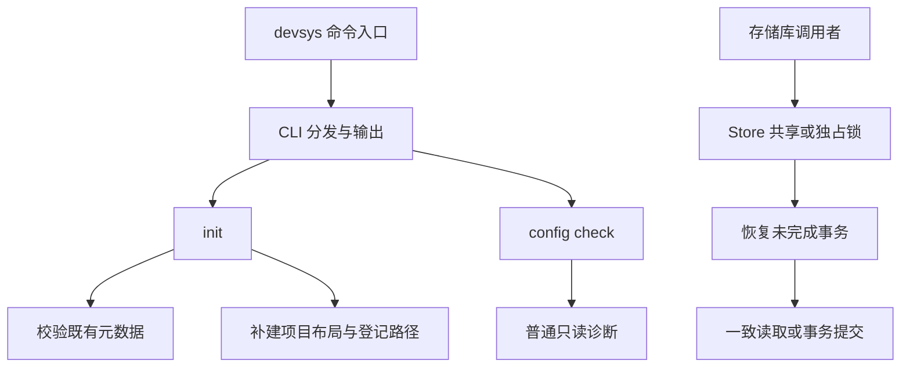

# 项目总览

<cite>
**本文引用的文件**
- [README.md:1-20](file://README.md#L1-L20)
- [internal/cli/cli.go:24-56](file://internal/cli/cli.go#L24-L56)
- [internal/project/init.go:41-123](file://internal/project/init.go#L41-L123)
- [internal/config/config.go:80-113](file://internal/config/config.go#L80-L113)
- [internal/storage/store.go:140-190](file://internal/storage/store.go#L140-L190)
</cite>

## 目录
1. [引言](#引言)
2. [项目结构](#项目结构)
3. [核心组件](#核心组件)
4. [架构总览](#架构总览)
5. [快速链接](#快速链接)

## 引言

Workloom 是独立于 Harness 的 Agent 开发基础设施，项目状态以文本存放在仓库内的 `.devsys/`，通过 Git 在设备间交接。当前实现截止 M0.4：命令入口、项目初始化、文本存储基元、严格配置校验。目录中出现 `workitems/`、`runs/` 等名称不代表对应业务命令已经可用。

章节来源：[README.md:1-20](file://README.md#L1-L20)、[internal/cli/cli.go:35-56](file://internal/cli/cli.go#L35-L56)。

## 项目结构

| 区域 | 当前职责 |
|---|---|
| `cmd/devsys/`、`internal/cli/` | 进程退出码、全局开关、命令分发与输出 |
| `internal/project/`、`internal/registry/` | 项目目录初始化与用户级项目路径登记 |
| `internal/config/` | 四个受管元数据文件的校验与问题定位 |
| `internal/storage/` | 原子写、序列化、JSONL、锁、版本守卫与可恢复事务 |
| `internal/version/` | 构建版本标识 |
| `docs/原始文档/` | 方案与实施计划，不作为当前实现清单 |

章节来源：[README.md:64-80](file://README.md#L64-L80)。

## 核心组件

**项目接入与配置。** `init` 要求当前目录为 Git 仓库根；先校验已有受管文件，再补建目录和缺失占位文件。`.devsys/.gitignore` 有特殊规则：保留原有行，补齐缺失忽略项。不能把初始化描述为一次跨文件存储事务。`config check` 是普通只读诊断，不加锁、不触发事务恢复。

章节来源：[internal/project/init.go:41-123](file://internal/project/init.go#L41-L123)、[internal/project/init.go:161-192](file://internal/project/init.go#L161-L192)、[internal/config/config.go:104-113](file://internal/config/config.go#L104-L113)。

**可靠文本存储。** `Store.Read` 在共享锁下执行回调；发现未完成事务时释放共享锁、恢复后重试。`Store.Write` 在独占锁下先恢复，再提交回调收集的操作。此一致性边界适用于经 Store 协调的访问，不自动覆盖任意 `os.ReadFile` 或手工写入。

章节来源：[internal/storage/store.go:108-190](file://internal/storage/store.go#L108-L190)。

## 架构总览

图表来源：
- [cmd/devsys/main.go:12-14](file://cmd/devsys/main.go#L12-L14)
- [internal/cli/cli.go:128-139](file://internal/cli/cli.go#L128-L139)
- [internal/project/init.go:63-123](file://internal/project/init.go#L63-L123)
- [internal/cli/cli.go:246-292](file://internal/cli/cli.go#L246-L292)
- [internal/storage/store.go:140-190](file://internal/storage/store.go#L140-L190)
- [README.md:36-37](file://README.md#L36-L37)

版本边界同样重要：当前 `project.yaml` 只定义元数据头，`config.yaml` 只有 `schema_version`；完整 Project 模型和业务配置属于后续工作。进程中断恢复不等于已证明断电持久性。

章节来源：[internal/config/config.go:80-95](file://internal/config/config.go#L80-L95)、[README.md:19-20](file://README.md#L19-L20)。存储保证的证据与限制见[可靠文本存储](../knowledge/可靠文本存储/概述.md)。

## 快速链接

- [快速开始](快速开始.md)：正确放置全局参数，初始化并检查配置。
- [开发与故障诊断](开发与故障诊断.md)：扩展约束、验证命令与已知限制。
- [项目接入与配置](../knowledge/项目接入与配置/概述.md)：命令与配置知识卡。
- [可靠文本存储](../knowledge/可靠文本存储/概述.md)：存储协议知识卡。
