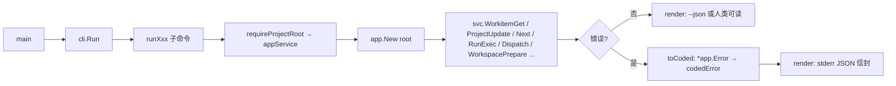
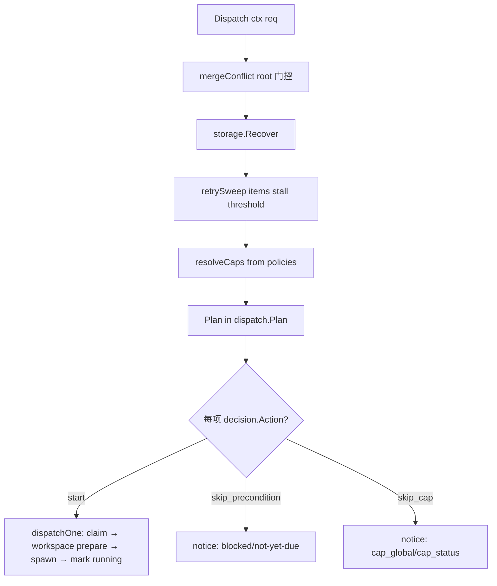

# 共享应用与 MCP · 架构设计

## 内部结构

```text
cmd/devsys/main.go           # 进程入口（不变）
   ↓
internal/cli/                # M4 起薄化为渲染层：flag 解析 + render + toCoded；M6 进一步承载执行层 CLI 适配
   ├── cli.go                # 全局开关、命令分发、--json/--jsonl 渲染、写 JSONL
   ├── records.go            # decision / finding / event / artifact / run 族；M6 增 run exec|prompt|verify|complete|fail|cancel
   ├── worktree.go           # M6：worktree prepare|remove|list
   ├── dispatch.go           # M6：dispatch --once|--watch|--dry-run|--max
   ├── diagnostics.go        # 仅 CLI 保留的 read-only 工具：search / config check / doctor / recover / repair
   ├── mcp.go                # `devsys mcp serve` 子命令：stdin/stdout 转 SDK transport
   └── cli_test.go / records_test.go / diagnostics_test.go / wire_test.go / mcp_test.go / exchange_test.go / session_test.go / dispatch_test.go / runexec_test.go / runverify_test.go / runround_test.go / worktree_test.go
   ↓
internal/app/                # M4 新增：共享应用服务（同一业务规则，CLI 与 MCP 共用）
   ├── app.go                # Error{Kind,Message,Problems}, Class(), Usagef/Preconditionf/Internalf/Invalidf, Classify, Service{Root,Now}, HookEnv
   ├── session.go            # SessionStart + SessionView/Action/Context + 唯一推荐动作
   ├── context.go            # ContextGet/Refresh/Compact + WorkitemContextView
   ├── project.go            # ProjectGet/Update + StateGet/Update + List/Status/Blueprint
   ├── workitem.go           # 14 方法：List/Get/Create/Update/Transition/Claim/Release/Start/Block/Complete/Comment/DepAdd/DepRemove/Next
   ├── workflow.go           # WorkflowList/Get/Start/StepNext/StepComplete/Pause/Resume/Cancel
   ├── approval.go           # ApprovalList/Get/Request/Approve/Reject
   ├── record.go             # Decision*/Finding*/Event*/Artifact* 族
   ├── run.go                # RunList/Get/Create/Update/Heartbeat/Log + RunFinish (M6)
   ├── runexec.go            # M6 RunExec + runStream + recordAgent + markRunning + finishAttempt + terminalStatus + recordExecOutcome + abortAttempt + advancePhase + logRelFor + execNote/Summary + roundCap
   ├── runverify.go          # M6 RunVerify + verifyCompletion + refuseCompletion + routeToReview + runUpdateRaw
   ├── runstream.go          # M6 readRunStream + nextRound/lastRound/lastExit + recordedPhases + streamRecord 结构
   ├── dispatch.go           # M6 DispatchRequest/Report/DispatchedAttempt/SweptAttempt + Dispatch + dispatchCaps + dispatchOne + dispatchOwner + releaseFailedClaim + defaultSpawner + dispatchCommandLine + shellArgv + claimHeld + retrySweep + sweepTrigger + lastProgress + queueNextAttempt + runsFor
   ├── workspace.go          # M6 WorkspacePrepareRequest/View + WorkspacePrepare + bindWorkspaceToRun + workspaceHooks + WorkspaceRemoveRequest + WorkspaceRemove + WorkspaceList + projectID
   ├── prompt.go             # M6 RunPromptRequest/View + RunPrompt + promptVars + workflowID/Step/Paused + specText + promptChanges + promptRemaining + recordPromptRefs + eventPromptRefs + riskLines + writePromptFile + firstLine；本批把 `in.Remaining = promptRemaining(...)` 提到 round>1 之外（首轮也带「待完成步骤」清单）
   ├── next.go               # Next() (Report, []*WorkItem, error)；本批装配 PolicyIDs/QualityBlocks/DefaultPolicy，policy 体走 workflow.Load 的 plain read（next 零写入）；ready 项过 next.QualityBlocks（与 claim 同源）
   ├── wire.go               # Wire(dryRun bool) — AGENTS.md 管理块注入；本批块末尾行从「--json/--jsonl + 退出码」改为指向 `.agents/skills/devsys/SKILL.md`
   ├── skill.go              # 本批新增 WriteSkill + skillFiles + skillMainBody/skillCLIRef/skillFixRef 常量；管理 `.agents/skills/devsys/{SKILL.md, references/cli.md, references/troubleshooting.md}` 三文件，统一以 `<!-- devsys-skill -->` marker 标定
   ├── wirecheck.go          # 本批新增 WireCheck / WireCheckView / WireCheckLine + checkTool/checkDevsys/checkSchema/checkRegistry/checkAgentsBlock/checkSkill/staleSkillFiles/checkMCPConfig；只读 8 行
   ├── mcpsnippets.go        # 本批新增 MCPSnippet(codex|claude|opencode, devsysBin) 拼 stdio 命令片段
   └── knowledge.go          # KnowledgeStatus — M4 恒返回 unavailable（M5 达到）
   ↓
internal/mcp/                # M4 新增：Model Context Protocol 服务（基于官方 Go SDK）
   ├── server.go             # Config, DefaultProfiles, ParseProfiles, NewServer, Run；本批新增 TierCore/TierStandard 常量 + DefaultTier/ParseTier/tierLevel/visibleTier，Config 加 Tier 字段，注册循环改为 `visible(...) && visibleTier(...)`
   ├── tools.go              # allTools()（66 项工具清单，含 19 项 TierCore 日常子集）, toolSpec{name, profiles, tier, register}, toolError 结构, fail/failNotice/usageFail；本批每个 toolSpec 显式标 tier（空 = standard）
   ├── tools_health.go       # health — session profile + TierCore；本批在 healthResult 增 Tier 字段回传当前档位
   ├── tools_project.go      # project_* — session/admin；含 project_blueprint_get（session + standard tier）
   ├── tools_workitem.go     # workitem_* — session/executor
   ├── tools_workflow.go     # workflow_* — session/executor
   ├── tools_approval.go     # approval_* — session/executor/reviewer
   ├── tools_record.go       # decision_*/finding_*/event_*/artifact_*
   ├── tools_run.go          # run_* — session/executor；M6 增 run_prompt / run_verify / run_complete / run_fail / run_cancel
   ├── tools_context.go      # context_*/knowledge_status/agent_session_start — session
   └── server_test.go        # 端到端 SDK 客户端回归；本批新增 TestTierStandardRestoresFullSessionExecutor / TestParseTier / TestProjectBlueprintToolAnswersWithoutADeclaration
   ↓
M3 既有底层（仅作调用方，不修改）：
   internal/{storage,workitem,events,run,record,search,reconcile,workflow,approval,next,config,project,registry,version,domain}
   ↓
M6 新增执行层（仅作调用方，不修改）：
   internal/{harness,workspace,dispatch,retry,prompt}
```

## 关键流程

### 1. CLI 调用链（M4 + M6 后）



`toCoded`（[internal/cli/cli.go:99-117](file://internal/cli/cli.go#L99-L117)）把 `*app.Error.Class()` 映射到退出码（`usage→2 / precondition→3 / internal→1`，其余归到 `4 invalid`），`kind` 字段直接透传 `*app.Error.Kind`。M6 的执行层错误（`workspace.HookError` / `workspace.GitError` / `harness.Result.Err` 等）在 `internal/app.dispatch / runexec / workspace` 内被包装为 `*app.Error{Kind: precondition / usage / invalid / workflow}`，落到同一 `toCoded` 翻译。

### 2. MCP 调用链

```mermaid
flowchart LR
    A[client] -- stdio JSON-RPC --> B[SDK server.Run]
    B --> C{tools/call name}
    C --> D[registerTool spec.handler]
    D --> E[parse req.Params → typed input]
    E --> F[svc := app.New cfg.Root]
    F --> G[svc.WorkitemTransition / RunExec / RunVerify / RunFinish ctx req]
    G --> H{错误?}
    H -- 否 --> I[wrap out → toolResult]
    H -- 是 --> J[fail err → toolResult{isError:true, structuredContent: toolError}]
```

M6 新增 `run_complete / run_fail / run_cancel` 的 `fail(err)` 通过 `app.RunFinish` 内部 `refuseCompletion` 携带 `Notice="completion check refused; routed to review"`，让 reviewer 通过 MCP 也能看到失败原因。

### 3. Profile + tier 注册期过滤

```go
tier := cfg.Tier
if tier == "" {
    tier = DefaultTier()
}
for _, spec := range allTools() {
    if !visible(spec.profiles, cfg.Profiles) || !visibleTier(spec.tier, tier) {
        continue
    }
    spec.register(server, cfg)
}
```

`visible`（[internal/mcp/server.go](file://internal/mcp/server.go)）的语义：

- 工具的 `profiles` 是「允许暴露该工具的 profile 集合」。
- `cfg.Profiles` 是当前 server 启动时选定的 profile 集合。
- 工具与配置**任一为空**都不暴露（空工具 profile = 永不可见；空配置 = 没有任何工具暴露）。
- 否则若 `spec.profiles ∩ cfg.Profiles` 非空则暴露。

`visibleTier`（[internal/mcp/server.go:176-181](file://internal/mcp/server.go#L176-L181)）的语义：

- 工具的 `tier` 字段：空字符串 = standard；显式 `TierCore` = core。
- 选定的 `tier` 通过 `tierLevel` 排序：`core=0`，其它（含空、`standard`）=1。
- `tierLevel(toolTier) <= tierLevel(selected)` 才暴露——core 在 core+standard 都暴露，standard 仅在 standard 暴露。
- `DefaultTier()` 返回 `TierCore`（CLI `devsys mcp serve` 不显式 `--tier` 时的默认值）。

**注册期**过滤意味着：未注册的工具既不出现在 `tools/list`，也无法以名称调用——`tools/call` 收到未注册名直接走 SDK 标准错误。

M6 新增 `run_prompt` / `run_verify` 是 `session` profile（agent 可读）；`run_exec` 是 `executor` profile（dispatch / reviewer 可写）；`run_complete` / `run_fail` / `run_cancel` 是 `executor` profile。**所有 profile 仍是 M4 既有的 `session / executor / reviewer / admin`**——本批不引入新 profile，但**新增 tier 维度**：`core`（默认 CLI `--tier core` / 缺省；含 19 项 TierCore 标定的「日常子集」）+ `standard`（`--tier standard`；含 profile 全量，例如 `workflow_step_complete` / `workitem_update` / `context_get` / `knowledge_status`），二者与 profile 合取（都满足才暴露）。`ParseTier` 拒绝未知名（拼错不能静默放行）。

MCP `project_blueprint_get`（session 档 / standard tier）补注册入口由 `internal/mcp/tools.go:37` 的 `toolSpec` + `internal/mcp/tools_project.go:56` 的 `registerProjectBlueprint` 共同组成；测试 `TestProjectBlueprintToolAnswersWithoutADeclaration` 用 `Tier: TierStandard` 跑 fixture，断言 `artifact: null`。


### 4. 双入口一致性

CLI 与 MCP 共享同一份 `app.Service`，因此：

- 同一个工作项的 `expect` 校验逻辑完全一致：CLI 的 `--expect <64-hex>` 与 MCP 工具的 `expect` 字段都走 `app.WorkitemUpdate / Transition` 内部的 `Tx.ReadForExpect` + `bytes.Equal`。
- 同一个 attempt 的 `run_prompt / run_verify / run_complete / run_fail / run_cancel`：CLI 的 `run prompt` / `run verify` / `run complete|fail|cancel` 与 MCP 的 `run_prompt` / `run_verify` / `run_complete / run_fail / run_cancel` 都走 `app.RunPrompt / RunVerify / RunFinish` 同一入口。
- 同一个审批门禁：MCP 的 `workitem_transition` 与 CLI 的 `workitem transition` 在 `app.WorkitemTransition` 内一并被 `approval.MatchingGate` 复审。本批 `gateEvidence` 在 `require_approval` 缺失时调 `approval.InvalidatedFor` 拿到被 §4.9 voided 的审批 id / 失效时间戳 / 原 `requested_status`，把 `ApprovalNote` 写进 `workflow.GateEvidence`，让 CLI/MCP reviewer 端都能看到失效原因（不再只是"还差一个审批"）。
- 同一个错误分类：`*app.Error` 的 `Kind` 与 `Class()` 既被 `toCoded` 翻译为退出码，也被 `fail` 翻译为 MCP 工具错误——调用方按 `code` 分支时无需关心入口。本批 `storeError` 把 `workitem.ErrBadID` 归 `Usagef`（exit 2 / `code=usage`）/ `storage.ErrConflict` 归 `Invalidf(KindWorkitem,…)`（exit 4 / `code=invalid`，附「重新读取重试 / `--latest`」出路文案）。

### 5. M6 调度 tick（[internal/app/dispatch.go](file://internal/app/dispatch.go)）



- 顺序：recover → sweep → plan → claim → spawn——每步都有 notice 写入；broken candidate 不阻塞队列。
- `dispatchOne` 选 spawn 策略：① `WorkItem.AssignedHarness` 非空 → `harness.ByName`；② 否则 `config.DispatchCommand` 模板渲染（默认模板即 CLI 调 `devsys run exec`）。
- `retrySweep` 在 tick 开始时把失败/超时/停滞 attempt 收尾——按 `retry.Delay(base, max, attempt, workitemID)` 派下一次到期时间，**派生 jitter** 保证可复现。
- `DispatchReport` 列出 `Started / Swept / Notices`——所有数据由 caller 序列化（CLI `--json` / MCP `dispatch_dry_run`）。

- **本批（#336/#337）调度预检与拒绝落账链路**：`dispatchOne` 在 `workitemClaim` 之前先调 `preflightAttempt`（[internal/app/dispatch.go:354-383](file://internal/app/dispatch.go#L354-L383)）——`assigned_harness` 非空必须 `harness.ByName` 已知名，否则 `Usagef`；shell 模式必须 `dispatch_command` 非空或带 `--` 命令，否则 `Usagef`；非 shell harness `Probe` 未安装 → `Usagef`。拒绝直接写 `notice`，**不**进入 claim，因此不占 concurrency cap；只有预检通过的 attempt 才走 `claim → workspace prepare → spawn → mark running`。`RunExec` 在 `openRunStream` 之前新增 `refuseAttempt`（[internal/app/runexec.go:466-539](file://internal/app/runexec.go#L466-L539)）——Usage/Precondition 拒绝统一落账为 `run.status=failed` + `result.errors` 含原因 + 写 `run_failed` 事件 + `releaseFailedClaim` 释放租约（与 `retrySweep` 同语义）；`abortAttempt`（before_run 钩子失败）接入同一函数，**禁止**把空 run 标 `finished`（保留证据可查）。`MCP serve` 前过滤检查：`internal/mcp/server.go` 新导出 `VisibleTools(cfg) []string`（与 `NewServer` 同一 `visible(...) && visibleTier(...)` 过滤），CLI `mcp serve` 在 `len(VisibleTools(cfg)) == 0` 时 `errUsage`（exit 2）——多 profile 时文案 `profiles "a", "b" have no tools in tier core; use --tier standard`，单 profile 文案 `profile "reviewer" has no tools in tier core; use --tier standard`，避免 spin up 一个静默 no-op server。

## 依赖关系

- `internal/app` 依赖 `internal/{storage,workitem,events,run,record,search,reconcile,workflow,approval,next,config,project,registry,version,domain}` 与 M6 新增的 `internal/{harness,workspace,dispatch,retry,prompt}`；本批 `workitem.go` 经 `approval.InvalidatedFor` 多依赖 `internal/approval` 的查证接口，`next.go` 多依赖 `internal/workflow`（`workflow.Load` / `workflow.Policy` 的 plain read，不走 last-known-good 缓存）。
- `internal/mcp` 依赖 `internal/app` 与 `github.com/modelcontextprotocol/go-sdk`（vendored，`go.mod` 引入 `v1.8.0`）；本批 `server.go` 多依赖 `strings` / `fmt`（`ParseTier` + `tierLevel`），不引入新外部包。
- `internal/cli` 在 M4 后只依赖 `internal/app`（业务分发）+ `internal/{config,project,registry,version,workflow,domain,reconcile,search}`（CLI 保留的诊断与渲染路径）；不再直接调 `internal/{workitem,approval,...}`，也不再直接调 `internal/{harness,workspace,dispatch,retry,prompt}`（M6 同样收敛到 `internal/app`）。本批 `cli.go` 把 `wire --skill` / `wire --check` / `wire --print-mcp <harness>` 三族路由调到 `app.WriteSkill` / `app.WireCheck` / `app.MCPSnippet`，业务逻辑仍收敛在 `internal/app`；`mcp.go` 的 `--tier` flag 把字面量传给 `mcp.ParseTier`，CLI 不再重复实现 tier 解析。
- `internal/{harness,workspace,dispatch,retry,prompt}` 之间只允许 `harness.shell` 被 `workspace.RunHook` 复用（hook 与 attempt 走同一流/超时/进程树语义），其它互不依赖。

## 与其他层的关系

- [可靠文本存储](../可靠文本存储/架构设计.md) — `app.Service` 是其上层消费者，写路径仍然走 `Store.Write` 与 `Tx.AppendJSONLRaw`
- [项目接入与配置](../项目接入与配置/架构设计.md) — CLI 薄化后变成纯渲染层；AGENTS.md 写入委托给 `app.Wire`；本批「技能目录」 `app.WriteSkill` 与 Wire 管理块同源（skillMarker 与 wireBegin/End marker 各自独立、不互相覆盖）
- [执行层 · 架构设计](../执行层/架构设计.md) — M6 五子包依赖方向与适配器协议；本批 `app.next.QualityBlocks` 把 `workflow.Policy` 直接喂给 `next.Evaluate`，与执行层无新耦合
