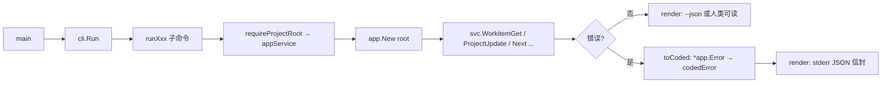

# 共享应用与 MCP · 架构设计

## 内部结构

```
cmd/devsys/main.go           # 进程入口（不变）
   ↓
internal/cli/                # M4 起薄化为渲染层：flag 解析 + render + toCoded
   ├── cli.go                # 全局开关、命令分发、--json/--jsonl 渲染、写 JSONL
   ├── records.go            # decision / finding / event / artifact 族（搬迁自 cli.go）
   ├── diagnostics.go        # 仅 CLI 保留的 read-only 工具：search / config check / doctor / recover / repair
   ├── mcp.go                # `devsys mcp serve` 子命令：stdin/stdout 转 SDK transport
   ├── cli_test.go / records_test.go / diagnostics_test.go / wire_test.go / mcp_test.go / exchange_test.go / session_test.go
   ↓
internal/app/                # M4 新增：共享应用服务（同一业务规则，CLI 与 MCP 共用）
   ├── app.go                # Error{Kind,Message,Problems}, Class(), Usagef/Preconditionf/Internalf/Invalidf, Classify, Service{Root,Now}
   ├── session.go            # SessionStart + SessionView/Action/Context + 唯一推荐动作
   ├── context.go            # ContextGet/Refresh/Compact + WorkitemContextView
   ├── project.go            # ProjectGet/Update + StateGet/Update + List/Status/Blueprint
   ├── workitem.go           # 14 方法：List/Get/Create/Update/Transition/Claim/Release/Start/Block/Complete/Comment/DepAdd/DepRemove/Next
   ├── workflow.go           # WorkflowList/Get/Start/StepNext/StepComplete/Pause/Resume/Cancel
   ├── approval.go           # ApprovalList/Get/Request/Approve/Reject
   ├── record.go             # Decision*/Finding*/Event*/Artifact* 族
   ├── run.go                # RunList/Get/Create/Update/Heartbeat/Log
   ├── next.go               # Next() (Report, []*WorkItem, error)
   ├── wire.go               # Wire(dryRun bool) — AGENTS.md 管理块注入
   └── knowledge.go          # KnowledgeStatus — M4 恒返回 unavailable（M5 达到）
   ↓
internal/mcp/                # M4 新增：Model Context Protocol 服务（基于官方 Go SDK）
   ├── server.go             # Config, DefaultProfiles, ParseProfiles, NewServer, Run
   ├── tools.go              # allTools(), toolSpec{name, profiles, register}, toolError 结构, fail/failNotice/usageFail
   ├── tools_health.go       # health — session profile
   ├── tools_project.go      # project_* — session/admin
   ├── tools_workitem.go     # workitem_* — session/executor
   ├── tools_workflow.go     # workflow_* — session/executor
   ├── tools_approval.go     # approval_* — session/executor/reviewer
   ├── tools_record.go       # decision_*/finding_*/event_*/artifact_*
   ├── tools_run.go          # run_* — session/executor
   ├── tools_context.go      # context_*/knowledge_status/agent_session_start — session
   └── server_test.go        # 端到端 SDK 客户端回归
   ↓
M3 既有底层（仅作调用方，不修改）：
   internal/{storage,workitem,events,run,record,search,reconcile,workflow,approval,next,config,project,registry,version,domain}
```

## 关键流程

### 1. CLI 调用链（M4 后）



`toCoded`（[internal/cli/cli.go:99-117](file://internal/cli/cli.go#L99-L117)）把 `*app.Error.Class()` 映射到退出码（`usage→2 / precondition→3 / internal→1`，其余归到 `4 invalid`），`kind` 字段直接透传 `*app.Error.Kind`。

### 2. MCP 调用链

```mermaid
flowchart LR
    A[client] -- stdio JSON-RPC --> B[SDK server.Run]
    B --> C{tools/call name}
    C --> D[registerTool spec.handler]
    D --> E[parse req.Params → typed input]
    E --> F[svc := app.New cfg.Root]
    F --> G[svc.WorkitemTransition ctx req]
    G --> H{错误?}
    H -- 否 --> I[wrap out → toolResult]
    H -- 是 --> J[fail err → toolResult{isError:true, structuredContent: toolError}]
```

### 3. Profile 注册期过滤

`internal/mcp/server.go:91-105` 的 `NewServer`：

```go
for _, spec := range allTools() {
    if !visible(spec.profiles, cfg.Profiles) {
        continue
    }
    spec.register(server, cfg)
}
```

`visible`（[internal/mcp/server.go:113-130](file://internal/mcp/server.go#L113-L130)）的语义：

- 工具的 `profiles` 是「允许暴露该工具的 profile 集合」。
- `cfg.Profiles` 是当前 server 启动时选定的 profile 集合。
- 工具与配置**任一为空**都不暴露（空工具 profile = 永不可见；空配置 = 没有任何工具暴露）。
- 否则若 `spec.profiles ∩ cfg.Profiles` 非空则暴露。

**注册期**过滤意味着：未注册的工具既不出现在 `tools/list`，也无法以名称调用——`tools/call` 收到未注册名直接走 SDK 标准错误。

### 4. 双入口一致性

CLI 与 MCP 共享同一份 `app.Service`，因此：

- 同一个工作项的 `expect` 校验逻辑完全一致：CLI 的 `--expect <64-hex>` 与 MCP 工具的 `expect` 字段都走 `app.WorkitemUpdate / Transition` 内部的 `Tx.ReadForExpect` + `bytes.Equal`。
- 同一个审批门禁：MCP 的 `workitem_transition` 与 CLI 的 `workitem transition` 在 `app.WorkitemTransition` 内一并被 `approval.MatchingGate` 复审。
- 同一个错误分类：`*app.Error` 的 `Kind` 与 `Class()` 既被 `toCoded` 翻译为退出码，也被 `fail` 翻译为 MCP 工具错误——调用方按 `code` 分支时无需关心入口。

## 依赖关系

- `internal/app` 依赖 `internal/{storage,workitem,events,run,record,search,reconcile,workflow,approval,next,config,project,registry,version,domain}`。
- `internal/mcp` 依赖 `internal/app` 与 `github.com/modelcontextprotocol/go-sdk`（vendored，`go.mod` 引入 `v1.8.0`）。
- `internal/cli` 在 M4 后只依赖 `internal/app`（业务分发）+ `internal/{config,project,registry,version,workflow,domain,reconcile,search}`（CLI 保留的诊断与渲染路径）；不再直接调 `internal/{workitem,approval,...}`。

## 与其他层的关系

- [可靠文本存储](../可靠文本存储/架构设计.md) — `app.Service` 是其上层消费者，写路径仍然走 `Store.Write` 与 `Tx.AppendJSONLRaw`
- [项目接入与配置](../项目接入与配置/架构设计.md) — CLI 薄化后变成纯渲染层；AGENTS.md 写入委托给 `app.Wire`
