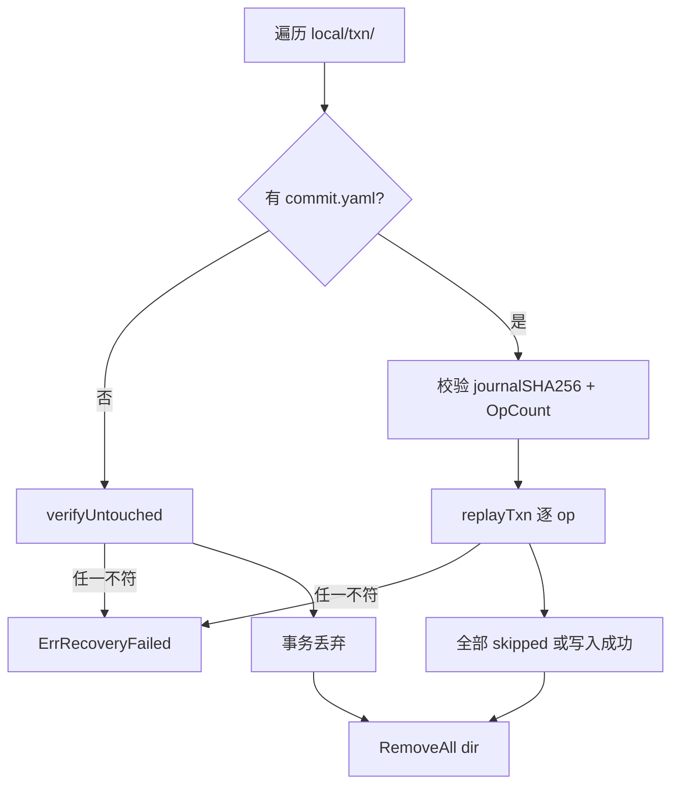

# 事务与恢复

本卡描述 storage 的**事务协议**（journal + commit marker + payload）、`Recover` 重放与 `verifyUntouched` 校验、写入路径的测试钩子，以及 M3 新增的 `AppendJSONLRaw`（多行 JSONL payload）与 `Tx.Staged`（事务内已暂存查询）。

## 物理边界

事务材料落在 `.devsys/local/txn/<txn-id>/` 下：

```
.devsys/local/txn/<txn-id>/
├── journal.yaml    # 意图 + payload 摘要
├── commit.yaml     # 原子落盘即提交点
└── payload/
    ├── 000.bin     # 每个 op 的实际字节
    ├── 001.bin
    └── ...
```

`.devsys/local/lock` 是项目级共享 / 排他锁（见 [架构设计](架构设计.md)）。`local/` 在 `.gitignore` 与 `search` 排除表内。

## 写入路径（`Store.Write` → `commitLocked`）

[internal/storage/store.go:172-190](file://internal/storage/store.go#L172-L190) + [internal/storage/txn.go:258-343](file://internal/storage/txn.go#L258-L343)：

1. 取独占锁（`lockExclusive`）；同时拒绝其它共享 / 排他请求。
2. `recoverLocked()` 处理历史残留（见下）。
3. 调 `fn(tx)` 收集 `op`（仅在内存中）。
4. `len(tx.ops) == 0` 时不写盘，直接返回。
5. `commitLocked`：
   - re-check preconditions
   - 创建事务目录
   - `WriteFileSync` 各 payload 到 `payload/NNN.bin`
   - `AtomicWrite` `journal.yaml`
   - `txnStage(stageJournalDurable)` 测试钩子
   - `AtomicWrite` `commit.yaml`
   - `txnStage(stageCommitted)` 测试钩子
   - 逐个 `applyPayload`（`AtomicWrite` / `appendJSONL` / M3 `appendJSONLRaw`）
   - `txnStage(stageApplied(i))` 测试钩子
   - `os.RemoveAll(dir)`
   - `txnStage(stageCleaned)` 测试钩子
6. 释放锁。

`applyPayload` ([internal/storage/txn.go:354-365](file://internal/storage/txn.go#L354-L365)) 把 op 类型映射到 `AtomicWrite`（`opKindPut`）/ `appendJSONL`（`opKindAppend`）。

### 测试钩子

`TxnStageHookForTest` 注入中断点：[internal/storage/txn.go:436-441](file://internal/storage/txn.go#L436-L441) 暴露 `stageJournalDurable / stageCommitted / stageApplied / stageCleaned` 四个阶段。M2 真实子进程回归（`internal/workitem/m2_crash_test.go`）在指定阶段 `os.Exit` 注入崩溃，验证恢复路径两侧语义：commit 前崩溃 → 事务丢弃、可重新执行；commit 后崩溃 → 重放幂等。

## Journal 与 Commit Marker

### journal.yaml

```yaml
schema_version: 1
txn_id: <uuid>
created_at: 2026-09-18T12:00:00.000Z
pid: 12345
ops:
  - kind: put              # 或 append
    rel: workitems/WLM-1.yaml
    expect: <sha256-hex | absent>
    payload: <sha256-hex>
    payload_sha256: <sha256-hex>
    payload_size: 1024
  - kind: append
    rel: events/2026-09.jsonl
    expect: ""
    payload: <sha256-hex>
    payload_sha256: <sha256-hex>
    payload_size: 256
```

`payload_sha256` 与 `payload_size` 是冗余校验，恢复时重新读取 `payload/N.bin` 与 journal 比对，任一不符 → `ErrRecoveryFailed`。

### commit.yaml

```yaml
schema_version: 1
txn_id: <uuid>
committed_at: 2026-09-18T12:00:00.500Z
journal_sha256: <sha256-hex of journal.yaml>
op_count: 2
```

`commit.yaml` 的落盘即事务提交点；`AtomicWrite` 保证它在 POSIX 下 `rename(2)` 原子覆盖、Windows 下退避重试 `ERROR_ACCESS_DENIED` / `ERROR_SHARING_VIOLATION`。

## 恢复协议

`Recover`（[internal/storage/recover.go:34-85](file://internal/storage/recover.go#L34-L85)）遍历 `.devsys/local/txn/`（按字典序），对每个事务目录二选一：

### 无 commit marker → `verifyUntouched`

[internal/storage/recover.go:89-141](file://internal/storage/recover.go#L89-L141)：

- 每个 Put 目标必须满足 `Expect`：缺失 → `ExpectAbsent()`；存在 → `HashBytes(current) == expected`
- 每个 JSONL 目标大小必须等于 `PreSize`（append 前的长度）

任一不符 → `ErrRecoveryFailed`（拒绝恢复，调用方可继续只读诊断）。

### 有 commit marker → `replayTxn` 幂等重放

[internal/storage/recover.go:218-330](file://internal/storage/recover.go#L218-L330)：

1. 校验 `journalSHA256` 与 `OpCount == len(j.Ops)`
2. Put：
   - 当前文件 hash == payload hash → `skipped`（已被应用）
   - 否则 `AtomicWrite(rel, payload, ExpectHash(...))`，hash 不符 → `ErrRecoveryFailed`
3. Append：
   - 当前 `Size == PreSize` → `appendJSONL(rel, payload)` 写入
   - 当前 `Size >= PreSize + PayloadSize` 且区间字节等于 payload → `skipped`
   - 其它 → 错误



### 3 次循环

`Store.Read`（[internal/storage/store.go:143-166](file://internal/storage/store.go#L143-L166)）最多重试 3 次：每次发现 `pendingTxns > 0` 就释放共享锁 → `Recover`（独占锁下重放/丢弃）→ 回到循环。3 次循环后仍有事务 → `ErrRecoveryFailed: pending transactions keep appearing; run recovery and retry`。

## M3 新增：`Tx.AppendJSONLRaw`

[internal/storage/txn.go:179-199](file://internal/storage/txn.go#L179-L199) 替代了「同一事务内多次 `tx.AppendJSONL` 到同 shard」违反「一文件一写」契约的旧路径（M2.1 Claim / M3.3 状态事件 + 传播事件的同款教训）。

签名：

```go
func (tx *Tx) AppendJSONLRaw(rel string, payload []byte) error
```

约束：

- `len(payload) > 0` 且末字节必须是 `'\n'`，否则 `payload is not JSONL`
- 首位 `'\n'` 或含 `\n\n`（空行）→ 拒绝（compact JSON 不会有空行）
- 含 `'\r'` → 拒绝（records LF-only）

通过 `tx.claim(rel, abs)` 防止同一 `rel` 在同一事务内被暂存两次（违反「一文件一写」）。

`events.AppendBatchTx` 是其典型消费者（[internal/events/events.go:108-144](file://internal/events/events.go#L108-L144)）：按 shard 分组，把同 shard 事件合并为一次 `AppendJSONLRaw` 调用。`workitem.changeStatus` 提交批（状态事件 + Guard 事件 + 失效事件 + 传播事件）就是这条路径。

## M3 新增：`Tx.Staged`

[internal/storage/txn.go:241-247](file://internal/storage/txn.go#L241-L247) 报告本事务内是否已经暂存过 `rel`：

```go
func (tx *Tx) Staged(rel string) bool
```

`approval.InvalidateForStatusTx` 是其典型消费者（M3Reviewer6 ③，[internal/approval/approval.go:516-559](file://internal/approval/approval.go#L516-L559)）：失效 pass 必须跳过本事务已被 `ConsumeTx` 改写的审批文件，否则会触发 `staged twice` 断言。

调用模式：

```go
for _, id := range ids {
    if tx.Staged(approvalRel(id)) {
        continue // already rewritten in this transaction (e.g. consumed by the gate)
    }
    raw, exists, err := tx.ReadForExpect(approvalRel(id))
    // ... 失效并 PutYAML(ExpectHash) ...
}
```

## 中断语义：commit 点两侧

- commit 前崩溃：journal + commit marker 都没落盘 → `verifyUntouched` 校验每个 Put 目标的 `Expect` 与 JSONL 大小；任一不符拒绝恢复。
- commit 后崩溃：commit marker 已落盘 → `replayTxn` 幂等重放：每个 Put / Append 跳过已应用的部分（hash / size 比对），未应用部分按 `Expect` 守卫应用。

这是「提交即决定」的事务边界：读者永不观察半提交状态。

## 只读路径的检查（`Inspect` / `InspectUnlocked`）

[internal/storage/inspect.go](file://internal/storage/inspect.go)：

- `Inspect`：取共享锁 → 列 `local/txn/` 目录 → 调 callback → 释放。
- `InspectUnlocked`：完全不取锁，但要求 caller 已经持有共享锁。

`reconcile.Doctor` 用 `InspectUnlocked`（[internal/reconcile/reconcile.go:1-20](file://internal/reconcile/reconcile.go#L1-L20)），never `storage.Read`——这是 `doctor` 决不创建锁文件、决不触发恢复的物理保证。
## 本批（M#337，commit 362b637）

M#337 让 reconcile 在 `Inspect` 回调里读工作项文件时具备「解码失败继续扫」的能力，对存储基元的影响**只**是新增一类只读探针：

- `internal/reconcile/reconcile.go:readAllWorkitems`（[internal/reconcile/reconcile.go:964-1003](file://internal/reconcile/reconcile.go#L964-L1003)）走 `inspectOrUnlocked` → `storage.Inspect` 列 `.devsys/workitems/*.yaml` → 对每条记录 `domain.DecodeYAML`；失败的文件记为 `InvalidFile{Path: rel, Err: derr.Error()}` 并 `continue` 扫下一个。**不**抛错、**不**触发 `Recover`、**不**写盘——这是 `storage.Inspect` 既有契约下的纯只读扫描。
- 与 `walkScheduling` 同形：都走 `Inspect`，都不调 `storage.Read`、都不创建锁文件、都不触发事务恢复。区别是 `walkScheduling` 解码租约 YAML 失败 → `UnreadableLeases`；`readAllWorkitems` 解码工作项 YAML 失败 → `InvalidFiles`。
- 与 `Inspect` 的整体边界：pending transactions 时 `Storage.Diagnose` 仍先返回 `PendingTransactions`，`Doctor` 在 pending 时**不**走 `readAllWorkitems`（直接返回带恢复提示的 report）；non-pending 时 `readAllWorkitems` 才被调，`InvalidFiles` 才会出现。

——M#337 不修改事务协议本身；它只是把 `Inspect` 回调里「解码单条记录失败」的语义从「整批丢弃」放宽到「记录后继续扫」，并通过 `reconcile.InspectionReport.InvalidFiles` 把不可信集合带出 Doctor。

## 与其他层的关系

- [架构设计](架构设计.md) — 写入路径的 mermaid 流程图与依赖关系
- [存储错误语义](存储错误语义.md) — `ErrRecoveryFailed` / `ErrConflict` / `ErrIncompleteTail` 等错误分类
