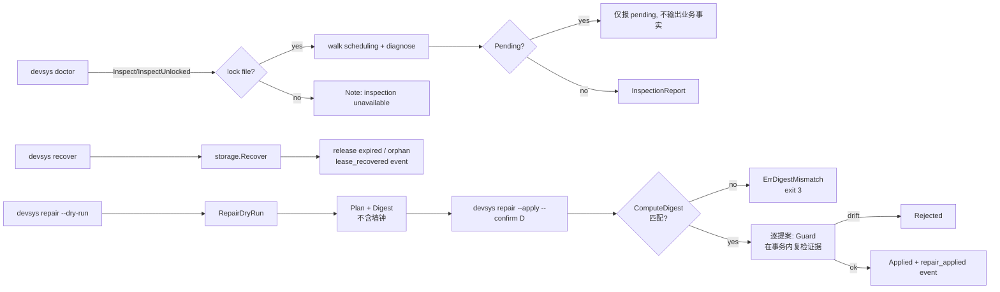

# 可靠文本存储 · 对账与修复

> 自定义维度卡（dimension: `reconciliation`）。M2.3 / M2.4 / M2.5 在 storage 事务与锁之上承接"读出来—恢复—确认式改写"三步：Doctor 只读扫盘、Recover 释放租约、RepairDryRun+RepairApply 凭证据摘要改写业务状态。本卡描述这三条入口的语义、契约、与 CLI 映射。

## 模块定位

`internal/reconcile/reconcile.go`（包注释见 `reconcile.go:1-19`）严格遵循三条原则：

1. **读路径只用 `storage.Inspect`**——永远不调用 `storage.Read`、不调用内部走 `storage.Read` 的 workitem 助手（那些会自动恢复并创锁）。
2. **写路径分两段**——Recover 先做 `storage.Recover`（确定性事务恢复），再分别对过期与孤儿租约调用 `workitem.Release`；RepairApply 同样地逐提案在 workitem 的 `Write` 内复用 `Guard` 回调做证据复核。
3. **摘要不含墙钟**——`ComputeDigest`（`reconcile.go:319-335`）按 `Kind → WorkitemID → Evidence` 规范化排序后 sha256，保证 `repair --apply --confirm <digest>` 可以拒绝任何中间状态漂移。

## 核心数据结构

`reconcile.go:38-130` 定义了 reconcile 暴露的全部类型：

| 类型 | 字段 / 含义 |
|---|---|
| `ProposalKind` | `release_expired_lease` / `release_orphan_lease` / `mark_done_to_in_progress`（`reconcile.go:40-44`） |
| `EvidenceKind` | `file`（带 sha256） / `absent`（`reconcile.go:49-52`） |
| `Evidence` | `Kind/Path/SHA256/Note`——apply 时在事务内逐条复核（`reconcile.go:56-61`） |
| `Proposal` | `Kind/WorkitemID/RunID/FromStatus/ToStatus/Description/Evidence/Note`（`reconcile.go:64-73`） |
| `Plan` | `Proposals + Digest + Note`（`reconcile.go:76-81`） |
| `InspectionReport` | `InspectionOK / PendingTransactions / ExpiredLeases / OrphanLeases / UnreadableLeases / Orphans / Note`（`reconcile.go:84-94`） |
| `RecoverReport` | `TransactionRecovery / ReleasedExpired / ReleasedOrphans / EventsAppended`（`reconcile.go:118-123`） |
| `ApplyReport` | `Applied / Rejected / Events`（`reconcile.go:126-130`） |
| `Options` | `Now / Actor / Reason`（`reconcile.go:111-115`） |

`ErrDigestMismatch`（`reconcile.go:134`）是 RepairApply 拒绝摘要漂移的唯一错误，CLI 把它映射到 `CodePrecondition`。

## Doctor：只读对账

`Doctor(ctx, root, opts)`（`reconcile.go:155-208`）三步执行，**永不创建锁、永不触发恢复**：

1. **pending 事务**：`storage.Diagnose()`（`reconcile.go:167-170`）。有残留 → 仅设 `Note = "pending transactions: run \`devsys recover\` before trusting business state (方案 §15.4)"` 并把尽力扫到的 lease 探针放进 `ExpiredLeases`，**立即返回**——不输出 `Orphans`、不构造任何业务事实（`reconcile.go:172-177`）。
2. **lease 扫描**：`walkScheduling(ctx, st, now())`（`reconcile.go:557-610`），通过 `inspectOrUnlocked`（`reconcile.go:311-317`，`Inspect` 失败回退到 `InspectUnlocked`）枚举 `.devsys/scheduling/`：
   - 解码失败 → `{Owner: "<unreadable>"}`，**绝不静默丢弃**，由 `Doctor` 单独汇入 `UnreadableLeases`（`reconcile.go:195-199`）。
   - `lease.LeaseUntil.Before(now)` → `ReasonKind = "expired"`。
   - `lease.RunID != ""` 且 `runFileExists(r, lease.RunID)` 为假 → `ReasonKind = "orphan"`（`reconcile.go:585-602`）。
   - 注意 `walkScheduling` 走 `Inspect`，所有读都在同一个共享锁 / 一次性只读快照里。
3. **构造提案**：`buildProposals`（`reconcile.go:716-795`）综合 lease 探针与工作项快照：
   - `expired` → `ProposalReleaseExpiredLease`（`reconcile.go:723-730`）。
   - `orphan` → `ProposalReleaseOrphanLease`（`reconcile.go:731-738`）。
   - `status=done` 且**至少一个**引用工件缺失 → `ProposalMarkDoneToInProgress`（`reconcile.go:746-793`，Main Q1: ONE missing is sufficient）。
   - 状态机门禁未开时，提案仍保留，但 `Note` 字段标 `unrepairable`（`reconcile.go:709-715`）。

字段语义：

- `InspectionOK=true`：锁文件存在且无 pending 事务，`ExpiredLeases` / `OrphanLeases` 是当前真实的 lease 列表。
- `InspectionOK=false` + `Note`：通常是 `ErrLockUnavailable`（没有锁文件 → "inspection unavailable"），绝不假装"no activity"。
- `UnreadableLeases`：严格解码失败的 lease 文件单独汇报，便于人工介入。

## Recover：释放过期/孤儿租约

`Recover(ctx, root, opts)`（`reconcile.go:214-280`）按以下顺序执行：

1. `storage.Recover(ctx)` 先做确定性事务恢复，`TransactionRecovery` 字段如实反映 `Discarded/Replayed/Skipped`（`reconcile.go:227-231`）。
2. `readAllLeasesPostRecover`（`reconcile.go:615-686`）改用 `storage.Read`——此时事务已落定，可以走完整读路径。
3. 遍历每条 lease：
   - `lp.WorkitemID` 不合法 → 跳过。
   - 既不 `Expired` 也不 `orphan` → 跳过。
   - `workitem.ReadSnapshot` 取工作项字节；`ErrNotFound` → 仅记录、不释放（孤儿但工作项已消失，Doctor 路径才是它的归宿，`reconcile.go:248-251`）。
   - 否则按 `ReasonKind` 切到 `ReleaseOptions`：`expired → ForExpired=true` / `orphan → ForOrphan=true`，统一带上 `Actor`、`Reason`、`Expected=snap`、`Now`（`reconcile.go:253-267`）。
   - 调 `ws.Release(...)`（`internal/workitem/claim.go:410-536`）：
     - `ForExpired` 要求 `lease.LeaseUntil.Before(now)`，否则 `ErrInvalidInput`。
     - `ForOrphan` 在事务内复核 `runs/<runID>.yaml` 不存在，否则同样 `ErrInvalidInput`。
     - 任一失败 → 返回并把错误冒泡到 `reconcile.go:268-269`。
   - 事件统一写为 `lease_recovered`（`claim.go:499-506`）；同事务内还把 `runs/<id>.yaml` 原子改成 `status=finished, finished_at=now`（`claim.go:509-525`）。
4. 成功条目进 `ReleasedExpired` / `ReleasedOrphans`，并累加 `EventsAppended`。

幂等性：再次调用 `Recover` 会在第 3 步看到 lease 已不存在（`claim.go:445-447` 的 idempotent 早返回），不会重复写事件。`scripts/smoke-m2.sh` 第 4 步（`smoke-m2.sh:74-78`）就是这条不变量的人肉检查：`grep -q 'lease_recovered' .devsys/events/*.jsonl` 只应有恰好一条。

## RepairDryRun：确认摘要

`RepairDryRun(ctx, root, opts)`（`reconcile.go:283-304`）几乎等价于 `Doctor` 的步骤 2+3，但产物是 `Plan` 而非 `InspectionReport`：

- `walkScheduling` 失败时 `plan.Note = "inspection ran without shared lock: " + ...`，但**仍继续构建 proposal**——降级而非拒绝。
- `plan.Proposals = buildProposals(...)`。
- `plan.Digest = ComputeDigest(proposals)`（`reconcile.go:319-335`）：
  - 永不包含任何墙钟时间。
  - `canonicalProposals`（`reconcile.go:337-355`）按 `Kind → WorkitemID` 排序，再按 `Path → Kind` 对每条 `Evidence` 排序——保证两次干跑在状态未变时给出完全相同的 sha256。
- digest 序列化形如 `P|<kind>|<workitem>|<run>|<from>|<to>|<desc>|E|<file|absent>|<path>|<sha256>|<note>|...`（`reconcile.go:325-330`）。

## RepairApply：逐提案 + Guard 摘要复核

`RepairApply(ctx, root, plan, opts)`（`reconcile.go:367-513`）按规范化顺序逐条提案写入：

1. **前置校验**：
   - `Options.Reason / Options.Actor` 必须非空（`reconcile.go:368-373`）。
   - `plan.Digest == ""` → `ErrDigestMismatch`。
   - `ComputeDigest(plan.Proposals) != plan.Digest` → `ErrDigestMismatch`（`reconcile.go:374-379`）——这是核心：apply 入口永远从当前存储重算 digest，与调用方传入的对比，任何漂移都拒绝。

2. **预读工作项快照**（`reconcile.go:391-414`）：在 storage `Read` 内读出当前 workitem YAML 字节 `snap`；`ErrNotFound` 进 `Rejected`，不进入 Write。

3. **构造 Guard 闭包**（`reconcile.go:416-450`）：运行在 `storage.Tx` 内部：
   - 先 CAS：`tx.ReadForExpect(workitemRel(id))` 的 sha256 必须等于 `snap`（`reconcile.go:418-427`）。
   - 再对每条 `Evidence`（`reconcile.go:428-448`）：
     - `EvidenceFile` → 文件必须存在且 sha256 一致。
     - `EvidenceAbsent` → 文件必须不存在。
     - 任何不匹配 → 返回 `evidence drift on <path>: ...`，外层事务回滚，apply 不写。
   - Guard 与 `Confirmation = []byte(plan.Digest)`、`AllowRepair=true` 一起作为 `TransitionRequest` 字段传入。

4. **写入**（`reconcile.go:451-510`）按 `Proposal.Kind` 分发：
   - `ProposalReleaseExpiredLease` / `ProposalReleaseOrphanLease`：`workitem.Release` 当前**还不支持 Guard**——所以核心做的是 workitem CAS + lease 删除 + `lease_recovered` 事件；之后用 `recheckEvidence`（`reconcile.go:518-551`）在 `storage.Read` 内做一次 post-apply 复核，作为防御性兜底。任何一步失败都进 `Rejected`。
   - `ProposalMarkDoneToInProgress`：`workitem.ApplyRepair(...)`，`TargetStatus = StatusInProgress`、`AllowRepair=true`、`Guard = guard`、`Confirmation = []byte(plan.Digest)`、`Expected = snap`。`workitem.changeStatus`（`internal/workitem/state.go:61-162`）在持锁的 `Tx` 内：CAS workitem → 解码 → `legalRepairTransition(from, to)` → 调 `req.Guard(tx)` → 写 workitem + `repair_applied` 事件，`Content` 末尾追加 `confirmation=<digest>` 并把 `repair_digest` 加入 `Related`（`state.go:148-152`）。

5. 汇总 `ApplyReport.Applied / Rejected / Events`。

无嵌套 Write：`buildProposals` 与每个 `Apply` 路径都在各自的顶层 `storage.Write` 里，互不嵌套（`reconcile.go:365-366` 注释）。

## CLI 映射与退出码

`internal/cli/cli.go` 暴露三个对账命令，参数与退出码见 `cli.go:33-72`、`cli.go:508-682`：

| 命令 | 入口 | 关键开关 | 退出码 |
|---|---|---|---|
| `devsys doctor` | `runDoctor`（`cli.go:511-554`） | 无参数；可加 `--json` / `--quiet` | OK 0；内部错误 → `CodeInternal=1` |
| `devsys recover` | `runRecover`（`cli.go:559-592`） | 必填 `--actor` / `--reason` | 用法错 → `CodeUsage=2`；内部错误 → `CodeInternal=1` |
| `devsys repair --dry-run` | `runRepair` 的 dry-run 分支（`cli.go:655-680`） | 必填 `--actor` / `--reason` | 用法错 → 2；内部错误 → 1 |
| `devsys repair --apply --confirm <digest>` | `runRepair` 的 apply 分支（`cli.go:614-651`） | 必填 `--actor` / `--reason` / `--confirm`；`--confirm` 缺失 → 2；digest 不匹配 → `CodePrecondition=3`（"confirmation digest does not match current state; run \`devsys repair --dry-run\` again"）；内部错误 → 1 |

退出码常量见 `cli.go:36-44`：

```
CodeOK           = 0
CodeInternal     = 1
CodeUsage        = 2
CodePrecondition = 3  // 含 digest 不匹配
CodeInvalid      = 4  // 受管状态不可信（解析/字段/schema_version）
```

医生路径的特殊处理：

- `PendingTransactions` 一律以 `PENDING  <id>` 行渲染（`cli.go:530-535`），随后提示 `run \`devsys recover\` before trusting business state`。
- `InspectionOK=false` 时第一行渲染 `inspection limited: <note>`（`cli.go:527-529`）。
- 每个 proposal 末尾打印证据行：文件带 sha256 前 12 位，缺席打 `absent`（`cli.go:542-551`、`cli.go:669-678`）。

## 中断语义：何时丢弃、何时重放、何时不可见

事务层的 commit point 协议已经在 [事务与恢复](事务与恢复.md) 详细描述。本节聚焦于"claim/调度事务"被中断时对账/修复路径看到的具体表现。

`internal/workitem/m2_crash_test.go` 用 re-exec 子进程在每个 durable stage 杀进程（`m2_crash_test.go:18-23`），枚举两个事务阶段：

| crash stage（`m2_crash_test.go:28`） | 恢复判定 | 读者观测 |
|---|---|---|
| `journal-durable` | 未提交 → `verifyUntouched` 校验丢弃 | lease 文件不存在、`SchedulingState != claimed/running`、无 `claimed` 事件；可被第二个 claimer 重新领取（`m2_crash_test.go:128-162`） |
| `committed` | 已提交 → `replayTxn` 完整重放 | lease 文件存在、`SchedulingState ∈ {claimed, running}`、恰好一条 `claimed` 事件；第二个 claimer 收到 `ErrAlreadyClaimed`（`m2_crash_test.go:107-127`） |

并在两个分支后都校验 `st.Recover` 第二次调用必须空报告（`m2_crash_test.go:163-176`），即**重放幂等**。

由此得出 reconcile 看到的两条事实：

- **commit point 之前被中断**：业务事实（lease 文件、claim 事件、workitem 状态）一概**不可见**，doctor/repair 不需要把它们当孤儿处理；它们由 `storage.Recover` 在第一次读路径上静默清理。
- **commit point 之后被中断**：业务事实**完整可见**，状态彼此一致；如果中途留下了不一致（例如 workitem 已 `done` 但某个引用工件被截断），将由 doctor 的 `mark_done_to_in_progress` 提案 + apply 的 `Guard` 摘要复核兜底——Guard 在事务内逐条校验 `Evidence`，任何漂移就拒绝写入（`reconcile.go:428-448`）。

## 流程概览



图表来源：

- `[internal/reconcile/reconcile.go:142-208]`（Doctor）
- `[internal/reconcile/reconcile.go:210-280]`（Recover）
- `[internal/reconcile/reconcile.go:282-304]`（RepairDryRun）
- `[internal/reconcile/reconcile.go:357-513]`（RepairApply 与 Guard）
- `[internal/reconcile/reconcile.go:319-335]`（ComputeDigest）
- `[internal/storage/inspect.go:20-98]`（Inspect / InspectUnlocked + ErrLockUnavailable / ErrPendingTxn）
- `[internal/workitem/claim.go:410-536]`（Release / ForExpired / ForOrphan / lease_recovered 事件）
- `[internal/workitem/state.go:53-162]`（ApplyRepair / Guard / repair_applied 事件）
- `[internal/cli/cli.go:33-72, 508-682]`（CLI 命令与退出码）
- `[internal/workitem/m2_crash_test.go:62-179]`（中断语义矩阵）
- `[scripts/smoke-m2.sh:66-100]`（端到端：doctor → recover → repair --dry-run → repair --apply）

## 不声明的能力

- **doctor 不识别业务策略**：lease 已过期但 `owner` 仍存活、`reason` 描述的是正常排队等待——doctor 仍会标 expired；策略判断留给 CLI/操作员。
- **Recover 不修复业务状态**：仅释放租约与关闭关联 Run，`workitem.Status` 不被降级（`claim.go:480-482` 的 `SchedulingStateMapping`）。
- **RepairApply 不在嵌套 Write 里跑**：每个 `Release` / `ApplyRepair` 都是顶层 `storage.Write`；嵌套会破坏 Guard 与 digest 复核的可观察性。
- **Guard 不能跨进程原子生效**：Guard 与 CAS 都在 `st.Write` 之内（持锁 + 事务），但跨多个独立进程的并行 apply 仍由 storage 锁串行化；不防止"两个不同操作员同时点 apply"。
