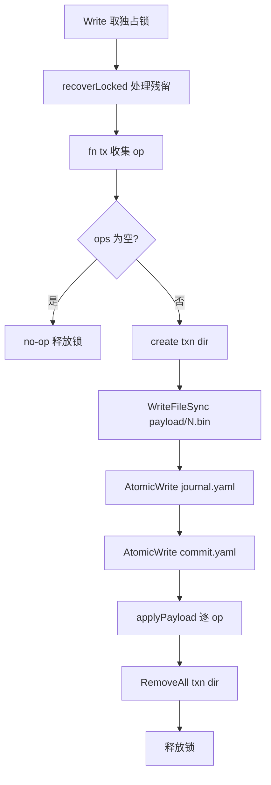
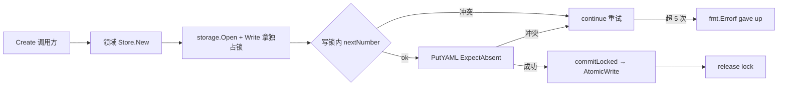
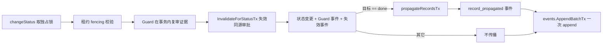

# 可靠文本存储 · 架构设计

## 内部结构

M1 把可靠文本存储分为上下两层；M2 在此之上又新增**只读检查**与**对账/修复**两层，依然全部落在 storage 基元上；M3 又新增**工作流策略**、**审批**、**就绪判定**三层应用逻辑，全部通过 storage 的事务与锁与共享 `internal/domain` 协作，自身不引入新的锁类型：

- **存储基元层** `internal/storage/`：原子写、目录 fsync、项目级共享 / 排他锁、事务 commit / recover 协议、YAML / JSON / JSONL 序列化与 `schema_version` 校验、七个 sentinel 错误；M2 新增只读检查 `Inspect` / `InspectUnlocked`（共享锁不创建文件、不触发恢复）；M3 新增 `Tx.AppendJSONLRaw`（多行 JSONL payload、拒绝空行/CR/缺终止符）与 `Tx.Staged(rel)`（检查本事务是否已暂存该路径）。
- **领域模块层**：`internal/workitem/`、`internal/events/`、`internal/run/`、`internal/record/`、`internal/search/`，外加共享的 `internal/domain/`（记录类型、序列化器、状态机九态图、§5.8 Approval 模型、WorkflowInstance 字段）。领域模块只持有 `*storage.Store`，把 ID 分配、乐观并发、不可变版本链、状态转换与租约领取映射到存储层原语上。M3 起 `workitem.changeStatus` 额外承载 Guard（在转换事务内复审证据并产出事件）、`propagateRecordsTx`（完成时把决策/发现记录的引用广播到父与直接兄弟）、`workflow_instance.go` 五个工作流实例方法（只动 `workflow` 字段）。
- **对账/修复层** `internal/reconcile/`：基于 `storage.Inspect` 的只读 Doctor、调用 `storage.Recover` + `workitem.Release` 的 Recover、确认式 RepairDryRun + RepairApply；自身不持锁。
- **工作流策略层（M3 新增）** `internal/workflow/`：解析 `.devsys/workflows/<id>.md`（YAML front matter + 提示词正文）、结构与值域 located 校验、条件白名单求值、门禁与质量门确定性评分、模板渲染与环境变量展开、last-known-good 缓存（`.devsys/.cache/workflows/<id>.md`）；纯函数 `Resolve` 为统一读取入口（每次重新 Parse、不信 mtime、失败回退快照并带当前 Issue）。
- **审批服务（M3 新增）** `internal/approval/`：持久化 `.devsys/approvals/approval-<N>.yaml`；`Request` / `Decide` / `DecideTx` / `ConsumeTx` / `MatchingGate` / `InvalidateForStatusTx`；消费永远在转换事务的 Guard 内完成，离开阶段即作废未消费的同源审批。
- **就绪判定（M3 新增）** `internal/next/`：纯函数 `Evaluate(Input) Report`，依据待恢复事务、过期/孤儿/不可读租约、滞留审查、阻塞、元数据/策略问题、待决审批输出 PASS/CONCERNS/FAIL 与 §7.4 唯一推荐动作；CLI `devsys next` 只读组装 Input。

平台差异（Windows / POSIX）通过 `//go:build` 标签文件隔离。
### storage 基元层

| 文件 | 角色 | 关键导出 |
|---|---|---|
| `atomic.go` | 单文件原子写基元 | `AtomicWrite`、`WriteFileSync`、`readFileMaybe` |
| `fsync_unix.go` / `fsync_windows.go` | 目录 fsync（Windows 下为 no-op） | `fsyncDir` |
| `lock.go` / `lock_unix.go` / `lock_windows.go` | 项目级共享 / 排他锁；Windows 通过 `kernel32` 动态调用 `LockFileEx` | `acquireLock`、`holderInfo` |
| `serialize.go` | 稳定 YAML/JSON/JSONL、严格解码、`schema_version` 校验 | `EncodeYAML`、`DecodeYAML`、`MarshalJSONL`、`CheckSchemaVersion` |
| `jsonl.go` | JSONL 扫描 / 追加 / 断尾检测 | `InspectJSONL`、`ScanJSONL` |
| `store.go` | `Store` / `Reader` / `Open`、路径解析、读 / 写协议入口 | `Open`、`Read`、`Write`、`Reader` |
| `txn.go` | `Expect` 版本守卫、`Tx` op 收集、commitLocked 协议、写锁内重读、`TxnStageHookForTest` 测试钩子；M3 新增 `AppendJSONLRaw`（多行 payload 一次 append、拒绝空行/CR/缺终止符）与 `Staged(rel)`（本事务已暂存查询，供失效 pass 跳过本事务已写的审批） | `Expect`、`Tx`、`commitLocked`、`ReadForExpect`、`AppendJSONLRaw`、`Staged` |
| `recover.go` | `Recover` / `Diagnose`、恢复 + 诊断 + `opStatuses` | `Recover`、`Diagnose`、`RecoveryReport` |
| `errors.go` | 七个 sentinel 错误（`ErrConflict` / `ErrLockTimeout` / `ErrRecoveryFailed` / `ErrIncompleteTail` / `ErrUnsafePath` / `ErrSchemaVersion` / `ErrNotInitialized`） | 错误变量 |
| `inspect.go`（M2） | 只读检查 `Inspect` / `InspectUnlocked`：共享锁下读、不创建锁文件、不触发恢复；`ErrLockUnavailable` / `ErrPendingTxn` + `PendingTxnError{IDs}` | `Inspect`、`InspectUnlocked` |

| 包 | 落盘目录 | 入口 | 不变量 | 来源 |
|---|---|---|---|---|
| `domain` | — | `WorkItem` / `Run` / `Event` / `Artifact` / `Decision` / `Finding` / `Approval` / `ContextSnapshot` / `WorkflowInstance` 类型；`EncodeYAML` / `DecodeYAML` 包装；M2 状态机九态图与保守转换；M3 `Approval.InvalidatedAt` / `WorkflowInstance.Paused` | `SchemaVersion = 1`；`null` 与 `[]` 在序列化中区分 | [internal/domain/models.go:1-221](file://internal/domain/models.go#L1-L221)、[internal/domain/serialize.go:1-108](file://internal/domain/serialize.go#L1-L108)、[internal/domain/state.go:1-200](file://internal/domain/state.go#L1-200) |
| `workitem` | `.devsys/workitems/<id>.yaml` | M1：`New`、`Create`、`Get`、`List`、`Update`、`ReadSnapshot`、`ValidID`。M2：`Transition` / `ApplyRepair` / `Claim` / `Heartbeat` / `Release` / `Start` / `QueueRetry` / `LeaseInspection` / `ListLeases` / `FenceRunUpdate`。M3：`TransitionRequest.Guard`（`func(*storage.Tx) ([]*domain.Event, error)`）+ `propagateRecordsTx`（完成时同事务广播决策/发现到父与直接兄弟，已存在则跳过） + `workflow_instance.go` 五个实例方法（只改 `workflow` 字段，不写状态/调度/租约；租约活跃时要求 owner+token fencing） | ID = `<PREFIX>-<N>`；CAS `ExpectAbsent` 分配；`ReadSnapshot` 返回原字节给 Update；调度状态与租约由 `Claim` 原子写 | [internal/workitem/workitem.go:1-258](file://internal/workitem/workitem.go#L1-L258)、[internal/workitem/state.go:1-195](file://internal/workitem/state.go#L1-L195)、[internal/workitem/claim.go:1-1019](file://internal/workitem/claim.go#L1-L1019)、[internal/workitem/propagate.go:1-225](file://internal/workitem/propagate.go#L1-L225)、[internal/workitem/workflow_instance.go:1-381](file://internal/workitem/workflow_instance.go#L1-L381) |
| `events` | `.devsys/events/<YYYY-MM>.jsonl` | `New`、`Append`、`Read`、`Comments`；M2 新增 `AppendTx` 让调度在同一事务里追加事件；M3 新增 `AppendBatchTx`（按 shard 分组、一次 append；状态事件 + 传播事件 + 失效事件同批提交） | 按 UTC 年月分片；`reply_to` 仅限 comment 事件且一级；ID 由时间戳 + 4 字节随机派生 | [internal/events/events.go:1-264](file://internal/events/events.go#L1-L264) |
| `run` | `.devsys/runs/<id>.yaml` | `New`、`Create`、`Get`、`List`、`Update`、`ReadSnapshot`、`ValidID` | ID = `run-<YYYYMMDD>-<seq>`，按日分序；CAS `ExpectAbsent` 分配 | [internal/run/run.go:1-268](file://internal/run/run.go#L1-L268) |
| `record` | `.devsys/{decisions,findings,artifacts}/<id>.yaml` | `New`、`CreateDecision` / `CreateFinding` / `CreateArtifact`、`Get*`、`List*`（M3 `ListArtifacts` 给门禁证据收集）、`NewArtifactVersion`、`ArtifactHistory` | `decision-<N>` / `finding-<N>` / `artifact-<N>` 三类独立序号；Artifact 版本链不可变 | [internal/record/record.go:1-351](file://internal/record/record.go#L1-L351) |
| `search` | 无（只读扫描 `.devsys/`） | `Search(devsysDir, query) ([]Match, int, error)` | 排除 `.cache/` 与 `local/`；不持锁；多 worker 扇出，排序保持单线程确定性 | [internal/search/search.go:1-173](file://internal/search/search.go#L1-L173) |
| `workflow`（M3） | `.devsys/workflows/<id>.md` | `Load(root) []FileResult`、`Parse(rel, data)`、`Resolve(ctx, root, id)`（统一读取入口；每次重新 Parse、不信 mtime、成功刷新 LKG、失败回退快照并带 Issue；无快照 fail closed）、`(*Policy).CheckGate(stage, evidence) GateResult`、`ScoreQuality(in) QualityResult`、`(*Policy).StepCandidates(step, facts)`、`(*Policy).NextStep`、`Render(body, vars)`、`ExpandEnv(raw, lookup)` | front matter 行号定位、未知键 warning；结构/类型/必填/交叉引用 error；条件白名单 7 字段；LKG 缓存 `.cache/workflows/<id>.md`（本地、可重建、不提交）；事件 ID 4 字节随机后缀保证同微秒多事件去重 | [internal/workflow/load.go:1-66](file://internal/workflow/load.go#L1-L66)、[internal/workflow/parse.go:1-769](file://internal/workflow/parse.go#L1-L769)、[internal/workflow/condition.go:1-313](file://internal/workflow/condition.go#L1-L313)、[internal/workflow/gate.go:1-73](file://internal/workflow/gate.go#L1-L73)、[internal/workflow/quality.go:1-96](file://internal/workflow/quality.go#L1-L96)、[internal/workflow/steps.go:1-49](file://internal/workflow/steps.go#L1-L49)、[internal/workflow/cache.go:1-122](file://internal/workflow/cache.go#L1-L122)、[internal/workflow/template.go:1-233](file://internal/workflow/template.go#L1-L233) |
| `approval`（M3） | `.devsys/approvals/approval-<N>.yaml` | `Store.Request` / `Decide` / `DecideTx` / `ConsumeTx` / `MatchingGate` / `InvalidateForStatusTx` | 全部写入在事务内重读 + `ExpectHash`；消费永远在转换事务 Guard 内；离开阶段未消费的同源审批自动失效（`invalidated_at` 写入 + `approval_invalidated` 事件并入同批）；`on_reject=block` 默认把工作项转 blocked，`regress:<status>` 回退到指定状态（同样在 Guard 内原子完成） | [internal/approval/approval.go:1-533](file://internal/approval/approval.go#L1-L533) |
| `next`（M3） | （无落盘） | `Evaluate(in Input) Report` | 纯函数；§7.4 固定六优先级推荐；FAIL = 有待恢复事务（§15.4 不输出业务事实）；CONCERNS = 任一风险信号；PASS = 无；exit 恒 0（评估成功），便于脚本按 `verdict` 分支 | [internal/next/evaluate.go:1-316](file://internal/next/evaluate.go#L1-L316) |

### 对账/修复层（M2）

| 包 | 文件 | 入口 | 不变量 | 来源 |
|---|---|---|---|---|
| `reconcile` | `reconcile.go` | `Doctor`（只读）/ `Recover`（`storage.Recover` + 释放过期/孤儿租约）/ `RepairDryRun`（构造 plan 与时间无关 digest）/ `RepairApply`（digest 校验 + 证据 Guard 在写事务内重核 + `workitem.ApplyRepair`） | 只读路径用 `storage.Inspect`，绝不调 `storage.Read`；evidence 含 `sha256 + present/absent`；`Digest` 排除 wall-clock；M3 起 Guard 签名改为 `func(*storage.Tx) ([]*domain.Event, error)`，事件并入 `AppendBatchTx` | [internal/reconcile/reconcile.go:1-904](file://internal/reconcile/reconcile.go#L1-L904) |
| `reconcile` | `reconcile_io.go` | `listSchedulingEntries` / `listWorkitemEntries`（仅在 `Inspect` 回调内调用，不直接走 `storage.Read`） | `os.ErrNotExist` 视为零结果；只接收 `*.yaml` | [internal/reconcile/reconcile_io.go:1-68](file://internal/reconcile/reconcile_io.go#L1-L68) |

```
<root>/
└── .devsys/                       # Open 要求已存在；store.go:60-69
    ├── project.yaml               # 共享：项目根 ID
    ├── config.yaml                # 共享：运行期配置
    ├── state/                     # current.yaml + milestones.yaml
    ├── workitems/                 # 一任务一文件
    ├── events/                    # 按 UTC 年月分片的 JSONL
    ├── runs/                      # run-<YYYYMMDD>-<N>.yaml
    ├── decisions/                 # decision-<N>.yaml
    ├── findings/                  # finding-<N>.yaml
    ├── artifacts/                 # artifact-<N>.yaml（多版本不可变链）
    ├── scheduling/               # M2 调度：<workitem-id>.yaml 租约文件，与 workitem 文件同事务写
    ├── workflows/                # M3 策略：<id>.md（YAML front matter + 提示词正文）
    ├── approvals/                # M3 审批：approval-<N>.yaml
    ├── .cache/                    # 搜索排除；可重建缓存（M3 含 workflows/<id>.md LKG 快照）
    └── local/                     # 不提交；含锁与事务材料
        ├── lock                   # 项目级锁文件（M2：reconcile 只读路径必须存在；缺失即 ErrLockUnavailable）
        └── txn/
            └── <txn-id>/          # commit marker 之前可被读路径检测到
                ├── journal.yaml
                ├── commit.yaml
                └── payload/000.bin, 001.bin, ...
```

`scheduling/` 受管路径同 `workitems/`，由 `workitem.leaseRel` 派生（[internal/workitem/claim.go:941-943](file://internal/workitem/claim.go#L941-L943)）。`reconcile` 通过 `storage.Inspect` 走只读路径，never `storage.Read`（[internal/reconcile/reconcile.go:1-20](file://internal/reconcile/reconcile.go#L1-L20)）。

受管路径（`store.go:90-106`）：slash 格式相对路径；拒绝绝对路径、含 `\` / `:`、`.`、`..`、`local/lock`、`local/txn`、`local/txn/...`。`payloadRel` ([internal/storage/txn.go:242-252](file://internal/storage/txn.go#L242-L252)) 对 payload 引用额外校验 `payload/...` 前缀且无 `..`。

## 关键流程

### 读路径（`Read`）

`store.go:143-166`：最多重试 3 次。每次循环：

1. 取共享锁（`lockShared`）。
2. `pendingTxns` 列出 `.devsys/local/txn/` 下的目录（`recover.go:43-60`，按字典序）。
3. 若无残留事务：调用 `fn(Reader)` 后释放锁并返回。
4. 若有残留：释放共享锁 → `Recover`（独占锁下重放 / 丢弃）→ 回到循环。

3 次循环后仍有事务 → `ErrRecoveryFailed: pending transactions keep appearing; run recovery and retry`。

### 写路径（`Write`）

`store.go:172-190` → `txn.go:258-343`：

1. 取独占锁（`lockExclusive`）；同时拒绝其它共享 / 排他请求。
2. `recoverLocked()` 处理历史残留。
3. 调 `fn(tx)` 收集 `op`（仅在内存中）。
4. `len(tx.ops) == 0` 时不写盘，直接返回。
5. `commitLocked` ([internal/storage/txn.go:258-343](file://internal/storage/txn.go#L258-L343))：re-check preconditions → 创建事务目录 → `WriteFileSync` 各 payload → `AtomicWrite` journal → `txnStage(stageJournalDurable)` → `AtomicWrite` commit marker → `txnStage(stageCommitted)` → 逐个 `applyPayload`（`AtomicWrite` / `appendJSONL`）→ `txnStage(stageApplied(i))` → `os.RemoveAll(dir)` → `txnStage(stageCleaned)`。
6. 释放锁。

`applyPayload` ([internal/storage/txn.go:354-365](file://internal/storage/txn.go#L354-L365)) 把 op 类型映射到 `AtomicWrite`（`opKindPut`）或 `appendJSONL`（`opKindAppend`）。

M3 的「事务内多事件同 shard 一次 append」由 `Tx.AppendJSONLRaw` 承担（[internal/storage/txn.go:179-199](file://internal/storage/txn.go#L179-L199)）：`events.AppendBatchTx` 在同一事务内把同 shard 事件拼成一个 payload 走它，每个 shard 仍只有一次 append，违反 `staged twice` 校验的路径（如审批消费后又让失效 pass 写同一文件）由 `Tx.Staged(rel)` 显式跳过。

### 事务恢复（`Recover` / `recoverLocked`）

`recover.go:34-85` → `recover.go:89-141`：

- 无 commit marker → `verifyUntouched`：每个 Put 目标必须满足 `Expect`；每个 JSONL 目标大小必须等于 `PreSize`。任一不符 → `ErrRecoveryFailed`。
- 有 commit marker → 校验 `journalSHA256`、`OpCount == len(j.Ops)` → `replayTxn` 幂等重放：
  - Put：若文件 hash 等于 payload hash → `skipped`；否则必须满足 `Expect`，再 `AtomicWrite`。
  - Append：若 `Size == PreSize` → `appendJSONL`；若 `Size >= PreSize+PayloadSize` 且区间字节等于 payload → `skipped`；其它 → 错误（`recover.go:218-244`）。



图表来源
- [internal/storage/store.go:168-190](file://internal/storage/store.go#L168-L190)
- [internal/storage/txn.go:258-343](file://internal/storage/txn.go#L258-L343)

### 领域模块写路径

M1 五个领域模块都遵循同一模式：所有变更都在 `Store.Write` 提供的独占事务里完成。

#### CAS ID 分配

`workitem.Create` ([internal/workitem/workitem.go:55-88](file://internal/workitem/workitem.go#L55-L88))、`run.Create` ([internal/run/run.go:51-92](file://internal/run/run.go#L51-L92))、`record.create` ([internal/record/record.go:124-153](file://internal/record/record.go#L124-L153))、`approval.nextNumber` ([internal/approval/approval.go:405-421](file://internal/approval/approval.go#L405-L421)) 共享同一结构：

```text
for range maxAttempts (5):
    err = st.Write(ctx, func(tx *storage.Tx) error {
        next := nextNumber(...)        // 写锁内重扫 max+1
        id   := fmt.Sprintf("%s-%d", kind, next)
        v.ID = id
        v.SchemaVersion = domain.SchemaVersion  // events 也用 0→1 默认；record 在 setID 闭包里设置
        return tx.PutYAML(dirRel+"/"+id+".yaml", v, storage.ExpectAbsent())
    })
    if err == nil                        { return id, nil }
    if errors.Is(err, storage.ErrConflict) { continue }  // 有人先抢；重扫重试
    return "", err
return "", fmt.Errorf("...gave up after %d conflicts", maxAttempts)
```

冲突上限 5 次后放弃，由调用方决定是否提示用户或重试。`record.NewArtifactVersion` ([internal/record/record.go:280-325](file://internal/record/record.go#L280-L325)) 复用同一形态，但 CAS 目标换成新建版本文件（`ExpectAbsent`）而非读取已有版本——读操作用 `tx.ReadForExpect` ([internal/storage/txn.go:167-180](file://internal/storage/txn.go#L167-L180)) 在写锁内获取当前字节。

#### 乐观并发更新

`workitem.Update` ([internal/workitem/workitem.go:156-164](file://internal/workitem/workitem.go#L156-L164))、`run.Update` ([internal/run/run.go:194-202](file://internal/run/run.go#L194-L202))、`approval.DecideTx` ([internal/approval/approval.go:210-257](file://internal/approval/approval.go#L210-L257))、`approval.ConsumeTx` ([internal/approval/approval.go:266-304](file://internal/approval/approval.go#L266-L304)) 走相同契约：

```text
st.Write(ctx, func(tx *storage.Tx) error {
    raw, exists, err := tx.ReadForExpect(rel)
    // ... 解码 raw ...
    return tx.PutYAML(rel, &decoded, storage.ExpectHash(storage.HashBytes(raw)))
})
```

`expected` 是调用方 `ReadSnapshot` 返回的原文件字节；并发写出现 `ErrConflict`，绝不会被静默覆盖。

#### 事件流追加

`events.Append` ([internal/events/events.go:53-82](file://internal/events/events.go#L53-L82)) 把 shard 路径由事件自身的 UTC 时间派生（`events.go:44-47`），12 月的事件 1 月写仍落 12 月分片；ID `ev-<UTC时间戳.微秒>-<8hex>` ([internal/events/events.go:150-157](file://internal/events/events.go#L150-L157)) 无全局计数器——4 字节随机后缀保证同微秒多事件去重（M3Reviewer2 处置）。append 用 `tx.AppendJSONL`，落到 storage 层的事务协议里——中断恢复交给 storage，事件层不做断尾处理（`ErrIncompleteTail` 由 `internal/jsonl.go` 透传）。

M3 起 `AppendBatchTx` 把同 shard 多个事件合并为一个 `AppendJSONLRaw` 调用（`events.go:108-144`），用于状态变更 + 记录传播 + 审批失效三类事件一次性提交（[internal/workitem/state.go:165-183](file://internal/workitem/state.go#L165-L183)）。

#### Artifact 不可变版本链

`record.NewArtifactVersion` ([internal/record/record.go:280-325](file://internal/record/record.go#L280-L325)) 写锁内：
1. `tx.ReadForExpect` 取当前版本字节并 `DecodeYAML` 到 `cur`；
2. `*next = *cur` 浅拷贝全部字段；
3. `next.ID = newID`、`next.Version = cur.Version+1`、`next.PreviousID = &currentID`；
4. `tx.PutYAML(... newID.yaml ..., ExpectAbsent())` 写新文件。

现有版本文件**永不被改写**；`ArtifactHistory` ([internal/record/record.go:329-351](file://internal/record/record.go#L329-L351)) 用 `previous_id` 单向链表反查，链中断（`ErrBadID`）或环（`seen[cursor]`）立即报错。M3 起 `record.ListArtifacts` ([internal/record/record.go:243-258](file://internal/record/record.go#L243-L258)) 给门禁证据收集使用：按 ID 升序列出全部 artifact 版本，门禁从中提取 `Name` 集做 `RequireArtifacts` 校验。



图表来源
- [internal/workitem/workitem.go:55-88](file://internal/workitem/workitem.go#L55-L88)
- [internal/run/run.go:51-92](file://internal/run/run.go#L51-L92)
- [internal/record/record.go:124-153](file://internal/record/record.go#L124-L153)
- [internal/record/record.go:280-325](file://internal/record/record.go#L280-L325)
- [internal/approval/approval.go:405-421](file://internal/approval/approval.go#L405-L421)
- [internal/storage/txn.go:167-180](file://internal/storage/txn.go#L167-L180)

### M2 领取链路（`workitem.Claim`）

`workitem.Claim` ([internal/workitem/claim.go:161-326](file://internal/workitem/claim.go#L161-L326)) 在**一个** `storage.Write` 独占事务里同时写：新建的 Run（通过 `run.CreateTx`）、`.devsys/scheduling/<id>.yaml` 租约文件（`ExpectAbsent`，新 32-char 十六进制 token）、`.devsys/workitems/<id>.yaml`（`status=in_progress, scheduling_state=claimed, lease_*` 字段），最后用 `events.AppendTx(tx, ev)` 追加一条 `claimed` 事件，**不**走第二个 `append_jsonl`（[internal/workitem/claim.go:300](file://internal/workitem/claim.go#L300)、[internal/events/events.go:90-93](file://internal/events/events.go#L90-L93)）。两路径同时争抢时，租约文件的 `ExpectAbsent` 让恰好一方赢，输方拿到 `ErrAlreadyClaimed`（[internal/workitem/claim.go:189-193](file://internal/workitem/claim.go#L189-L193)）。`Heartbeat` / `Release` / `UpdateClaimed` / `FenceRunUpdate` 复用同一锁内事务，但要求调用方…


图表来源
- [internal/workitem/claim.go:161-326](file://internal/workitem/claim.go#L161-L326)
- [internal/workitem/state.go:61-162](file://internal/workitem/state.go#L61-L162)
- [internal/events/events.go:84-93](file://internal/events/events.go#L84-L93)

### M3 转换事务：Guard + 记录传播 + 审批失效（`workitem.changeStatus`）

`changeStatus` ([internal/workitem/state.go:66-188](file://internal/workitem/state.go#L66-L188)) 仍是单一 `storage.Write` 独占事务，但在提交前依次做三件事：

1. **租约 fencing**（M2 沿用，[internal/workitem/state.go:107-127](file://internal/workitem/state.go#L107-L127)）：如果存在租约，校验 `Token/Owner/RunID` 与 `LeaseUntil`，任一不符即 `ErrLeaseTokenMismatch` 或 `ErrLeaseExpired`。
2. **Guard**（M3 新增，[internal/workitem/state.go:128-134](file://internal/workitem/state.go#L128-L134)）：调用 `req.Guard(tx) ([]*domain.Event, error)`，由调用方在事务内复审证据——典型用法是 `approval.ConsumeTx` 在转换事务内把待消费的审批标记为 consumed 并返回 `approval_consumed` 事件；任何 Guard 失败即整单回滚。`ApplyRepair` 的 Guard 走 `reconcile.RepairApply` 的证据复核路径，不返回事件。
3. **审批失效**（M3 新增，[internal/workitem/state.go:136-141](file://internal/workitem/state.go#L136-L141)）：离开 `from` 状态后调用 `approval.InvalidateForStatusTx(tx, devsysDir, id, from, now, reason)` 把所有从该状态申请的未消费、未失效审批标记为 `invalidated_at`，事件并入提交批——保证「离开后回到原状态旧批准不可用」（M3Reviewer6 P1）。

变更落盘后，`changeStatus` 把 `status_changed`（或 `repair_applied`）事件、Guard 事件、失效事件、传播事件一并送入 `events.AppendBatchTx` 一次提交（[internal/workitem/state.go:165-182](file://internal/workitem/state.go#L165-L182)）。`propagateRecordsTx` 仅在目标为 `done` 且非来自 `done` 时触发（[internal/workitem/propagate.go:28-57](file://internal/workitem/propagate.go#L28-L57)）：扫描 `decisions/` 与 `findings/` 中 `RelatedWorkItems` 命中的记录，把 `decision://<id>` / `finding://<id>` 追加到父与直接兄弟的 `context_refs`（同事务 CAS、不改对方状态、已存在则跳过 → 幂等）；无 parent 不广播。父子自环（`parent_id == self`）显式拒绝并回滚（M3Reviewer2 处置）。



图表来源
- [internal/workitem/state.go:66-188](file://internal/workitem/state.go#L66-L188)
- [internal/approval/approval.go:266-304](file://internal/approval/approval.go#L266-L304)
- [internal/approval/approval.go:485-533](file://internal/approval/approval.go#L485-L533)
- [internal/workitem/propagate.go:28-225](file://internal/workitem/propagate.go#L28-L225)
- [internal/events/events.go:108-144](file://internal/events/events.go#L108-L144)

### M3 工作流实例操作（`workitem.workflowWrite`）

`workitem.workflowWrite` ([internal/workitem/workflow_instance.go:336-381](file://internal/workitem/workflow_instance.go#L336-L381)) 是工作流实例的写路径：在一个 `storage.Write` 独占事务里：

1. `tx.ReadForExpect` 取出工作项原字节，`bytes.Equal(raw, expected)` 校验调用方持有的 `--expect` 版本（`workflowWrite` 与 `changeStatus` 同样要求调用方持有 `expected`；`workflow start` / `step-complete` / `pause` / `resume` / `cancel` 在 CLI 层强制 `--expect`）。
2. **租约 fencing**（[internal/workitem/workflow_instance.go:359-363](file://internal/workitem/workflow_instance.go#L359-L363)）：租约活跃时调用方必须提供当前 `LeaseOwner` + `LeaseToken`，否则拒绝——和 `UpdateClaimed` 同契约。
3. `mutate` 闭包重写 `wi.Workflow`（不改 `Status` / `SchedulingState` / 租约字段），返回事件。
4. `tx.PutYAML` 用 `ExpectHash` 写回，`events.AppendTx` 追加事件（同分片）。

实例操作有五类：[WorkflowStart](file://internal/workitem/workflow_instance.go#L108-L149)（首步 + 状态对齐校验）、[WorkflowStepComplete](file://internal/workitem/workflow_instance.go#L151-L240)（首满足候选优先；显式 `--to` 必须命中声明的转换且条件成立；自环拒绝；目标步骤声明 `status` 则当前工作项状态必须匹配）、[WorkflowPause](file://internal/workitem/workflow_instance.go#L243-L254) / [Resume](file://internal/workitem/workflow_instance.go#L257-L265) / [Cancel](file://internal/workitem/workflow_instance.go#L268-L280)（只动 `Workflow` 字段的 `Paused` 与 `Step`）。`WorkflowNext` 只读，调用 `(*Policy).StepCandidates` 列出当前步骤的全部候选与 `satisfied` 标志。

### M3 工作流读取入口（`workflow.Resolve`）

[internal/workflow/cache.go:47-73](file://internal/workflow/cache.go#L47-L73) 是工作流的统一读取入口：

1. 校验 id 形状 `^[a-z][a-z0-9-]*$`，拒绝 `../`、大写、斜杠。
2. `os.ReadFile` 取当前文件：`Parse` 成功 → `refreshLastKnownGood`（best-effort 通过 `storage.Write` 把原文写入 `.devsys/.cache/workflows/<id>.md`，同字节不写）+ 返回 `SourceCurrent`。
3. 当前文件解析失败：尝试 `cachedPolicy` 解析 LKG 快照。**快照损坏视为缺失**，绝不作为回退候选。回退成功返回 `SourceLastKnownGood` + 当前失败 `Issue`；回退失败 fail closed（`workflow policy %q is invalid: %s (no last-known-good retained)`）。
4. 文件不存在但有快照 → 返回 `SourceLastKnownGood` + `Issue{Reason: "missing; using last-known-good"}`；无快照 fail closed。

`workflow check` 命令面沿用 `Load(root)` 直接出每文件 issues；调用方按需决定是 LKG 还是当前文件。

### M3 审批生命周期

`approval.Store` ([internal/approval/approval.go:63-77](file://internal/approval/approval.go#L63-L77)) 把审批封装为「请求 → 决定 → 消费」三段：

- **Request** ([internal/approval/approval.go:101-176](file://internal/approval/approval.go#L101-L176))：写事务内先 `findOpenApproval` 检查同 (work item, stage, requested status) 是否已有未消费、非失效、非 rejected 的开放审批（避免重复请求永悬），再 `nextNumber` 拿下一个 ID，`ExpectAbsent` 写入 + `approval_requested` 事件。CAS 冲突重试 ≤ 5 次。
- **Decide / DecideTx** ([internal/approval/approval.go:187-257](file://internal/approval/approval.go#L187-L257))：写事务内重读 + `ExpectHash`，pending → approved/rejected 转换 + 写入 `DecidedBy` / `DecidedAt` / `Comment`；失效审批（`InvalidatedAt != nil`）拒绝决定。事件 `approval_approved` / `approval_rejected` 由调用方决定走 `AppendTx` 还是合并到 Guard 的 `AppendBatchTx`。
- **ConsumeTx** ([internal/approval/approval.go:266-304](file://internal/approval/approval.go#L266-L304))：仅在调用方写事务（典型是 `workitem.changeStatus` 的 Guard）内调用，校验 approved + 未消费 + 同 work item + 同 stage + 当前状态 = `requested_status`，任一不符 fail closed。写入 `ConsumedAt` + 返回 `approval_consumed` 事件。
- **InvalidateForStatusTx** ([internal/approval/approval.go:485-533](file://internal/approval/approval.go#L485-L533))：在 `changeStatus` 的离开状态分支调用，跳过本事务已暂存的文件（`tx.Staged(rel)`，防止消费后被失效 pass 二次写违反 `staged twice`）→ 把同源未消费、非失效、未 rejected 的审批标记为 `InvalidatedAt` + 返回 `approval_invalidated` 事件。
- **MatchingGate** ([internal/approval/approval.go:372-386](file://internal/approval/approval.go#L372-L386))：门禁判定辅助，列出 `WorkItemID = id` 且 `Status = approved` 且 `Stage = stage` 且 `RequestedStatus = status` 的未消费非失效审批。

`approval reject` 在 CLI 层走 `rejectStageGate` ([internal/cli/cli.go:942-976](file://internal/cli/cli.go#L942-L976))：先 `DecideTx(rejected)`（理由入 `Comment` + `approval_rejected` 事件），再按策略 `on_reject` 决定目标状态（默认 `blocked`，`regress:<status>` 回退），在同一 `workitem.Transition` 事务的 Guard 内完成——任何失败整单回滚，审批保持 pending，错误信息明示「nothing was changed」（M3Reviewer6 P1）。

### M3 就绪判定（`next.Evaluate`）

[internal/next/evaluate.go:113-181](file://internal/next/evaluate.go#L113-L181) 是 §7.4 落点：

1. 收集风险：过期租约 → 孤儿领取 → 不可读调度文件 → 滞留审查（`review`/`verification` 且 `UpdatedAt ≤ now − ReviewStaleAfter(24h)`）→ 阻塞 → 元数据非法 → 策略非法（含「工作项引用缺失策略」）→ 待决审批。
2. 判定：待恢复事务数 > 0 → **FAIL**，并把 `devsys recover …` 写入 `Fixes`；否则有任一风险 → **CONCERNS**；无 → **PASS**。
3. 推荐：`recover_claim`（过期/孤儿）→ `review`（review/verification 或有 pending 审批，按 `updated_at` 升序）→ `start`（ready，按 §7.4 dispatch 排序：priority 降序 → created_at 升序 → id）→ `start_backlog`（backlog 按 created_at 升序）→ `milestone_review`（首个未完成 milestone）→ `report_done`。

CLI `devsys next` ([internal/cli/cli.go:1323-1437](file://internal/cli/cli.go#L1323-L1437)) 是只读组装入口：先调 `reconcile.Doctor` 拿待恢复事务与租约风险；仅在 `InspectionOK && len(pending) == 0` 时列举 workitems 与 pending approvals（不可信状态不输出业务事实，§15.4）；策略问题与缺失策略引用合并入 `PolicyProblems`。输出 `readiness: PASS|CONCERNS|FAIL` + reasons + risks + fixes + next，exit 恒 0。

`lock.go:29-66`：自旋 `LOCK_NB`，起始 5 ms 退避，上限 40 ms；`now().Before(deadline)` 才继续；`ctx.Done()` 立即返回。`holderInfo` 读取独占者留下的 `pid / mode / since`（`lock.go:71-84,96-102`），供 `ErrLockTimeout` 报错点名占用者。

POSIX（`lock_unix.go`）：`flock(LOCK_SH|LOCK_NB)` / `LOCK_EX|LOCK_NB`；`lockContended` 识别 `EWOULDBLOCK` / `EAGAIN`；`transientRenameError` 永远返回 `false`（POSIX rename 原子覆盖）。

Windows（`lock_windows.go`）：`LockFileEx` 锁定偏移 `1<<30` 处一字节（避开文件内容以便读取 holder 描述）；`lockContended` 识别 `ERROR_LOCK_VIOLATION(33)`；`transientRenameError` 识别 `EACCES` 和 `ERROR_SHARING_VIOLATION(32)`——`atomic.go:60-63` 注明这是 Go `os.Open` 不带 `FILE_SHARE_DELETE` 造成的已验证行为。

## 依赖关系

| 调用方 | 被调用方 | 用途 |
|---|---|---|
| `workitem/*` | `storage.Store.{Read,Write,Inspect}`、`Tx.{PutYAML,ReadForExpect,AppendJSONLRaw,Staged}`、`storage.{ExpectAbsent,ExpectHash,HashBytes,ErrConflict}`、`approval.{ConsumeTx,InvalidateForStatusTx}`（M3）、`events.AppendBatchTx`（M3） | 任务 CRUD + CAS 分配 + 乐观并发 + 状态转换 + 租约领取 + 修复 + 工作流实例 + Guard + 传播 |
| `events/*` | `storage.Store.{Read,Write}`、`Tx.AppendJSONL`（单事件）、`Tx.AppendJSONLRaw`（M3 多事件）、M2 `AppendTx(tx, ev)`、M3 `AppendBatchTx(tx, evs)` | 事件 JSONL 追加与分片扫描；状态 + 传播 + 失效三类事件同批提交 |
| `run/*` | `storage.Store.{Read,Write}`、`Tx.{PutYAML,ReadForExpect}`、`storage.{ExpectAbsent,ExpectHash,ErrConflict}` | Run CRUD + CAS 分配 + 乐观并发；M2 由 `Claim` 在同一事务内 `run.CreateTx` |
| `record/*` | `storage.Store.{Read,Write}`、`Tx.{PutYAML,ReadForExpect}`、`storage.{ExpectAbsent,ErrConflict}` | 决策 / 发现 / 工件 CRUD + Artifact 不可变版本链；M3 `ListArtifacts` 给门禁证据收集 |
| `search/*` | （仅 `os.ReadDir`、`filepath.WalkDir`） | 不持锁，纯文本扫描；排除 `.cache/`、`local/` |
| `reconcile/*` | `storage.Store.Inspect` / `InspectUnlocked`、`storage.Recover`、`workitem.{Release,ApplyRepair}`、`domain.{WorkItem,SchedulingLease,DecodeYAML}` | Doctor / Recover / RepairDryRun / RepairApply；M3 Guard 返回 `[]*domain.Event` 并入提交批 |
| `workflow/*`（M3） | `storage.Store.Write`（仅 `refreshLastKnownGood`）、`domain.AllStatuses`（gate key 与 per_status 校验）、`storage.HashBytes`（无）、`yaml.v3`（front matter 解码） | 策略解析 / 条件白名单求值 / 门禁与质量门评分 / 模板与环境变量展开 / LKG 缓存 |
| `approval/*`（M3） | `storage.Store.{Read,Write}`、`Tx.{PutYAML,ReadForExpect}`、`storage.{ExpectAbsent,ExpectHash,ErrConflict}`、`events.AppendTx`、`events.AppendBatchTx`（消费由 Guard 编排） | 审批生命周期 + 同事务消费与失效 |
| `next/*`（M3） | `domain.AllStatuses`、`reconcile.LeaseProbe` 类型、`storage.PendingTxn` 类型 | 纯函数 `Evaluate`；CLI `devsys next` 负责组装 Input |
| 领域包 | `domain.{SchemaVersion,EncodeYAML,DecodeYAML}`、`domain.{allowedTransitions,UnclaimedInitial,TransitionError,Scheduling*}`（M2）、`domain.{Approval,WorkflowInstance,InvalidatedAt}`（M3） | 类型与序列化由 `internal/domain/` 统一提供 |

- **单文件原子性**：临时文件 + rename；POSIX 下 `rename(2)` 原子覆盖；Windows 下重试 `ERROR_ACCESS_DENIED` / `ERROR_SHARING_VIOLATION`。
- **进程中断恢复**：commit marker 是 commit point；存在即幂等重放，不存在即在 `verifyUntouched` 校验后丢弃。
- **乐观并发**：`ExpectHash(HashBytes(expected))` 守卫写事务；冲突直接报 `ErrConflict`，写不被静默吞掉。
- **CAS ID 分配**：每次 `Create` 在写事务内重扫 `max+1` + `PutYAML(ExpectAbsent)`；冲突重试 ≤ 5 次。
- **Artifact 不可变**：版本链 `previous_id` 单向链，新版本是新文件；链断裂或成环立即报错。
- **搜索无索引**：`search` 不持锁、不写状态；结果排序与单线程遍历一致（[internal/search/search.go:1-127](file://internal/search/search.go#L1-L127)）。
- **M2 原子领取**：`workitem.Claim` 一次 `storage.Write` 写齐 run + 租约 + workitem + 事件；任一失败整体回滚；token 与 owner 在 lease_until 之后被 `Release` / `Recover` 一并清理（[internal/workitem/claim.go:161-326](file://internal/workitem/claim.go#L161-L326)）。
- **M2 只读检查**：`storage.Inspect` 共享锁不创建锁文件、不触发事务恢复；缺锁文件报 `ErrLockUnavailable`，有未决事务报 `ErrPendingTxn` + 携带 IDs（[internal/storage/inspect.go:20-41](file://internal/storage/inspect.go#L20-L41)）。
- **M2 确认式修复**：`RepairApply` 必须重新走 `RepairDryRun` 并 digest 校验，再由 `workitem.ApplyRepair` 在写事务内通过 `TransitionRequest.Guard` 重核每条 evidence；任一不符整体拒绝（[internal/reconcile/reconcile.go:357-513](file://internal/reconcile/reconcile.go#L357-L513)、[internal/workitem/state.go:53-59](file://internal/workitem/state.go#L53-L59)）。
- **M3 事务内同 shard 多事件**：`Tx.AppendJSONLRaw` + `events.AppendBatchTx` 让状态变更、Guard 消费、记录传播、审批失效四类事件同 shard 共用一次 append；违反 `staged twice` 由 `Tx.Staged(rel)` 显式跳过已暂存路径。
- **M3 工作流实例只动 `workflow` 字段**：`workflowWrite` 改 `Workflow.Step` / `Paused` / `StepEnteredAt` 与 `UpdatedAt`，不写状态、不写调度态/租约、`scheduling/` 不变；租约活跃要求 owner+token fencing（[internal/workitem/workflow_instance.go:336-381](file://internal/workitem/workflow_instance.go#L336-L381)）。
- **M3 策略 LKG fail-closed**：`Resolve` 每次重新 Parse、不信 mtime；成功刷新快照（best-effort 同字节不写）、失败回退快照并带当前 Issue；无快照 fail closed；坏快照视为缺失。
- **M3 审批消费在转换事务内**：`approval.ConsumeTx` 永远由 `workitem.changeStatus` 的 Guard 触发，任一字段不符 abort 整单；离开状态未消费的同源审批自动失效（`approval_invalidated` 事件并入提交批）。
- **M3 `next` 只读**：`Evaluate` 是纯函数；CLI `devsys next` 不创建锁、不触发恢复、不可信状态不输出业务事实；判定在数据里、exit 恒 0，便于脚本按 `verdict` 分支。
- **尽力 fsync**：每个新文件 `Sync()`；目录 `fsyncDir` 在 Windows 为 no-op（`fsync_windows.go:5-7`）。
