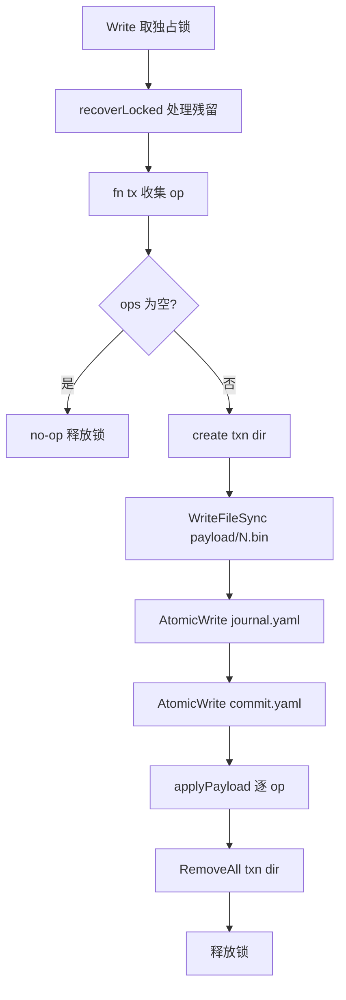
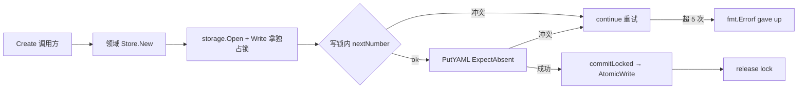

# 可靠文本存储 · 架构设计

## 内部结构

M1 把可靠文本存储分为上下两层：

- **存储基元层** `internal/storage/`：原子写、目录 fsync、项目级共享 / 排他锁、事务 commit / recover 协议、YAML / JSON / JSONL 序列化与 `schema_version` 校验、七个 sentinel 错误。该层提供 `Store.Read` / `Store.Write` / `Tx.Put*` / `Tx.ReadForExpect` 等纯事务 API，不理解业务记录。
- **领域模块层**：`internal/workitem/`、`internal/events/`、`internal/run/`、`internal/record/`、`internal/search/`，外加共享的 `internal/domain/`（记录类型与序列化器）。领域模块只持有 `*storage.Store`，把 ID 分配、乐观并发、不可变版本链映射到存储层原语上。

平台差异（Windows / POSIX）通过 `//go:build` 标签文件隔离。

### storage 基元层

| 文件 | 角色 | 关键导出 |
|---|---|---|
| `atomic.go` | 单文件原子写基元 | `AtomicWrite`、`WriteFileSync`、`readFileMaybe` |
| `fsync_unix.go` / `fsync_windows.go` | 目录 fsync（Windows 下为 no-op） | `fsyncDir` |
| `lock.go` / `lock_unix.go` / `lock_windows.go` | 项目级共享 / 排他锁；Windows 通过 `kernel32` 动态调用 `LockFileEx` | `acquireLock`、`holderInfo` |
| `serialize.go` | 稳定 YAML/JSON/JSONL、严格解码、`schema_version` 校验 | `EncodeYAML`、`DecodeYAML`、`MarshalJSONL`、`CheckSchemaVersion` |
| `jsonl.go` | JSONL 扫描 / 追加 / 断尾检测 | `InspectJSONL`、`ScanJSONL` |
| `store.go` | `Store` / `Reader` / `Open`、路径解析、读 / 写协议入口 | `Open`、`Read`、`Write`、`Reader` |
| `txn.go` | `Expect` 版本守卫、`Tx` op 收集、commitLocked 协议、写锁内重读 | `Expect`、`Tx`、`commitLocked`、`ReadForExpect` |
| `recover.go` | `Recover` / `Diagnose`、恢复 + 诊断 + `opStatuses` | `Recover`、`Diagnose`、`RecoveryReport` |
| `errors.go` | 七个 sentinel 错误（`ErrConflict` / `ErrLockTimeout` / `ErrRecoveryFailed` / `ErrIncompleteTail` / `ErrUnsafePath` / `ErrSchemaVersion` / `ErrNotInitialized`） | 错误变量 |

### 领域模块层

| 包 | 落盘目录 | 入口 | 不变量 | 来源 |
|---|---|---|---|---|
| `domain` | — | `WorkItem` / `Run` / `Event` / `Artifact` / `Decision` / `Finding` / `Approval` / `ContextSnapshot` 类型；`EncodeYAML` / `DecodeYAML` 包装 | `SchemaVersion = 1`；`null` 与 `[]` 在序列化中区分 | [internal/domain/models.go:1-221](file://internal/domain/models.go#L1-L221)、[internal/domain/serialize.go:1-108](file://internal/domain/serialize.go#L1-L108) |
| `workitem` | `.devsys/workitems/<id>.yaml` | `New`、`Create`、`Get`、`List`、`Update`、`ReadSnapshot`、`ValidID` | ID = `<PREFIX>-<N>`；CAS `ExpectAbsent` 分配；`ReadSnapshot` 返回原字节给 Update | [internal/workitem/workitem.go:1-258](file://internal/workitem/workitem.go#L1-L258) |
| `events` | `.devsys/events/<YYYY-MM>.jsonl` | `New`、`Append`、`Read`、`Comments` | 按 UTC 年月分片；`reply_to` 仅限 comment 事件且一级；ID 由时间戳 + 4 字节随机派生 | [internal/events/events.go:1-264](file://internal/events/events.go#L1-L264) |
| `run` | `.devsys/runs/<id>.yaml` | `New`、`Create`、`Get`、`List`、`Update`、`ReadSnapshot`、`ValidID` | ID = `run-<YYYYMMDD>-<seq>`，按日分序；CAS `ExpectAbsent` 分配 | [internal/run/run.go:1-268](file://internal/run/run.go#L1-L268) |
| `record` | `.devsys/{decisions,findings,artifacts}/<id>.yaml` | `New`、`CreateDecision` / `CreateFinding` / `CreateArtifact`、`Get*`、`List*`、`NewArtifactVersion`、`ArtifactHistory` | `decision-<N>` / `finding-<N>` / `artifact-<N>` 三类独立序号；Artifact 版本链不可变 | [internal/record/record.go:1-351](file://internal/record/record.go#L1-L351) |
| `search` | 无（只读扫描 `.devsys/`） | `Search(devsysDir, query) ([]Match, int, error)` | 排除 `.cache/` 与 `local/`；不持锁；多 worker 扇出，排序保持单线程确定性 | [internal/search/search.go:1-173](file://internal/search/search.go#L1-L173) |

### 路径布局

```
<root>/
└── .devsys/                       # Open 要求已存在；store.go:60-69
    ├── project.yaml               # 共享：项目根 ID
    ├── config.yaml                # 共享：运行期配置
    ├── state/                     # current.yaml + milestones.yaml
    ├── workitems/                 # 一任务一文件
    ├── events/                    # 按 UTC 年月分片的 JSONL
    ├── runs/                      # run-<YYYYMMDD>-<N>.yaml
    ├── decisions/                 # decision-<N>.yaml
    ├── findings/                  # finding-<N>.yaml
    ├── artifacts/                 # artifact-<N>.yaml（多版本不可变链）
    ├── .cache/                    # 搜索排除；可重建缓存
    └── local/                     # 不提交；含锁与事务材料
        ├── lock                   # 项目级锁文件
        └── txn/
            └── <txn-id>/          # commit marker 之前可被读路径检测到
                ├── journal.yaml
                ├── commit.yaml
                └── payload/000.bin, 001.bin, ...
```

受管路径（`store.go:90-106`）：slash 格式相对路径；拒绝绝对路径、含 `\` / `:`、`.`、`..`、`local/lock`、`local/txn`、`local/txn/...`。`payloadRel` ([internal/storage/txn.go:242-252](file://internal/storage/txn.go#L242-L252)) 对 payload 引用额外校验 `payload/...` 前缀且无 `..`。

## 关键流程

### 读路径（`Read`）

`store.go:143-166`：最多重试 3 次。每次循环：

1. 取共享锁（`lockShared`）。
2. `pendingTxns` 列出 `.devsys/local/txn/` 下的目录（`recover.go:43-60`，按字典序）。
3. 若无残留事务：调用 `fn(Reader)` 后释放锁并返回。
4. 若有残留：释放共享锁 → `Recover`（独占锁下重放 / 丢弃）→ 回到循环。

3 次循环后仍有事务 → `ErrRecoveryFailed: pending transactions keep appearing; run recovery and retry`。

### 写路径（`Write`）

`store.go:172-190` → `txn.go:258-343`：

1. 取独占锁（`lockExclusive`）；同时拒绝其它共享 / 排他请求。
2. `recoverLocked()` 处理历史残留。
3. 调 `fn(tx)` 收集 `op`（仅在内存中）。
4. `len(tx.ops) == 0` 时不写盘，直接返回。
5. `commitLocked` ([internal/storage/txn.go:258-343](file://internal/storage/txn.go#L258-L343))：re-check preconditions → 创建事务目录 → `WriteFileSync` 各 payload → `AtomicWrite` journal → `txnStage(stageJournalDurable)` → `AtomicWrite` commit marker → `txnStage(stageCommitted)` → 逐个 `applyPayload`（`AtomicWrite` / `appendJSONL`）→ `txnStage(stageApplied(i))` → `os.RemoveAll(dir)` → `txnStage(stageCleaned)`。
6. 释放锁。

`applyPayload` ([internal/storage/txn.go:354-365](file://internal/storage/txn.go#L354-L365)) 把 op 类型映射到 `AtomicWrite`（`opKindPut`）或 `appendJSONL`（`opKindAppend`）。

### 事务恢复（`Recover` / `recoverLocked`）

`recover.go:34-85` → `recover.go:89-141`：

- 无 commit marker → `verifyUntouched`：每个 Put 目标必须满足 `Expect`；每个 JSONL 目标大小必须等于 `PreSize`。任一不符 → `ErrRecoveryFailed`。
- 有 commit marker → 校验 `journalSHA256`、`OpCount == len(j.Ops)` → `replayTxn` 幂等重放：
  - Put：若文件 hash 等于 payload hash → `skipped`；否则必须满足 `Expect`，再 `AtomicWrite`。
  - Append：若 `Size == PreSize` → `appendJSONL`；若 `Size >= PreSize+PayloadSize` 且区间字节等于 payload → `skipped`；其它 → 错误（`recover.go:218-244`）。



图表来源
- [internal/storage/store.go:168-190](file://internal/storage/store.go#L168-L190)
- [internal/storage/txn.go:258-343](file://internal/storage/txn.go#L258-L343)

### 领域模块写路径

M1 五个领域模块都遵循同一模式：所有变更都在 `Store.Write` 提供的独占事务里完成。

#### CAS ID 分配

`workitem.Create` ([internal/workitem/workitem.go:55-88](file://internal/workitem/workitem.go#L55-L88))、`run.Create` ([internal/run/run.go:51-92](file://internal/run/run.go#L51-L92))、`record.create` ([internal/record/record.go:124-153](file://internal/record/record.go#L124-L153)) 共享同一结构：

```text
for range maxAttempts (5):
    err = st.Write(ctx, func(tx *storage.Tx) error {
        next := nextNumber(...)        // 写锁内重扫 max+1
        id   := fmt.Sprintf("%s-%d", kind, next)
        v.ID = id
        v.SchemaVersion = domain.SchemaVersion  // events 也用 0→1 默认；record 在 setID 闭包里设置
        return tx.PutYAML(dirRel+"/"+id+".yaml", v, storage.ExpectAbsent())
    })
    if err == nil                        { return id, nil }
    if errors.Is(err, storage.ErrConflict) { continue }  // 有人先抢；重扫重试
    return "", err
return "", fmt.Errorf("...gave up after %d conflicts", maxAttempts)
```

冲突上限 5 次后放弃，由调用方决定是否提示用户或重试。`record.NewArtifactVersion` ([internal/record/record.go:280-325](file://internal/record/record.go#L280-L325)) 复用同一形态，但 CAS 目标换成新建版本文件（`ExpectAbsent`）而非读取已有版本——读操作用 `tx.ReadForExpect` ([internal/storage/txn.go:167-180](file://internal/storage/txn.go#L167-L180)) 在写锁内获取当前字节。

#### 乐观并发更新

`workitem.Update` ([internal/workitem/workitem.go:156-164](file://internal/workitem/workitem.go#L156-L164))、`run.Update` ([internal/run/run.go:194-202](file://internal/run/run.go#L194-L202)) 走相同契约：

```text
st.Write(ctx, func(tx *storage.Tx) error {
    return tx.PutYAML(dirRel+"/"+v.ID+".yaml", v,
        storage.ExpectHash(storage.HashBytes(expected)))
})
```

`expected` 是调用方 `ReadSnapshot` 返回的原文件字节（[internal/workitem/workitem.go:169-195](file://internal/workitem/workitem.go#L169-L195)、[internal/run/run.go:125-154](file://internal/run/run.go#L125-L154)）；并发写出现 `ErrConflict`，绝不会被静默覆盖。

#### 事件流追加

`events.Append` ([internal/events/events.go:53-82](file://internal/events/events.go#L53-L82)) 把 shard 路径由事件自身的 UTC 时间派生（`events.go:44-47`），12 月的事件 1 月写仍落 12 月分片；ID `ev-<UTC时间戳.微秒>-<4hex>` ([internal/events/events.go:86-93](file://internal/events/events.go#L86-L93)) 无全局计数器。append 用 `tx.AppendJSONL`，落到 storage 层的事务协议里——中断恢复交给 storage，事件层不做断尾处理（`ErrIncompleteTail` 由 `internal/jsonl.go` 透传，[internal/events/events.go:27](file://internal/events/events.go#L27)）。

#### Artifact 不可变版本链

`record.NewArtifactVersion` ([internal/record/record.go:280-325](file://internal/record/record.go#L280-L325)) 写锁内：
1. `tx.ReadForExpect` 取当前版本字节并 `DecodeYAML` 到 `cur`；
2. `*next = *cur` 浅拷贝全部字段；
3. `next.ID = newID`、`next.Version = cur.Version+1`、`next.PreviousID = &currentID`；
4. `tx.PutYAML(... newID.yaml ..., ExpectAbsent())` 写新文件。

现有版本文件**永不被改写**；`ArtifactHistory` ([internal/record/record.go:329-351](file://internal/record/record.go#L329-L351)) 用 `previous_id` 单向链表反查，链中断（`ErrBadID`）或环（`seen[cursor]`）立即报错。



图表来源
- [internal/workitem/workitem.go:55-88](file://internal/workitem/workitem.go#L55-L88)
- [internal/run/run.go:51-92](file://internal/run/run.go#L51-L92)
- [internal/record/record.go:124-153](file://internal/record/record.go#L124-L153)
- [internal/record/record.go:280-325](file://internal/record/record.go#L280-L325)
- [internal/storage/txn.go:167-180](file://internal/storage/txn.go#L167-L180)

### 锁协议

`lock.go:29-66`：自旋 `LOCK_NB`，起始 5 ms 退避，上限 40 ms；`now().Before(deadline)` 才继续；`ctx.Done()` 立即返回。`holderInfo` 读取独占者留下的 `pid / mode / since`（`lock.go:71-84,96-102`），供 `ErrLockTimeout` 报错点名占用者。

POSIX（`lock_unix.go`）：`flock(LOCK_SH|LOCK_NB)` / `LOCK_EX|LOCK_NB`；`lockContended` 识别 `EWOULDBLOCK` / `EAGAIN`；`transientRenameError` 永远返回 `false`（POSIX rename 原子覆盖）。

Windows（`lock_windows.go`）：`LockFileEx` 锁定偏移 `1<<30` 处一字节（避开文件内容以便读取 holder 描述）；`lockContended` 识别 `ERROR_LOCK_VIOLATION(33)`；`transientRenameError` 识别 `EACCES` 和 `ERROR_SHARING_VIOLATION(32)`——`atomic.go:60-63` 注明这是 Go `os.Open` 不带 `FILE_SHARE_DELETE` 造成的已验证行为。

## 依赖关系

| 调用方 | 被调用方 | 用途 |
|---|---|---|
| `storage/store.go` | `lock.go`、`recover.go`、`txn.go` | 协调读 / 写 / 恢复入口 |
| `storage/txn.go::commitLocked` | `atomic.go::AtomicWrite`、`jsonl.go::appendJSONL`、`serialize.go::EncodeYAML` | 写 payloads、journal、commit marker 与目标文件 |
| `storage/recover.go::recoverTxn` | `atomic.go::AtomicWrite`、`jsonl.go::appendJSONL` / `InspectJSONL`、`serialize.go::DecodeYAML` | 读取 / 校验 / 重放 |
| `storage/serialize.go::EncodeYAML` | `vendor/gopkg.in/yaml.v3` | 唯一外部依赖；`go.mod:1-4` 与 `go.sum:3-4` 锁版本 `v3.0.1` |
| `storage/lock.go` | `lock_unix.go` / `lock_windows.go` | 平台差异；`lock_windows.go:28-31` 通过 `syscall.NewLazyDLL("kernel32.dll")` 动态解析 `LockFileEx` |
| `storage/atomic.go` | `fsync_unix.go` / `fsync_windows.go` | 目录 fsync；Windows 为 no-op（`fsync_windows.go:1-7`） |
| `workitem/*` | `storage.Store.{Read,Write}`、`Tx.{PutYAML,ReadForExpect}`、`storage.{ExpectAbsent,ExpectHash,HashBytes,ErrConflict}` | 任务 CRUD + CAS 分配 + 乐观并发 |
| `events/*` | `storage.Store.{Read,Write}`、`Tx.AppendJSONL` | 事件 JSONL 追加与分片扫描 |
| `run/*` | `storage.Store.{Read,Write}`、`Tx.{PutYAML,ReadForExpect}`、`storage.{ExpectAbsent,ExpectHash,ErrConflict}` | Run CRUD + CAS 分配 + 乐观并发 |
| `record/*` | `storage.Store.{Read,Write}`、`Tx.{PutYAML,ReadForExpect}`、`storage.{ExpectAbsent,ErrConflict}` | 决策 / 发现 / 工件 CRUD + Artifact 不可变版本链 |
| `search/*` | （仅 `os.ReadDir`、`filepath.WalkDir`） | 不持锁，纯文本扫描；排除 `.cache/`、`local/` |
| 领域包 | `domain.{SchemaVersion,EncodeYAML,DecodeYAML}` | 类型与序列化由 `internal/domain/` 统一提供 |

## 持久性声明与边界

- **单文件原子性**：临时文件 + rename；POSIX 下 `rename(2)` 原子覆盖；Windows 下重试 `ERROR_ACCESS_DENIED` / `ERROR_SHARING_VIOLATION`。
- **进程中断恢复**：commit marker 是 commit point；存在即幂等重放，不存在即在 `verifyUntouched` 校验后丢弃。
- **乐观并发**：`ExpectHash(HashBytes(expected))` 守卫写事务；冲突直接报 `ErrConflict`，写不被静默吞掉。
- **CAS ID 分配**：每次 `Create` 在写事务内重扫 `max+1` + `PutYAML(ExpectAbsent)`；冲突重试 ≤ 5 次。
- **Artifact 不可变**：版本链 `previous_id` 单向链，新版本是新文件；链断裂或成环立即报错。
- **搜索无索引**：`search` 不持锁、不写状态；结果排序与单线程遍历一致（`internal/search/search.go:1-127`）。
- **尽力 fsync**：每个新文件 `Sync()`；目录 `fsyncDir` 在 Windows 为 no-op（`fsync_windows.go:5-7`）。
- **断电一致性未声明**：`errors.go:6-9`、`atomic.go:17-18` 明确不主张 power-loss 语义——若需要强一致性，需独立验证当前实现（详见 [事务与恢复](事务与恢复.md) 的 `txnStage` 钩子与 `TestCrashRecoveryMatrix`）。
