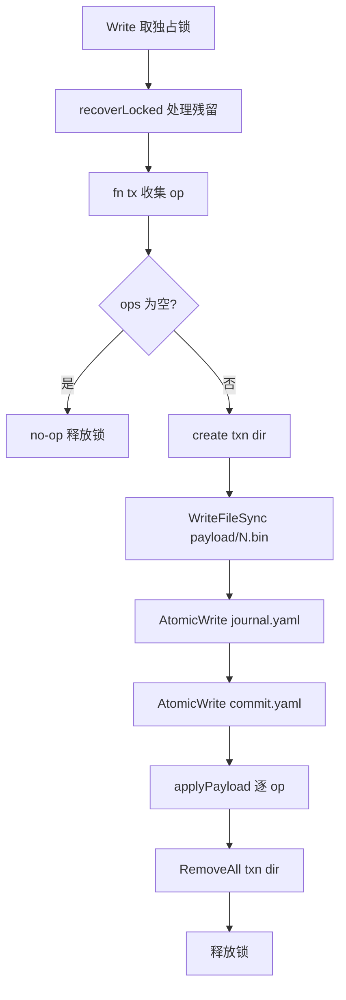

# 可靠文本存储 · 架构设计

## 内部结构

`internal/storage/` 按"基元 → 协调 → 事务"三层组织；平台差异（Windows / POSIX）通过 `//go:build` 标签文件隔离。

| 文件 | 角色 | 关键导出 |
|---|---|---|
| `atomic.go` | 单文件原子写基元 | `AtomicWrite`、`WriteFileSync`、`readFileMaybe` |
| `fsync_unix.go` / `fsync_windows.go` | 目录 fsync（Windows 下为 no-op） | `fsyncDir` |
| `lock.go` / `lock_unix.go` / `lock_windows.go` | 项目级共享 / 排他锁；Windows 通过 `kernel32` 动态调用 `LockFileEx` | `acquireLock`、`holderInfo` |
| `serialize.go` | 稳定 YAML/JSON/JSONL、严格解码、`schema_version` 校验 | `EncodeYAML`、`DecodeYAML`、`MarshalJSONL`、`CheckSchemaVersion` |
| `jsonl.go` | JSONL 扫描 / 追加 / 断尾检测 | `InspectJSONL`、`ScanJSONL` |
| `store.go` | `Store` / `Reader` / `Open`、路径解析、读 / 写协议入口 | `Open`、`Read`、`Write`、`Reader` |
| `txn.go` | `Expect` 版本守卫、`Tx` op 收集、commitLocked 协议 | `Expect`、`Tx`、`commitLocked` |
| `recover.go` | `Recover` / `Diagnose`、恢复 + 诊断 + `opStatuses` | `Recover`、`Diagnose`、`RecoveryReport` |
| `errors.go` | 七个 sentinel 错误（`ErrConflict` / `ErrLockTimeout` / `ErrRecoveryFailed` / `ErrIncompleteTail` / `ErrUnsafePath` / `ErrSchemaVersion` / `ErrNotInitialized`） | 错误变量 |

### 路径布局

```
<root>/
└── .devsys/                       # Open 要求已存在；store.go:60-69
    ├── <managed>/...               # 业务文件；resolve 校验不能逃逸
    └── local/                     # 不提交；含锁与事务材料
        ├── lock                   # 项目级锁文件
        └── txn/
            └── <txn-id>/          # commit marker 之前可被读路径检测到
                ├── journal.yaml
                ├── commit.yaml
                └── payload/000.bin, 001.bin, ...
```

受管路径（`store.go:90-106`）：slash 格式相对路径；拒绝绝对路径、含 `\` / `:`、`.`、`..`、`local/lock`、`local/txn`、`local/txn/...`。`txn.go:230-240` 对 payload 引用额外校验 `payload/...` 前缀且无 `..`。

## 关键流程

### 读路径（`Read`）

`store.go:143-166`：最多重试 3 次。每次循环：

1. 取共享锁（`lockShared`）。
2. `pendingTxns` 列出 `.devsys/local/txn/` 下的目录（`recover.go:43-60`，按字典序）。
3. 若无残留事务：调用 `fn(Reader)` 后释放锁并返回。
4. 若有残留：释放共享锁 → `Recover`（独占锁下重放 / 丢弃）→ 回到循环。

3 次循环后仍有事务 → `ErrRecoveryFailed: pending transactions keep appearing; run recovery and retry`。

### 写路径（`Write`）

`store.go:172-190` → `txn.go:246-332`：

1. 取独占锁（`lockExclusive`）；同时拒绝其它共享 / 排他请求。
2. `recoverLocked()` 处理历史残留。
3. 调 `fn(tx)` 收集 `op`（仅在内存中）。
4. `len(tx.ops) == 0` 时不写盘，直接返回。
5. `commitLocked`：re-check preconditions → 创建事务目录 → `WriteFileSync` 各 payload → `AtomicWrite` journal → `txnStage(stageJournalDurable)` → `AtomicWrite` commit marker → `txnStage(stageCommitted)` → 逐个 `applyPayload`（`AtomicWrite` / `appendJSONL`）→ `txnStage(stageApplied(i))` → `os.RemoveAll(dir)` → `txnStage(stageCleaned)`。
6. 释放锁。

`applyPayload` (`txn.go:343-352`) 把 op 类型映射到 `AtomicWrite`（`opKindPut`）或 `appendJSONL`（`opKindAppend`）。

### 事务恢复（`Recover` / `recoverLocked`）

`recover.go:34-85` → `recover.go:89-141`：

- 无 commit marker → `verifyUntouched`：每个 Put 目标必须满足 `Expect`；每个 JSONL 目标大小必须等于 `PreSize`。任一不符 → `ErrRecoveryFailed`。
- 有 commit marker → 校验 `journalSHA256`、`OpCount == len(j.Ops)` → `replayTxn` 幂等重放：
  - Put：若文件 hash 等于 payload hash → `skipped`；否则必须满足 `Expect`，再 `AtomicWrite`。
  - Append：若 `Size == PreSize` → `appendJSONL`；若 `Size >= PreSize+PayloadSize` 且区间字节等于 payload → `skipped`；其它 → 错误（`recover.go:218-244`）。



图表来源
- [internal/storage/store.go:168-190](file://internal/storage/store.go#L168-L190)
- [internal/storage/txn.go:246-332](file://internal/storage/txn.go#L246-L332)

### 锁协议

`lock.go:29-66`：自旋 `LOCK_NB`，起始 5 ms 退避，上限 40 ms；`now().Before(deadline)` 才继续；`ctx.Done()` 立即返回。`holderInfo` 读取独占者留下的 `pid / mode / since`（`lock.go:71-84,96-102`），供 `ErrLockTimeout` 报错点名占用者。

POSIX（`lock_unix.go`）：`flock(LOCK_SH|LOCK_NB)` / `LOCK_EX|LOCK_NB`；`lockContended` 识别 `EWOULDBLOCK` / `EAGAIN`；`transientRenameError` 永远返回 `false`（POSIX rename 原子覆盖）。

Windows（`lock_windows.go`）：`LockFileEx` 锁定偏移 `1<<30` 处一字节（避开文件内容以便读取 holder 描述）；`lockContended` 识别 `ERROR_LOCK_VIOLATION(33)`；`transientRenameError` 识别 `EACCES` 和 `ERROR_SHARING_VIOLATION(32)`——`atomic.go:60-63` 注明这是 Go `os.Open` 不带 `FILE_SHARE_DELETE` 造成的已验证行为。

## 依赖关系

| 调用方 | 被调用方 | 用途 |
|---|---|---|
| `store.go` | `lock.go`、`recover.go`、`txn.go` | 协调读 / 写 / 恢复入口 |
| `txn.go::commitLocked` | `atomic.go::AtomicWrite`、`jsonl.go::appendJSONL`、`serialize.go::EncodeYAML` | 写 payloads、journal、commit marker 与目标文件 |
| `recover.go::recoverTxn` | `atomic.go::AtomicWrite`、`jsonl.go::appendJSONL` / `InspectJSONL`、`serialize.go::DecodeYAML` | 读取 / 校验 / 重放 |
| `serialize.go::EncodeYAML` | `vendor/gopkg.in/yaml.v3` | 唯一外部依赖；`go.mod:1-4` 与 `go.sum:3-4` 锁版本 `v3.0.1` |
| `lock.go` | `lock_unix.go` / `lock_windows.go` | 平台差异；`lock_windows.go:28-31` 通过 `syscall.NewLazyDLL("kernel32.dll")` 动态解析 `LockFileEx` |
| `atomic.go` | `fsync_unix.go` / `fsync_windows.go` | 目录 fsync；Windows 为 no-op（`fsync_windows.go:1-7`） |

## 持久性声明与边界

- **单文件原子性**：临时文件 + rename；POSIX 下 `rename(2)` 原子覆盖；Windows 下重试 `ERROR_ACCESS_DENIED` / `ERROR_SHARING_VIOLATION`。
- **进程中断恢复**：commit marker 是 commit point；存在即幂等重放，不存在即在 `verifyUntouched` 校验后丢弃。
- **尽力 fsync**：每个新文件 `Sync()`；目录 `fsyncDir` 在 Windows 为 no-op（`fsync_windows.go:5-7`）。
- **断电一致性未声明**：`errors.go:6-9`、`atomic.go:17-18` 明确不主张 power-loss 语义——若需要强一致性，需独立验证当前实现（详见 [事务与恢复](事务与恢复.md) 的 `txnStage` 钩子与 `TestCrashRecoveryMatrix`）。
