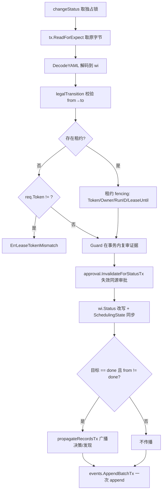

# 状态机与调度

本卡描述工作项的**九状态机、保守转换矩阵、调度态分离、文件级领取/心跳/释放/重试**，以及 M3 起 `TransitionRequest.Guard`（事务内复审证据）、`propagateRecordsTx`（完成事务内把决策/发现记录引用广播到父与直接兄弟）、`workflow_instance.go` 五类实例操作（只动 `workflow` 字段，租约 fencing）。

## 状态机

工作项九状态由 [internal/domain/state.go](file://internal/domain/state.go) 定义：

| 状态 | 含义 |
|---|---|
| `draft` | 起草，初始状态 |
| `backlog` | 待规划池 |
| `ready` | 可领取 |
| `in_progress` | 已被领取且有活跃租约 |
| `review` | 实施完成等待审阅 |
| `verification` | 审阅完成等待验证 |
| `done` | 已完成（终态） |
| `blocked` | 阻塞（保留 `PreviousStatus` 以便恢复） |
| `cancelled` | 已取消（终态） |

`done` 与 `cancelled` 是终态，**不可再转换**（除 `ApplyRepair` 路径）。

### 转换矩阵

由 `domain.IsTransitionLegal(from, to)` 判定（[internal/domain/state.go](file://internal/domain/state.go)），`domain.AllowedFrom(from)` 给出所有合法下一步。完整矩阵：

| from \ to | draft | backlog | ready | in_progress | review | verification | done | blocked | cancelled |
|---|---|---|---|---|---|---|---|---|---|
| draft | — | ✓ | ✓ | — | — | — | — | ✓ | ✓ |
| backlog | ✓ | — | ✓ | — | — | — | — | ✓ | ✓ |
| ready | ✓ | ✓ | — | ✓ | — | — | — | ✓ | ✓ |
| in_progress | — | — | — | — | ✓ | — | — | ✓ | ✓ |
| review | — | — | ✓ | ✓ | — | ✓ | — | ✓ | ✓ |
| verification | — | — | — | — | ✓ | — | ✓ | ✓ | ✓ |
| done | — | — | — | — | — | — | — | — | — |
| blocked | ✓ ① | ✓ ① | ✓ ① | — | — | — | — | ✓ | ✓ |
| cancelled | — | — | — | — | — | — | — | — | — |

① 仅在 `blocked.PreviousStatus` 等于目标状态时合法（[internal/workitem/state.go:96-98](file://internal/workitem/state.go#L96-L98)）。其余 `blocked` 仅可转 `cancelled` 或保持 `blocked`。

`ApplyRepair` 的合法转换走 `legalRepairTransition`（[internal/workitem/state.go:207-210](file://internal/workitem/state.go#L207-L210)），比 `Transition` 更宽松；调用方必须提供 `Confirmation` digest 与 `Guard`，两者缺一即拒绝（[internal/workitem/state.go:58-61](file://internal/workitem/state.go#L58-L61)）。

### 拒绝面

非法转换返回 `domain.TransitionError{From, To, Allowed, Reason}`（[internal/domain/state.go](file://internal/domain/state.go)）；CLI 层把 `TransitionError` 通过 `app.storeError` 走 `KindInvalid` 升为 `CodeInvalid = 4`，`Allowed` 列表在 stderr 逐条渲染（[internal/app/workitem.go:460-484](file://internal/app/workitem.go#L460-L484)）。

## 调度态与业务状态分离

工作项的两套字段必须**始终一致**：

| 业务状态 | `SchedulingState` |
|---|---|
| `draft` / `backlog` / `ready` | `SchedulingUnclaimed` |
| `in_progress` | `SchedulingClaimed`（必须有租约文件 `.devsys/scheduling/<id>.yaml`） |
| `review` / `verification` / `done` / `cancelled` | `SchedulingReleased`（租约必须已释放） |

`changeStatus` 写入新状态前会自动设置 `SchedulingState`（[internal/workitem/state.go:162-175](file://internal/workitem/state.go#L162-L175)）；离开 `in_progress` 时若租约仍活跃 → `ErrAlreadyClaimed: release claim before advancing status`（[internal/workitem/state.go:159-161](file://internal/workitem/state.go#L159-L161)），必须先 `Release` 或 `Heartbeat` 续约。d726ed4 起租约 fencing 失败细节升级为「`workitem <id> is leased by "<owner>" (run <run-id>); release the claim before leaving execution: devsys workitem release --id <id> --owner <owner> --token <token from .devsys/local/leases/<id>.token> --actor <actor> --reason <reason>`」——`transition` 没有 `--token` 标记，提示明确指向释放路径，token 从本机侧车 `local/leases/<id>.token` 取（[internal/workitem/state.go:119-128](file://internal/workitem/state.go#L119-L128)）。

## 状态机写路径：单一 `changeStatus`

**所有状态变更**都走 `workitem.changeStatus`（[internal/workitem/state.go:66-195](file://internal/workitem/state.go#L66-L195)）。它是 M2 起既有的唯一入口，M3 在事务内额外承担 Guard、记录传播、审批失效三件事。

事务流程（一次 `storage.Write`）：



任何步骤失败都回滚整个事务；状态字段由 `changeStatus` 改写，`Update` 拒绝状态变更（[internal/workitem/workitem.go:173-227](file://internal/workitem/workitem.go#L173-L227)）。

### M3 Guard：事务内复审证据

`TransitionRequest` 新增 `Guard func(*storage.Tx) ([]*domain.Event, error)`（[internal/workitem/state.go:23-36](file://internal/workitem/state.go#L23-L36)）。Guard 在事务内、状态字段改写**之前**被调用：

- 典型用法：`approval.ConsumeTx` 在 Guard 内把门禁所依赖的审批标记为 consumed，返回 `approval_consumed` 事件。
- `ApplyRepair` 的 Guard 走 `reconcile.RepairApply` 的证据复核路径，不返回事件。

Guard 返回的事件与 `status_changed` / 失效事件 / 传播事件**一起**送入 `events.AppendBatchTx`（[internal/workitem/state.go:167-190](file://internal/workitem/state.go#L167-L190)），保证状态、Guard、失效、传播四类事件在同事务内一次 append。

`Transition`（非 repair）也支持 Guard；`ApplyRepair` 强制 `Guard != nil` 且 `len(Confirmation) > 0`（[internal/workitem/state.go:58-61](file://internal/workitem/state.go#L58-L61)）。

### M3 审批失效：离开阶段即作废

离开 `from` 状态时，`changeStatus` 调用 `approval.InvalidateForStatusTx(tx, devsysDir, id, from, now, reason)`（[internal/workitem/state.go:143-149](file://internal/workitem/state.go#L143-L149)）：

- 仅作用域内同 `WorkItemID` 且 `RequestedStatus == from` 的审批会被处理。
- 已 consumed 或已 invalidated 的审批跳过。
- 通过 `tx.Staged(rel)` 跳过本事务已暂存的文件——防止消费后被失效 pass 二次写违反 `staged twice`。
- 每条失效审批写一份 `approval_invalidated` 事件，事件 join 提交批。

这是 M3Reviewer6 P1「离开后回到原状态旧批准仍可用」的修：回原状态后必须重新 `Request`。

### M3 记录传播：完成事务内广播

仅在目标为 `done` 且来自非 `done` 时触发 `propagateRecordsTx`（[internal/workitem/state.go:183-189](file://internal/workitem/state.go#L183-L189)、[internal/workitem/propagate.go:28-59](file://internal/workitem/propagate.go#L28-L59)）：

1. `relatedRecordRefs` 扫描 `decisions/` 与 `findings/`，挑出 `RelatedWorkItems` 包含本工作项的记录，按文件名字典序返回 `decision://<id>` / `finding://<id>` 引用。
2. `propagationTargets` 取父与所有直接兄弟（按 id 排序）。
3. `propagateToTarget` 对每个目标 `tx.ReadForExpect` → `DecodeYAML` → 追加缺失引用 → `PutYAML`（`ExpectHash` 守卫）→ 返回 `record_propagated` 事件。
4. 目标已包含全部引用 → 跳过写盘与事件（幂等）。
5. 父子自环（`parent_id == self`）显式拒绝并回滚完成（M3Reviewer2 处置，[internal/workitem/propagate.go:32-34](file://internal/workitem/propagate.go#L32-L34)）。
6. 无 `ParentID` 或为空 → 不广播。

记录传播事件与 `status_changed`、Guard 事件、失效事件一并 `AppendBatchTx` 提交，每个 shard 只一次 append。

## 租约：文件级 token fencing

### 文件与字段

`.devsys/scheduling/<workitem-id>.yaml`，ID 与工作项 ID 同形。结构由 `domain.SchedulingLease` 定义：

```yaml
schema_version: 1
workitem_id: WLM-1
owner: alice
claimed_at: 2026-09-18T12:00:00Z
lease_until: 2026-09-18T13:00:00Z
run_id: run-20260918-1
head_sha: …
agent_id: …
agent_harness: …
```

**#342（v0.1.4，9aab68f）起持久化文件不携带 token**：`token` 字段仍留在 `domain.SchedulingLease` 结构里（解码旧树兼容），但 `Claim` 写租约时不再填充它——token 由 `crypto/rand` 生成 32 字符 hex（16 字节随机，128 bit，[internal/workitem/claim.go:1031-1037](file://internal/workitem/claim.go#L1031-L1037)），经 `ClaimResult.Token` 交给领取方，同时以**本地侧车** `local/leases/<id>.token` 写在同一事务内（`local/` 已被 `.gitignore` 与 `search` 排除，[internal/workitem/lease_token.go:13-28](file://internal/workitem/lease_token.go#L13-L28)）。租约文件保留 `owner / claimed_at / lease_until / run_id` 等元数据随 git 可见，用于跨设备漂移检测；`Heartbeat` / `Release` / `workflowWrite` 经 `tokenFromTx` 对照侧车校验 presented token，侧车缺失时回落 persisted 值，旧树在 claim 轮换前保持可校验（[internal/workitem/lease_token.go:31-49](file://internal/workitem/lease_token.go#L31-L49)）。`Store.LeaseToken(ctx, id)` 供本地操作者（dispatch tick、`devsys recover`）在不持有 token 时读取当前 token（[internal/workitem/lease_token.go:78-100](file://internal/workitem/lease_token.go#L78-L100)）。没有续签秘密、过期由 `doctor` 报告、`recover` 释放。

### 领取（`workitem.Claim`）

[internal/workitem/claim.go:192-346](file://internal/workitem/claim.go#L192-L346) 在**一个** `storage.Write` 独占事务里写齐四件事：

1. `run.CreateTx` 写入 `runs/run-<YYYYMMDD>-<N>.yaml`。
2. `leaseRel` 用 `ExpectAbsent` 创建租约文件（恰好一个胜者，输方拿 `ErrAlreadyClaimed`）。
3. `workitemRel` 用 `ExpectHash` 写 `status=in_progress, scheduling_state=claimed, lease_owner, lease_claimed_at, lease_until`（#342 起不写 `lease_token`）。
4. `stageToken(tx, id, token)` 写本地侧车 + `events.AppendTx(tx, ev)` 追加一条 `claimed` 事件。

并发争抢：租约文件 `ExpectAbsent` 让恰好一方胜出；输方拿到 `ErrAlreadyClaimed`（[internal/workitem/claim.go:308-309](file://internal/workitem/claim.go#L308-L309)）。

`Heartbeat` / `Release` / `UpdateClaimed` / `FenceRunUpdate` 复用同一锁内事务，但要求调用方持有当前 `Owner + Token + RunID`（与 `--expect` 类似但针对租约；token 以侧车为准）。

### 心跳 / 释放 / 重试

- `Heartbeat` 续约 `lease_until` 与 `heartbeat_at`；要求 `Token/Owner` 匹配（经侧车校验）且 `now < lease_until`。
- `Release` 删除租约文件、删除侧车（`dropToken`），并把工作项调度态回到 `released`（要求 `Token/Owner` 匹配，经侧车校验；[internal/workitem/claim.go:448-563](file://internal/workitem/claim.go#L448-L563)）。缺 owner/token 时报错并指明「expired or orphaned leases are recovered with `devsys recover` instead」（[internal/workitem/claim.go:488-490](file://internal/workitem/claim.go#L488-L490)）。
- `ReleaseOptions` 的恢复路径 `ForExpired=true`（要求已验证 `lease_until < now`）与 `ForOrphan=true`（要求绑定 run 文件缺失）**绕过 owner/token**，由 `devsys recover` 使用；#342 起新增 run-bound 释放 `ForCompleted=true`（要求租约属于已 `succeeded` 的绑定 run）与 `ForRefused=true`（要求绑定 run 带有记录的拒绝 `Verification.Advanced=false`），以 run 记录为证明、不要求 owner/token，也不会误杀更新的 claim（[internal/workitem/claim.go:100-122](file://internal/workitem/claim.go#L100-L122)）。
- `QueueRetry` 把工作项转 `blocked`（保留 `PreviousStatus`）并释放租约；恢复时从 `PreviousStatus` 回到原状态。
- `doctor` 通过 `storage.Inspect` 报告过期/孤儿租约；`recover` 在写事务内调用 `storage.Recover` + `workitem.Release` 释放并写 `lease_recovered` 事件；`repair` 不处理租约（`lease_recovered` 是显式恢复路径的事件）。

## M3 工作流实例操作

`internal/workitem/workflow_instance.go` 提供五类操作（[internal/workitem/workflow_instance.go:111-387](file://internal/workitem/workflow_instance.go#L111-L387)），**只改 `wi.Workflow` 字段 + 事件**，**不**写状态、不写调度态/租约/`scheduling/`。

### 字段

```go
type WorkflowInstance struct {
    ID             string  // 策略 id
    Step           string  // 当前步骤 id（终态为 "done" / "cancelled"）
    Paused         bool    // M3 新增
    StepEnteredAt  time.Time
}
```

`Paused` 是 M3 新增的唯一领域模型字段（[internal/domain/models.go](file://internal/domain/models.go)），向后兼容：旧 `WorkItem` 解码 `Paused` 默认为 `false`。

### 五类操作

| 操作 | 入口 | 副作用 | 拒绝面 |
|---|---|---|---|
| `WorkflowStart` | `devsys workflow start --id … --policy … --actor … --reason … [--expect …] [--owner … --token …]` | 写 `wi.Workflow = {ID: policy.ID, Step: policy.Steps[0].ID}` + `workflow_started` 事件；首步声明 `status` 时要求当前工作项状态匹配 | 已存在 instance、终态工作项、首步 status 不匹配 |
| `WorkflowStepComplete` | `devsys workflow step-complete --id … [--to …] --actor … --reason … [--expect …] [--owner … --token …]` | 按声明序取首满足候选（或显式 `--to`）；目标步骤声明 `status` 时要求当前状态匹配；自环拒绝 | 无 instance、instance 终态、instance paused、`--to` 未声明或条件不满足、目标 status 不匹配 |
| `WorkflowPause` / `WorkflowResume` / `WorkflowCancel` | `devsys workflow pause/resume/cancel --id … --actor … --reason … [--expect …] [--owner … --token …]` | `Workflow.Paused` 或 `Step = "cancelled"` + 对应事件 | 无 instance、终态 / 已暂停 / 未暂停 / 已取消 |

所有实例操作共用 `workflowWrite`（[internal/workitem/workflow_instance.go:336-387](file://internal/workitem/workflow_instance.go#L336-L387)）：

1. `tx.ReadForExpect` 取原字节 → `bytes.Equal` 校验 `--expect`（`--expect` 是 `workitem get` 的 `version` 字段，64-hex sha256）。
2. **租约 fencing**：若 `wi.LeaseOwner != ""` 且 `wi.LeaseUntil != nil`，要求 `opts.Owner == wi.LeaseOwner` 且 `opts.Token` 经 `tokenFromTx` 与本地侧车（旧 persisted 值兜底）校验通过，否则 `ErrInvalidInput: <id> is claimed (lease active); pass the current lease owner and token`（M3Reviewer5 ④；#342 起校验源从 persisted 字段改为侧车，[internal/workitem/workflow_instance.go:355-365](file://internal/workitem/workflow_instance.go#L355-L365)）。这是与 `UpdateClaimed` 相同的契约：实例操作必须由当前持有者执行。
3. `mutate` 闭包重写 `wi.Workflow` 字段 → 返回事件。
4. `tx.PutYAML(workitemRel, &wi, ExpectHash(HashBytes(raw)))` + `events.AppendTx(tx, ev)`。

`WorkflowNext` 只读：列出当前步骤的全部候选与 `satisfied` 标志（[internal/workitem/workflow_instance.go:311-327](file://internal/workitem/workflow_instance.go#L311-L327)）。

### 条件求值

`transitions[].when` 是声明式条件（[internal/workflow/condition.go](file://internal/workflow/condition.go)），`<field> <op> <literal>` 形态：

- 操作符：`==` `!=` `<` `>` `in` `exists`
- 白名单字段（`factWhitelist`）：`workitem.id` / `workitem.status` / `workitem.type` / `workitem.priority` / `workitem.clarification_needed` / `workitem.approval_required` / `workitem.parent_id`
- 类型规则：`<` `>` 仅 int；`in` 仅 string；`exists` 仅 `workitem.parent_id`
- 字符串字面量支持单/双引号包裹；`in` 字面量列表支持逗号后空格、去重、拒绝空成员
- 不支持复合表达式（`&&` / `||` / `()`）；未知字段/操作符/类型不匹配在**加载期**报错（`workflow.Parse`）
- `Eval(Facts)` 是纯函数：把 `domain.WorkItem` 投影到 `Facts` 后逐字段比较

### 候选与首满足

`(*Policy).StepCandidates(step, facts)` 按声明序返回当前步骤的全部 `Transition` 与 `satisfied` 标志（[internal/workflow/steps.go:16-29](file://internal/workflow/steps.go#L16-L29)）。`WorkflowStepComplete`：

- 自动模式：取声明序中第一个 `satisfied && To != 当前 step` 的候选（自环候选跳过）。
- 显式 `--to`：要求命中声明的转换且 `satisfied`，否则拒绝并返回 `allowed` 列表（`WorkflowStepError.Step / Reason / Allowed`，[internal/workitem/workflow_instance.go:32-45](file://internal/workitem/workflow_instance.go#L32-L45)）。

## 错误分类与退出码

工作项 / 状态机 / 工作流错误在 CLI 层统一走 `app.storeError` + `app.Error{Kind}`（[internal/app/workitem.go:460-484](file://internal/app/workitem.go#L460-L484)）；各 handler 用 `errUsage / errPrecondition / errInvalid` 三个工厂（[internal/cli/cli.go:125-145](file://internal/cli/cli.go#L125-L145)）造 `codedError`：

| 错误 | 退出码 | kind |
|---|---|---|
| `storage.ErrNotInitialized` / `workitem.ErrNotFound` / `approval.ErrNotFound` / `record.ErrNotFound` / `run.ErrNotFound` | 3 | precondition |
| `--expect` 哈希不匹配（`storage.ErrConflict`） | 4 | invalid |
| `workitem.ErrBadID`（d726ed4 起读写入口前移 `ValidID` 拦截） | 2 | usage |
| `domain.TransitionError` / `domain.AllowedFrom` 拒绝 | 4 | invalid（workitem） |
| `workitem.WorkflowStepError` | 4 | invalid（workitem） |
| `approval.ErrInvalidated` / `approval.ErrMismatch` / `approval.ErrNotApproved` / `approval.ErrAlreadyConsumed` | 4 | invalid（approval） |
| `workflow.Policy` 非法（`workflow.Resolve` 失败且无 LKG） | 4 | invalid（workflow） |
| 各命令缺必填参数（如 `workitem transition` 缺 `--to` / `--actor` / `--reason` / `--expect | --latest`） | 2 | usage |

M3 起 `approval.Error` 系列统一以 `codedError{kind: "approval", code: 4}` 输出，与 `kind="workitem"` 同级，调用脚本按 `code` 分支。b89ffae 起 `require_approval` 阶段门缺失时若审批曾被 `InvalidatedFor` 作废，`Policy.CheckGate` 把 `ApprovalNote` 拼到 missing 文案末尾（[internal/workflow/gate.go:73-77](file://internal/workflow/gate.go#L73-L77)）——判定与退出码不变。

## 调用契约示例

```sh
# 状态机转换
V=$(bin/devsys.exe --json workitem get WLM-1 | jq -r .version)
bin/devsys.exe workitem transition --id WLM-1 --to in_progress \
    --actor alice --reason "kickoff" --expect "$V"

# 审批门禁（默认 on_reject=blocked）
bin/devsys.exe approval request --id WLM-1 --stage in_progress --actor alice --reason "gate"
bin/devsys.exe approval approve --id approval-1 --by boss --comment ok
# 转换在同一事务消费：工作项进入 in_progress + approval-1 consumed

# 工作流实例推进（要求当前 lease owner + token）
bin/devsys.exe workflow start --id WLM-1 --policy quick-fix --actor alice --reason begin --expect "$V" \
    --owner alice --token <lease-token>
bin/devsys.exe workflow step-complete --id WLM-1 --actor alice --reason next --expect "$V" \
    --owner alice --token <lease-token>
```

## 本批（M#337，commit 362b637）

M#337 在工作项存储侧把 `Store.List` 空集合的返回值从不固定改为稳定的非 nil `[]*domain.WorkItem{}`：

- `internal/workitem/workitem.go:Store.List`（[internal/workitem/workitem.go:133-171](file://internal/workitem/workitem.go#L133-L171)）把 `items` 初始化为 `items := []*domain.WorkItem{}`，不再用 `var items []*domain.WorkItem` 隐式 nil。空集合 → `(non-nil empty slice, nil)`；非空 → `(slice, nil)`。
- 这是与 reconcile `readAllWorkitems`（M#337 同时段新增的不可信集合）的对比：`readAllWorkitems` 仍返回 `var items []*domain.WorkItem`（可 nil），因为它面向对账子路径、需要「无文件」与「空文件集合」区分；`Store.List` 面向 `devsys workitem list` / MCP `workitem_list` 等消费者，统一返回非 nil 让下游可直接 `len(...) == 0` 判定 / JSON 序列化 `[]` 而无需 nil 守卫。
- 顺序契约不变：按数字序号稳定排序，不依赖目录枚举顺序或 mtime。
- 调用方不需要修改：所有 `range items`、`len(items)` 行为保持一致；唯一变化是空集合时 `items == nil` 不再成立——之前会写出 `null` 的 JSON 现在统一为 `[]`。

## 与其他层的关系

- [架构设计](架构设计.md) — `changeStatus` / `workflowWrite` / `approval.*` / `events.AppendBatchTx` 的整体流程
- [对账与修复](对账与修复.md) — `ApplyRepair` 与 `RepairApply` 的 Guard 路径；租约的 doctor/recover 报告与释放
- [领域记录与事件](领域记录与事件.md) — `Record.ListArtifacts`、`events.AppendBatchTx`、`propagateRecordsTx` 的细节
