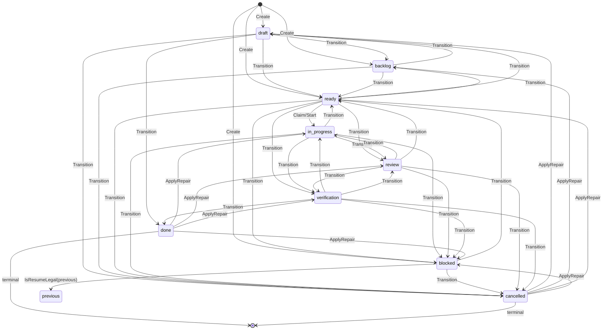

# 可靠文本存储 · 状态机与调度

本卡描述 M2 的任务生命周期：`internal/domain/state.go` 的九状态图与 `internal/workitem/{state,claim}.go` 在 storage 基元之上提供的 Transition / ApplyRepair / Claim / Heartbeat / Release / Start / QueueRetry 等调度入口。所有写操作都跑在 `internal/storage` 的独占事务之上，workitem YAML、lease YAML、Run YAML、events JSONL 同事务落盘；任何索引外路径都不会绕过 fencing。

## 九状态与保守图（§6）

`internal/domain/state.go` 把 §6.1 的九个合法状态定义为字符串常量：

- `draft`、`backlog`、`ready`、`in_progress`、`blocked`、`review`、`verification`、`done`、`cancelled`（[internal/domain/state.go:17-27](file://internal/domain/state.go#L17-L27)）。

`allowedTransitions`（[internal/domain/state.go:62-112](file://internal/domain/state.go#L62-L112)）是图的核心。关键性质：

- 终态 `done` / `cancelled` 的出边表为空，**任何**正常路径都不能从终态走出。
- `blocked` 只有显式的 `ready` 与 `cancelled` 两条边；回退到原本状态由调用方在 `TransitionRequest.PreviousStatus` 里携带原状态经 `IsResumeLegal` 校验。
- 正向跳过：`ready → review / verification`、`in_progress → verification`，对应 §6.3「任务无实现阶段或 review 被配置关闭」的形态。

图表来源：

- [internal/domain/state.go:62-112](file://internal/domain/state.go#L62-L112) — `allowedTransitions` 完整定义。
- [internal/domain/state.go:143-155](file://internal/domain/state.go#L143-L155) — `IsResumeLegal` 的 `blocked → previous` 边。
- [internal/workitem/state.go:164-184](file://internal/workitem/state.go#L164-L184) — `legalTransition` 与 `legalRepairTransition` 在运行期按图裁决。

### Create 初始状态白名单

`UnclaimedInitial = {draft, backlog, ready, blocked}`（[internal/domain/state.go:123-128](file://internal/domain/state.go#L123-L128)），由 `workitem.Create` 在写事务前强制校验（[internal/workitem/workitem.go:67-69](file://internal/workitem/workitem.go#L67-L69)）。其余状态（含 `done` / `cancelled` 等终态）一律返回 `ErrInvalidInput`。`AllowedFrom("")` 把这四个状态作为初始允许集输出（[internal/domain/state.go:159-167](file://internal/domain/state.go#L159-L167)），供 CLI/MCP 报错时复用。

### 走图裁决函数

- `IsTransitionLegal(from, to)`（[internal/domain/state.go:132-141](file://internal/domain/state.go#L132-L141)）：纯表查；`from == ""` 时退化为 `UnclaimedInitial`。
- `IsResumeLegal(from, to, previous)`（[internal/domain/state.go:147-155](file://internal/domain/state.go#L147-L155)）：`from == blocked` 且满足静态图或 `to == previous && previous != ""`。
- `AllowedFrom(current)`（[internal/domain/state.go:159-174](file://internal/domain/state.go#L159-L174)）：返回所有合法下一状态（排序后），驱动 `TransitionError.Allowed` 与 CLI/MCP 提示。
- `IsTerminal(status)`（[internal/domain/state.go:116-119](file://internal/domain/state.go#L116-L119)）：出边表空即为终态。
- `TransitionError`（[internal/domain/state.go:179-193](file://internal/domain/state.go#L179-L193)）：错误结构体携带 `From/To/Allowed/Reason`，让上层不必再走 `AllowedFrom`。

## Transition vs ApplyRepair

`internal/workitem/state.go` 公开两个变更入口：

- `Transition(ctx, id, TransitionRequest, expected)`（[internal/workitem/state.go:46-51](file://internal/workitem/state.go#L46-L51)）— 正常路径；强制 `req.AllowRepair == false`，否则 `ErrInvalidInput`。
- `ApplyRepair(ctx, id, TransitionRequest, expected)`（[internal/workitem/state.go:53-59](file://internal/workitem/state.go#L53-L59)）— 修复路径；必须同时满足 `AllowRepair && len(Confirmation) > 0 && Guard != nil`，否则 `ErrInvalidInput`。

`TransitionRequest` 公共字段（[internal/workitem/state.go:18-29](file://internal/workitem/state.go#L18-L29)）：

| 字段 | 必填 | 用途 |
|---|---|---|
| `TargetStatus` | 是 | 目标状态；`valid()` 要求非空（[internal/workitem/state.go:31-36](file://internal/workitem/state.go#L31-L36)） |
| `Actor` | 是 | 操作者；写入事件 `Actor` 字段 |
| `Reason` | 是 | 原因字符串；写入事件 `Content` |
| `RunID` | 否 | 若关联 Run，写入事件 `Related` |
| `Token` | 视上下文 | 若 lease 存在则必须等于 `lease.Token` |
| `PreviousStatus` | 视上下文 | `from == blocked` 且要回到原状态时携带 |
| `Confirmation` | 仅 ApplyRepair | 修复证据摘要，写入 `repair_applied` 事件 `Related` |
| `AllowRepair` | ApplyRepair 为 `true` | 切到 `legalRepairTransition` |
| `Now` | 否 | 测试 / 重放使用；缺省取 `time.Now().UTC()` |
| `Guard` | 仅 ApplyRepair | 写锁内再跑一次的自定义校验 |

写锁内逻辑（[internal/workitem/state.go:61-162](file://internal/workitem/state.go#L61-L162)）：

1. `req.valid()` + `ValidID(id)` + `len(expected) > 0` 三道闸。
2. `st.Write` 进入写锁；`tx.ReadForExpect(workitemRel(id))` 重读快照，`bytes.Equal(raw, expected)` 校验 CAS；不一致返回 `storage.ErrConflict`。
3. 走图裁决：`allowed = domain.AllowedFrom(wi.Status)`，但若 `wi.Status == blocked && wi.PreviousStatus != ""` 把 `allowed` 扩成 `{PreviousStatus, cancelled}`，然后用 `legalTransition` 或 `legalRepairTransition` 决策。
4. lease 校验：若 lease 存在：
   - repair 模式 → 直接 `ErrAlreadyClaimed`（必须先释放再修复）；
   - 否则要求 `req.Token == lease.Token && req.Actor == lease.Owner`，`req.RunID` 若非空须等于 `lease.RunID`；过期（`now >= lease.LeaseUntil`）返回 `ErrLeaseExpired`。
   - 没有 lease 但调用方带了 token → `ErrLeaseTokenMismatch`。
5. repair 模式跑 `req.Guard(tx)`。
6. 改写 `wi.Status / UpdatedAt`，按 §6.4 同步 `SchedulingState`（见下表）；若进入 `blocked` 记 `PreviousStatus = from`，离开 `blocked` 清空。
7. 终态约束：`leased && req.TargetStatus != in_progress` 一律拒绝，要求先释放再离开执行态。
8. `tx.PutYAML(workitemRel, ..., ExpectHash(HashBytes(raw)))` 写 workitem；`events.AppendTx(tx, ev)` 写事件；事件类型：正常路径 `status_changed`，repair 路径 `repair_applied`（`Content` 后缀 ` confirmation=<digest>`，`Related` 加 `repair_digest`）。

`legalRepairTransition`（[internal/workitem/state.go:173-184](file://internal/workitem/state.go#L173-L184)）：

- `done` → `{in_progress, review, verification, blocked}`；
- `cancelled` → `{draft, backlog, ready, blocked}`；
- 其他来源走 `legalTransition`。

## 转换事件

- 正常路径：`status_changed`（[internal/workitem/state.go:38-44](file://internal/workitem/state.go#L38-L44)），`Content = "<from> -> <to>: <reason>"`，`Related` 含 `workitem_status/<from>-><to>` 与可选的 `run/<id>`。
- repair 路径：`repair_applied`，在以上基础上 `Content += " confirmation=<confirmation>"`，并追加 `repair_digest/<confirmation>`（[internal/workitem/state.go:147-152](file://internal/workitem/state.go#L147-L152)）。
- 事件与状态变更**同事务**落盘：写 workitem 与 `events.AppendTx(tx, ev)` 都在同一 `st.Write` 内，任何中断只会留下「workitem 与事件都不存在」或「两者都存在」两种一致状态，不会出现中间态。

## SchedulingState 五值与 §6.4 映射

`SchedulingState` 是与 `Status` 正交、写在 workitem YAML 里的调度态字段（[internal/domain/models.go:80](file://internal/domain/models.go#L80)），用于让 reconcile / 调度器在不读 lease 的情况下也能区分「可领取」「已被持有」「重新尝试」「彻底释放」：

| 常量 | 值 | 含义 |
|---|---|---|
| `SchedulingUnclaimed` | `unclaimed` | 当前 status 没有持有 lease（典型：`draft / backlog / ready / blocked / in_progress` 在 lease 释放后） |
| `SchedulingClaimed` | `claimed` | Claim 成功后但 Run 尚未进入执行阶段 |
| `SchedulingRunning` | `running` | lease 持有 + Run 实际执行（与 `Claimed` 同语义，主要给未来升级） |
| `SchedulingRetryQueued` | `retry_queued` | `QueueRetry` 设置，等待 `next_attempt_at` |
| `SchedulingReleased` | `released` | 任务进入终态（review / verification / done / cancelled），不应再被自动领取 |

`SchedulingStateMapping`（[internal/workitem/claim.go:57-67](file://internal/workitem/claim.go#L57-L67)）把 §6.4 表固化为 `workitem.Status → scheduling_state`：

| `workitem.Status` | `SchedulingState` |
|---|---|
| `ready` / `in_progress` / `blocked` / `backlog` / `draft` | `unclaimed` |
| `review` / `verification` / `done` / `cancelled` | `released` |

`Transition` 在改写 `Status` 时按目标状态同步：

- 目标 `draft / backlog / ready / blocked` → `SchedulingUnclaimed`（[internal/workitem/state.go:141-146](file://internal/workitem/state.go#L141-L146)）；
- 目标 `review / verification / done / cancelled` → `SchedulingReleased`。

`Release` 不改 `Status`，只按 `SchedulingStateMapping` 重置 `SchedulingState`（[internal/workitem/claim.go:482-486](file://internal/workitem/claim.go#L482-L486)），保证租约清理后状态语义一致。

## 租约文件 `.devsys/scheduling/<id>.yaml`

lease 文件存放在 `internal/workitem.SchedulingDirName = "scheduling"`（[internal/workitem/claim.go:47](file://internal/workitem/claim.go#L47)）目录下，与 `storage.SchedulingDirName` 同名约定；路径由 `leaseRel(id)` 拼装（[internal/workitem/claim.go:941-943](file://internal/workitem/claim.go#L941-L943)）。

`domain.SchedulingLease`（[internal/domain/models.go:92-104](file://internal/domain/models.go#L92-L104)）字段：

| 字段 | 用途 |
|---|---|
| `SchemaVersion` | 落地 `schema_version`；`Claim` 写入时填 `domain.SchemaVersion` |
| `WorkItemID` | 持有者 workitem id |
| `Owner` | 持有者（agent / 进程） |
| `Token` | 32-hex 字符串，`crypto/rand` 16 字节（[internal/workitem/claim.go:931-938](file://internal/workitem/claim.go#L931-L938)） |
| `ClaimedAt` | 领取时刻，UTC |
| `LeaseUntil` | 当前过期时刻，每次 Heartbeat 续期 |
| `HeartbeatAt` | 最近一次心跳时刻 |
| `HeadSHA` | 领取时的 git HEAD；调度器可据此决策回退 |
| `RunID` | 本次 Claim 在同一事务创建的 Run id |
| `AgentID` / `AgentHarness` | agent 身份 + harness 名 |

WorkItem 上镜像一组 lease 字段（`LeaseOwner / LeaseToken / LeaseClaimedAt / LeaseUntil / HeartbeatAt / ActiveRunID`，[internal/domain/models.go:80-88](file://internal/domain/models.go#L80-L88)）以便 storage 层单文件就能知道 lease 状态；两者一致性由 Claim / Heartbeat / Release / QueueRetry 在同一事务内写齐保证。

## Claim 不变量

`Claim(ctx, id, ClaimOptions)`（[internal/workitem/claim.go:179-326](file://internal/workitem/claim.go#L179-L326)）是领取入口：

- 每次 `newToken()` 生成新 32-hex 字符串；`ClaimOptions.Token` 字段被忽略（注释里也强调这一点，[internal/workitem/claim.go:72](file://internal/workitem/claim.go#L72)）。
- `expected []byte` 与 `s.ReadSnapshot` 的字节做 CAS；不一致 → `storage.ErrConflict`。
- `leaseFilePresent(s, id)` 做廉价预检：若 lease 还在 → `ErrAlreadyClaimed`。
- 状态裁决：仅 `ready / backlog / retry_queued / review / verification` 允许领取；其他状态若 `SchedulingState` 已是 `claimed / running` 也算 `ErrAlreadyClaimed`，否则返回 `*domain.TransitionError` 带允许集。
- 同事务动作：
  1. `runpkg.New(s.root).CreateTx(tx, run)` 新建 Run（`Attempt = 1, Phase = "claimed", Status = "running"`，[internal/workitem/claim.go:236-246](file://internal/workitem/claim.go#L236-L246)），由 `internal/run.CreateTx` 派生 `run-<YYYYMMDD>-<N>` 并回填 `r.ID`（[internal/run/run.go:99-125](file://internal/run/run.go#L99-L125)）；
  2. `tx.PutYAML(leaseRel(id), lease, ExpectAbsent())` 写 lease；
  3. `tx.PutYAML(workitemRel(id), cur, ExpectHash(HashBytes(snap)))` 写 workitem：`Status = in_progress`、`SchedulingState = claimed`，并镜像 lease 字段；
  4. `events.AppendTx(tx, ev)` 写一条 `claimed` 事件，`Related` 含 `run/<id>`。
- 并发单赢家：lease 文件以 `ExpectAbsent` CAS，并发 `Claim` 中只有一个能落盘，失败者被 `storage.ErrConflict` 拦截后由 `Claim` 映射成 `ErrAlreadyClaimed`（[internal/workitem/claim.go:302-307](file://internal/workitem/claim.go#L302-L307)）。
- 返回 `(ClaimResult{RunID, Token, Lease, Status})`，调用方拿到 token 才能进行后续 Heartbeat / Release / FenceRunUpdate。

## Heartbeat

`Heartbeat(ctx, id, HeartbeatOptions)`（[internal/workitem/claim.go:331-408](file://internal/workitem/claim.go#L331-L408)）：

- 校验 `owner / token` 非空；`expected` 走 CAS。
- 工作 item 上 `LeaseOwner / LeaseToken` 必须与传入一致，否则 `ErrLeaseTokenMismatch`；缺 lease 字段则 `ErrNotClaimed`。
- 写锁内重读 lease 文件，再校验 `lease.Owner / lease.Token / now.Before(lease.LeaseUntil)`；过期返回 `ErrLeaseExpired`。
- 更新 `lease.HeartbeatAt = now`、`lease.LeaseUntil = now + ExtendBy`（默认 `DefaultLeaseDuration = 5 * time.Minute`，[internal/workitem/claim.go:52](file://internal/workitem/claim.go#L52)）。
- workitem 上同步 `LeaseUntil / HeartbeatAt / UpdatedAt`，与 lease 文件一起 `ExpectHash` 写回；append `lease_heartbeat` 事件。

## Release

`Release(ctx, id, ReleaseOptions)`（[internal/workitem/claim.go:414-536](file://internal/workitem/claim.go#L414-L536)）：

- 默认要求 `owner + token` 校验；
- `ForExpired = true` 绕过 owner/token 但要求 `lease.LeaseUntil.Before(now)`，否则 `ErrInvalidInput`；
- `ForOrphan = true` 绕过 owner/token 并要求 `runs/<lease.RunID>.yaml` 缺失，否则 `ErrInvalidInput`。
- 写锁内：清空 `cur.LeaseOwner / LeaseToken / LeaseClaimedAt / LeaseUntil / HeartbeatAt`，按 `SchedulingStateMapping` 重置 `SchedulingState`，**不降级** workitem `Status`（注释与实现同时保证，[internal/workitem/claim.go:480-486](file://internal/workitem/claim.go#L480-L486)）。
- 若 `lease.RunID` 对应的 Run 文件还在：`status = finished, finished_at = now`，事件 `Related` 追加 `run_finished`。
- `tx.Delete(leaseRel, ExpectHash(HashBytes(leaseBytes)))` 删除 lease 文件；append `lease_released` 事件，`ForExpired` / `ForOrphan` 时事件类型改为 `lease_recovered`，`Content` 描述过期 / 孤儿。
- lease 缺失时静默返回（`if !leaseExists { return nil }`，[internal/workitem/claim.go:445-447](file://internal/workitem/claim.go#L445-L447)），让幂等释放安全。

## Start

`Start(ctx, id, StartOptions)`（[internal/workitem/claim.go:541-665](file://internal/workitem/claim.go#L541-L665)）针对 `blocked` 或 `retry_queued` 的 workitem 重新开始执行：状态裁决只允许这两者，其余返回 `*domain.TransitionError`。与 Claim 同形态地在**一个事务**内创建新 Run + 新 lease（`ExpectAbsent` CAS，冲突映射为 `ErrAlreadyClaimed`）+ workitem 更新 + `started` 事件；差异点：`SchedulingState = running`（Claim 为 `claimed`）、Run `Phase = "started"`、每次重新生成 token（不重用旧 lease）。

## QueueRetry

`QueueRetry(ctx, id, RetryOptions)`（[internal/workitem/claim.go:670-764](file://internal/workitem/claim.go#L670-L764)）：

- 当前 `Status` 必须 `in_progress`，否则 `*domain.TransitionError`。
- `owner / token` 必须匹配当前 lease（`workitem` 上的镜像字段），否则 `ErrLeaseTokenMismatch`；缺 lease → `ErrNotClaimed`。
- `BaseDelay` 默认 `1min`；`next_attempt_at = now + min(base · 2^(attempt-1), 1h)`，确定性退避（[internal/workitem/claim.go:709-716](file://internal/workitem/claim.go#L709-L716)）。
- 清空 workitem 上所有 lease 字段；`Status = retry_queued`、`SchedulingState = retry_queued`、`NextAttemptAt = next`；`tx.Delete(leaseRel, ExpectHash(...))` 删除 lease；append `retry_queued` 事件，`Content` 写明 `next_attempt_at` 与 attempt 序号。
- 返回 `RetryResult{NextAttemptAt}`，调度器据此在到时后调用 `Claim`。

## 其它只读 / Fencing 入口

- `UpdateClaimed(ctx, id, owner, token, mutate, expected)`（[internal/workitem/claim.go:770-819](file://internal/workitem/claim.go#L770-L819)）：在 lease 活跃时改 workitem metadata；owner/token 必须在 workitem 上匹配，`mutate` 写完强制重置 status / scheduling_state / 所有 lease 字段（fence 兜底）；只写 workitem，不动 lease，不 append 事件。
- `FenceRunUpdate(ctx, workitemID, owner, token, mutate, expected)`（[internal/workitem/claim.go:889-929](file://internal/workitem/claim.go#L889-L929)）：在 lease 与 Run 同事务内重读，owner/token 校验通过后 `mutate(&domain.Run)`，`ExpectHash` 写回；缺 lease → `ErrNotClaimed`；缺 Run → `run %s missing`。
- `LeaseInspection(ctx, id)`（[internal/workitem/claim.go:823-856](file://internal/workitem/claim.go#L823-L856)）：只读路径解析 lease 文件，缺则 `ErrNotClaimed`；供 reconcile / CLI 探查。
- `ListLeases(ctx)`（[internal/workitem/claim.go:860-883](file://internal/workitem/claim.go#L860-L883)）：枚举 `.devsys/scheduling/` 下 `*.yaml`，仅保留匹配 `^[A-Z][A-Z0-9_]*-[0-9]+$` 的 id，返回 `(WorkitemID, Path)` 给 reconcile 遍历。

## 跨卡关系

- [领域记录与事件](领域记录与事件.md) — WorkItem / Run / Events / Record 四个模块的公共形态与 M2 API 表、Update / lease fencing 的约束汇总。
- [对账与修复](对账与修复.md) — `ApplyRepair` 的 `Confirmation` + `Guard` 在 `internal/reconcile/` 的 doctor / recover / repair 中如何被驱动，以及和本卡 API 的协作。
