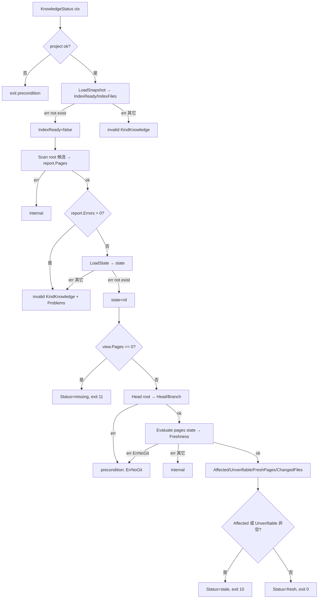

# 知识层 · 新鲜度与基线

本卡描述 M5 知识层**新鲜度**裁决（`internal/knowledge/freshness.go`）：在工作树发生变更时，判定每个页面是否还描述当前代码，并把这些判定合成为 `fresh` / `stale` / `missing` 三态——后者对应 0 / 10 / 11 三个退出码。

## 三态裁决

`KnowledgeStatus`（[internal/app/knowledge.go:45-86](../知识层/架构设计.md)）按以下顺序决定 `KnowledgeStatusView.Status`：



**关键约束**：

- **无 sources / 无 baseline 的页面**被视为「不可验证」（`Unverifiable`），仍走 `stale` 分支——`Cannot tell` 不是 `fresh`。理由：CI 与 hook 必须拦得住「无法自证」的页面，否则会放任 `fresh` 伪装。
- **`unverifiable ≠ error`**：它进入 `Affected`/`Unverifiable` 但**不进** `Errors`——退出码是 10，不是 4。
- **git 失败/缺 git 一律 error**：§12.5 写明「禁止对未知 baseline 答 fresh」。

## `Evaluate` 的三层基线

[internal/knowledge/freshness.go:111-187](../知识层/架构设计.md) 对每页按下面顺序取基线：

```text
1. in-page: Page.SourceCommit (来自 front matter source_commit)
2. mapping: state.Mapping(page.Path).SourceCommit
3. layer:   state.Baseline.Commit
```

任一非空都能下结论；全部为空则 `verdict.Reason = "no baseline: neither the page nor the state records a commit"`。

**三层之间有优先级**：in-page > mapping > layer。`recordedMatches`（[freshness.go:192-198](../知识层/架构设计.md)）是一个特殊通路：

```go
if state != nil && state.Baseline.Commit != "" && recordedMatches(root, page.Path, entry.ContentHash) {
    baseline = state.Baseline.Commit
}
```

当生成器记录的 `content_hash` 与磁盘文件**完全一致**（即自上次生成以来页面**没**被改过），就**强制把基线提升到层基线**。理由：生成器写完页面后记录的 `source_commit` 可能滞后于 `state.Baseline.Commit`（生成器写页面在先、写 state 在后；中间 git 又提交了一次）。若不晋升，会把「刚刚生成完、未变」的页面误判为 stale——这违反「自上次扫描以来未变 = fresh」的不变量。

**注意 `recordedMatches` 只在 baseline 已经有值时晋升**——如果 in-page / mapping / layer 全空，没有 `recorded` 可用，仍是 unverifiable。

## `Changes` 的合并

[internal/knowledge/freshness.go:31-56](../知识层/架构设计.md) 把两种变更合并：

```text
git diff --name-only -z <commit> --
  +  git ls-files --others --exclude-standard -z
```

- 第一种：**已提交的变更**（commit 之后又改了文件的部分）；
- 第二种：**未跟踪的新文件**（`.gitignore` 排除的不算）；
- 都按 `\x00` 分隔，dedup。

`commit` 为空字符串时直接返回 `ErrNoGit`（理由：没有 baseline 谈什么 diff）。

`ChangedFiles` 在 `Evaluate` 末尾合并计数：

```go
if len(changes) == 1 {
    freshness.ChangedFiles = len(list)
} else {
    seen := map[string]bool{}
    for _, list := range changes { for _, path := range list { seen[path] = true } }
    freshness.ChangedFiles = len(seen)
}
```

`loadChanges(commit)` 在 `Evaluate` 内是 memoized 的——同一 commit 只跑一次 git。

## `Head` 的 detached 处理

[internal/knowledge/freshness.go:13-24](../知识层/架构设计.md)：

```go
commit := git(root, "rev-parse", "HEAD")
branch := git(root, "rev-parse", "--abbrev-ref", "HEAD")
```

detached HEAD（`HEAD` 指向某个 commit 而不是 branch）时：

- `commit` 是真实 commit；
- `branch` 字面是 `"HEAD"`——不强行发明 branch 名，理由：仓库不承认的 branch 名是假数据。

## `Unverifiable` 的判定

[internal/knowledge/freshness.go:96-104](../知识层/架构设计.md)：

```go
func (f Freshness) Unverifiable() []string {
    var paths []string
    for _, page := range f.Pages {
        if !page.Stale && page.Baseline == "" {
            paths = append(paths, page.Path)
        }
    }
    return paths
}
```

判定条件：

- `!Stale`：还没被标记 stale（说明 `Evaluate` 走了「无 sources 或无 baseline」分支）；
- `Baseline == ""`：三层基线全空。

`Stale=true` 的页面**总是**有 baseline（必须有才能 diff）；`Stale=false && Baseline==""` 是「幸存的 unverifiable」。

## `Affected` 与 `Status` 的对应

| `Affected` | `Unverifiable` | `view.Status` | 退出码 | 触发条件 |
|---|---|---|---|---|
| 空 | 空 | `fresh` | 0 | 全部页面都对得上工作树（且都有 baseline） |
| 非空 | 空 | `stale` | 10 | 至少一页 changes 命中 sources |
| 空 | 非空 | `stale` | 10 | 至少一页三层基线全空 |
| 非空 | 非空 | `stale` | 10 | 上面两类都有 |

**没有 `fresh-with-unverifiable`**：只要 `Unverifiable` 非空就是 stale——CI 必须拦得住。

`KnowledgeStatusView.Reason`（[internal/app/knowledge.go:160-169](../知识层/架构设计.md)）按上面四类拼一句话：

- 全 fresh：`all %d page(s) match the baseline %s`；
- 只有 affected：`%d page(s) affected by %d changed file(s)`；
- 只有 unverifiable：`%d page(s) have no sources or baseline, so they cannot be called fresh`；
- 都有：`%d page(s) affected by %d changed file(s); %d page(s) have no sources or baseline, so they cannot be called fresh`。

## 与 `Refresh` 的协作

`Refresh` 的 `candidates` 在 `affected=false` 模式下用 `Evaluate` 的输出：

```go
candidates = freshness.Affected()
// unverifiable 必须 join: 不重新生成会让 unverifiable 页面继续 unverifiable
candidates = append(candidates, freshness.Unverifiable()...)
sort.Strings(candidates)
```

`Unverifiable` 也要进 `candidates`——一个 unverifiable 页面被生成器重写后通常会带上 sources 与 content_hash，从而转 fresh。

## `Changes` 的边界

- **不读 commit 之前的暂存区**：`git diff <commit>` 比较的是 commit 到工作树；如果你想覆盖暂存区，请先 `git commit`。
- **不报 submodule 路径变化**：submodule 的 SHA 变化会让 submodule 内文件路径出现，但 submodule 本身是另一个仓库。
- **不报告大小写改名**：文件系统层的 rename 不一定带 git mv；这超出层职责。

## 边界与不做的事

- **不实现 watch**：M5 不引入 inotify/FSEvents；状态变化由 `knowledge refresh` 显式触发。
- **不做语义相似度**：仅按路径精确匹配 sources 模式；`Evaluate` 不读页面内容来判断「是否还描述当前代码」。
- **不检测页面内链接的失效**：M5 留给后续版本。