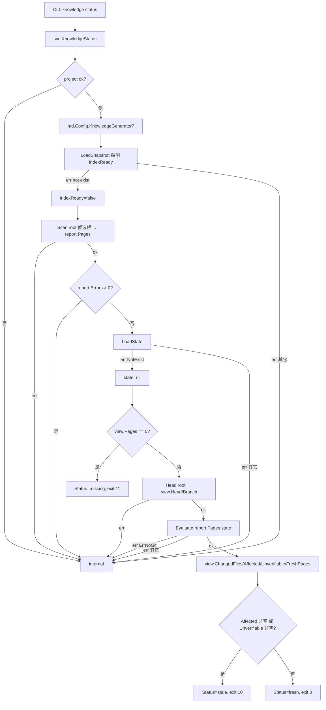

# 知识层 · 架构设计

## 内部结构

```text
cmd/devsys/main.go               # 进程入口（不变）
   ↓
internal/cli/                    # M4 薄渲染层；M5 增 knowledge 路由
   ├── cli.go                    # 全局开关 + codedExit{code} + CodeStale=10 / CodeMissing=11 + toCoded + codedError
   ├── records.go                # M4：decision/finding/event/artifact/run 族；M5 增 knowledge { status | scan | validate | refresh [--full|--affected] [--force] } + humanBytes + shortSHA + indexSummary + reportRefresh
   ├── diagnostics.go            # 只读：search / config check / doctor / recover / repair
   └── worktree.go / dispatch.go / mcp.go   # 既有 M6 接线
   ↓
internal/config/                 # 严格元数据校验
   ├── config.go                 # M5 增 KnowledgePages []string + KnowledgeGenerator string + SeverityWarning 常量 + Problem.Severity + String() 前缀 "warning: "
   └── validate.go               # M5 拆 kindStrings 分支：null/单元素/空列表保留 + kindMilestones 维持旧路径
   ↓
internal/app/                    # M4 共享应用服务
   ├── app.go                    # Service{Root,Now} + KindKnowledge + Usagef/Preconditionf/Internalf/Invalidf + Class
   ├── knowledge.go              # M5：KnowledgeStatusView + KnowledgeScanView + KnowledgeValidateView + KnowledgeRefreshView + KnowledgePageView + KnowledgeScanExclusion + KindKnowledge + KnowledgeFresh/Stale/Missing + KnowledgeStatus/Scan/Validate/Refresh + pageRoots + checkPageRoot + runGenerator(limitWriter 256 KiB) + refreshHolder + pagesPresent + compact + shortCommit
   ├── context.go                # M5：knowledgeContext + KnowledgeContext + KnowledgePageRef + MatchTrigger/MatchSources（触发词匹配与文本拼接在 M7.1 抽到 internal/knowledge/trigger.go）
   ├── knowledge_state.go        # （私有助手）knowledgeState(md) → (state, rawRel, error)
   ├── workitem.go / record.go / ...  # 既有 M4/M6 接线
   └── prompt.go / runexec.go / runverify.go / runstream.go / dispatch.go / workspace.go / wire.go / session.go / project.go / workflow.go / approval.go / next.go  # M6 既有
   ↓
internal/mcp/                    # 官方 Go SDK；M5 增 knowledge_validate / knowledge_refresh / context_for_workitem paths
   ├── server.go                 # Config + DefaultProfiles + ParseProfiles + NewServer + Run
   ├── tools.go                  # allTools() 注册表：M5 在 context 与 knowledge_* 行新增
   ├── tools_context.go          # registerKnowledgeStatus/Validate/Refresh + registerContextForWorkitem（paths []string）+ KnowledgeContext 解析
   └── tools_health.go / tools_project.go / ...   # 既有
   ↓
M5 新增主模块：
internal/knowledge/              # 知识层业务规则（九子文件 + 一锁复用）
   ├── page.go                   # Page 结构 + Parse + 必填/字典/known/warning + Dir/SnapshotFile/StateFile/RunFile/ScopeFile + DefaultRoots/AuthoredStatuses/KnownTypes/KnownKeys/RequiredKeys + checkX 助手 + checkSourcePattern + scalar/scalarList + blockLine/yamlMessage + errAt/warnAt
   ├── scan.go                   # Report + Scan(root, roots) + ExistingRoots + collectPages
   ├── snapshot.go               # Snapshot + BuildSnapshot + WriteSnapshot + LoadSnapshot + loadIgnoreFile + collectCandidates + gitIgnored + scanFile + fingerprint + languageOf + containsFold + matchesAny + secretReason + DefaultMaxFileSize + DefaultExcludedDirectories + SecretPatterns + CustomIgnoreFile + ErrNoGit
   ├── match.go                  # Match(pattern, path) + compilePattern + patternToRegexp + matchRegexp(matchCacheSize=4096) + IgnoreFile + ParseIgnoreFile
   ├── freshness.go              # Head + Changes + PageFreshness + Freshness + Affected + Unverifiable + Evaluate + recordedMatches + git(root, args...)
   ├── protection.go             # HashFile + HashBytes + Skip + Skips(root, pages, state, force)
   ├── generator.go              # FormatVersion + ScopeFull/ScopeAffected + ScopeFile + Scope + GeneratorCommand + WriteScope
   ├── run.go                    # RunSchemaVersion + RunLockFile + PhaseGenerating/Finished/Failed + Checkpoint + LoadCheckpoint/WriteCheckpoint/ClearCheckpoint + LockRefresh + MissingCheckpoint + ResumePending
   ├── trigger.go                # M7.1 新增：TriggerHit(triggers, lowerText) + WorkItemText(item)；调用方 internal/app（context get --task 选页）与 internal/view（relatedItems 关联知识页 ↔ 工作项）共用一份实现
   └── state.go                  # StateSchemaVersion + Baseline + PageState + State + LoadState/WriteState + Mapping + MissingState
   ↓
M5 复用既有 OS 锁原语：
internal/storage/lockfile.go      # M5 新增（39 行）：ErrLocked + LockFile(path) (release func, err) —— Refresh mutex 直接复用
   ↓
方案 §12.6 首选外部生成器（外部代码）：
   repowiki                       # docs/repowiki/{knowledge,content}/** 写入 + .repowiki/state.json 维护
   ↓
M3/M4/M6 既有底层（仅作调用方，不修改）：
   internal/{storage,workitem,events,run,record,search,reconcile,workflow,approval,next,domain,project,registry,version,harness,workspace,dispatch,retry,prompt}
```

## 关键流程

### 知识状态裁决（`knowledge status`）



**裁决语**：
- `fresh`：每页要么无变化，要么无 sources 也无 baseline 时被标 `unverifiable`——而`unverifiable`也是 stale（"cannot tell" ≠ fresh）。
- `stale`：有 `affected` 或 `unverifiable`；`Reason` 含「`%d page(s) affected by %d changed file(s)`」或「`%d page(s) have no sources or baseline, so they cannot be called fresh`」。
- `missing`：层还没生成页面，或生成器未配置（`view.Pages == 0`）。

**退出码契约**（方案 §12.5）：

| Status | exit | 含义 | 来源 |
|---|---|---|---|
| `fresh` | 0 | 所有页面都对得上工作树 | `CodeOK`（无） |
| `stale` | 10 | 至少一页 affected 或 unverifiable | `CodeStale` 常量（新增） |
| `missing` | 11 | 页面层不存在或生成器未配置 | `CodeMissing` 常量（新增） |

`codedExit{code}` 是新增的错误类型，stdout 已写好报告，退出码承载状态——`render` 把它解包后**直接**返回 `code`，不再走 `toCoded` 的错误分支。

### 知识刷新（`knowledge refresh`）

```mermaid
flowchart TD
    A[CLI: knowledge refresh --affected --force] --> B[svc.KnowledgeRefresh req]
    B --> C{KnowledgeStatus ok?}
    C -- err --> X1[原样返回 err]
    C -- ok --> D{status.Pages == 0?}
    D -- 是 --> E[view.Missing=true, exit 11]
    D -- 否 --> F[Scan root]
    F -- err --> X1[internal]
    F -- ok --> G[LoadState]
    G -- err NotExist --> H[state=nil]
    G -- err 其它 --> X1[invalid]
    H --> I{req.Full?}
    I -- 是 --> J[candidates = all pages]
    I -- 否 --> K[Evaluate → candidates = Affected ∪ Unverifiable ∪ sort+compact]
    K --> L[LoadCheckpoint]
    L -- err NotExist --> M[无 checkpoint]
    L -- ok --> N[view.Resumed=true, pending = checkpoint.Pages ∪ candidates, sort+compact, ResumePending]
    L -- err 其它 --> X1[invalid]
    N --> O[Skips root pages state force]
    O -- err --> X1[internal]
    O --> ok --> P{req.Force?}
    P -- 否 --> Q[剔除 Skipped 命中]
    P -- 是 --> R[保留全部, Skipped[i].Overridden=true]
    Q --> S
    R --> S{len(view.Pages)==0?}
    S -- 是 --> T[view.Reason = nothing to regenerate; 清 checkpoint; return]
    S -- 否 --> U{view.Generator==""?}
    U -- 是 --> V[view.Missing=true, exit 11]
    U -- 否 --> W[LockRefresh root]
    W -- err ErrLocked --> X2[precondition: 另一刷新正在跑]
    W -- err 其它 --> X1[internal]
    W -- ok --> X[defer release; GeneratorCommand → argv]
    X --> Y[Scope 写到 refresh-scope.json]
    Y --> Z[Checkpoint 生成写入; PID+Host+StartedAt+UpdatedAt]
    Z --> AA[runGenerator(ctx, argv) → output]
    AA -- err --> AB[Checkpoint.Phase=failed + err; view.Failed/Error; precondition]
    AA -- ok --> AC[Checkpoint.Phase=finished + Completed=view.Pages]
    AC --> AD[KnowledgeStatus after → view.Status]
    AD --> AE[ClearCheckpoint]
    AE --> AF[return view, nil]
```

**续跑语义**：
- `ResumePending` 把 `pending[]` 中"已记录 `content_hash` 且磁盘一致"的页剔除（无需重生成）；记录哈希为空或与磁盘不一致的页继续 `remaining`。
- `run.lock` 是 OS 锁：刷新进程死时锁自动释放。`run.json` 是 checkpoint：保留 `pending`，让下一轮只跑未完成页。
- `Phase` 三态：`generating`（运行中）/ `finished`（成功）/ `failed`（generator 退出非零）；失败 checkpoint 不清，下一轮接续。

### 任务上下文装配（`context get --task`）

```mermaid
flowchart TD
    A[CLI/MCP: context get --task wi-<id>] --> B[svc.ContextForWorkitem item paths]
    B --> C[knowledgeContext item paths]
    C --> D[Scan root 候选 → report]
    D -- err --> X1[internal]
    D -- ok --> E{report.Pages==0?}
    E -- 是 --> F[Degraded=true, Notice='degrade to records and events'; return]
    E -- 否 --> G[knowledgeState md → state]
    G -- err --> X1[internal]
    G -- ok --> H[文本 = title+desc+type+workflowID+workflowStep; lowercase]
    H --> I[phase1: 遍历 pages, trigger 命中 → MatchTrigger]
    I --> J[phase2: 遍历 pages, sources 命中 path 列表 → MatchSources]
    J --> K{matched 空?}
    K -- 是 --> L[返回 view, nil]
    K -- 否 --> M[Evaluate matched state → freshness 仅针对选中页]
    M -- err ErrNoGit --> N[view.Notice=freshness unavailable; 返回 matched 原样]
    M -- err 其它 --> X1[internal]
    M -- ok --> O[逐页 ref.Stale = freshness.Pages[i].Stale]
    O --> P[返回 KnowledgeContext]
```
**匹配规则**：
- `MatchTrigger`：由 `internal/knowledge/trigger.go: TriggerHit(triggers, lowerText)` 实现（[trigger.go:14-25](file://internal/knowledge/trigger.go#L14-L25)）；触发词在 lowercased 文本中作为子串出现（`strings.Contains(lowerText, strings.ToLower(trimmed))`），触发词先 `strings.TrimSpace`、空触发词忽略；多个命中保留第一个（按 page 遍历顺序）。`lowerText` 由调用方一次性 lowercase 后传入，扫描多页时只为每页付一次 ToLower——`internal/app/context.go: knowledgeContext` 与 `internal/view/build.go: relatedItems` 共用这一份实现。
- `MatchSources`：sources 列表中任意 pattern 与 paths 中任意路径命中（按 `knowledge.Match` 语法，[internal/knowledge/match.go:22-24](file://internal/knowledge/match.go#L22-L24)）；`sources` 为空时回退到 `state.Mapping(path).Sources`。
- `Degraded`：report 无 pages → 提示未生成；matched 空 → 仍返回空 pages，但 `Degraded` 由更上层（无页面层时）判断。

**归属说明**（M7.1）：触发词匹配语义（子串、大小写折叠、TrimSpace、子串命中）现在属于知识层，`internal/app` 只是装配调用方，`internal/view` 也用它做「知识页 ↔ 工作项」关联（`relatedItems` 走 `TriggerHit` + `WorkItemText`）。

## 模块边界

**知识层（M5 新增）的内部边界**：

| 文件 | 依赖 | 不依赖 | 角色 |
|---|---|---|---|
| `page.go` | `config`、`yaml.v3`、`sha256` | `storage`（除 `AtomicWrite` 通过 `generator.go` 与 `run.go` 间接使用） | 纯解析：front matter + body |
| `scan.go` | `config` | `storage`、`git` | 遍历 + 解析组合 |
| `snapshot.go` | `storage.AtomicWrite`、`exec.LookPath("git")` | `page` | 索引层主流程 |
| `match.go` | `regexp`（缓存） | 全部 | 通用匹配器 |
| `freshness.go` | `exec.Command("git")` | `storage` | 新鲜度计算 + 阈值 |
| `protection.go` | `sha256`、`os.ReadFile` | `storage` | 整文件 hash 与 skip 判定 |
| `generator.go` | `storage.AtomicWrite` | `git`、`page` | 协议形状 |
| `run.go` | `storage.LockFile`、`storage.AtomicWrite` | `page` | 锁 + checkpoint |
| `trigger.go` | `strings`、`domain` | `storage`、`git`、`page`、`match` | 触发词子串匹配与 WorkItem 文本拼接（M7.1 新增；与 `internal/app` 和 `internal/view` 共用） |

**共享应用服务接入**：
- `internal/app.knowledge.go` 不持有 `*storage.Store`：所有 IO 走 `app` 自己的 `Root` 路径，`knowledge` 子包负责原语；
- `KnowledgeStatus/Scan/Validate/Refresh` 顺序：`project()` → `LoadSnapshot`（Status 探测）→ `Scan` → `LoadState` → `Head` → `Evaluate`；Refresh 在此基础上加 checkpoint 与 lock。
- `KnowledgeScan` 不读 state、不读 checkpoint——它是「重置索引」的入口。

**CLI / MCP 双入口**：
- CLI：`runKnowledgeStatus/Scan/Validate/Refresh` 把 stdout 与退出码分开——`--json` 走 JSON 信封，`--quiet` 下 warnings / affected / unverifiable / skipped / Output 仍可见；
- MCP：`toolError` 翻译 `*app.Error`，含 `Problems` 数组与 `Notice`（降级提示）。
- 退出码契约只在 CLI 用：`knowledge_status` 工具结果正常返回，`KnowledgeStatusView.Status` 字段也带状态——MCP 客户端按 `view.Status` 而不是工具结果码分支。

**生成器契约**：
- 生成器是「带参数的程序」，**不**走 shell：`strings.Fields(command)` 切分后直接 argv；Windows 用 `cygpath -m` 把脚本包装成 `.cmd` 转发到 bash（smoke 脚本里的 fallback）。
- Scope 通过 `--scope-file <rel>` 落地文件，避免超长 argv。
- `FormatVersion = 1`：升到 2 时 Generator 必须在 scope 文件里读到 `format_version: 2` 才接受——这是契约的唯一版本信号。

## 关键决策

- **索引层 = 本系统的活，页面层 = 生成器的活**：这是 §12.6 的核心分工。层永远不会向 generator 发「请给我写这个页」之外的指令，generator 也不会触碰 `.devsys/` 下的 state/snapshot。
- **退出码 10/11 复用既有 0**：M4 之前的所有命令用 `0/1/2/3/4`；M5 把 `10/11` 留给知识层——`codedExit` 是为此而设的错误类型，避免误用 `*codedError` 的字段（那会污染 `toCoded` 的错误路径）。
- **hash 整文件 vs hash body**：front matter 与 body 都计入 `content_hash`；`Page.Hash()`（body only）只在比较"这次写了什么"时用——但保护机制 (`Skips`) 走 `HashFile`（整文件），与生成器记录的 `content_hash` 字段对齐。
- **不需要 DB 索引**：方案 §12.2 把索引上限定为 1 MiB 单文件、不超过目录列表的实际可读规模——任何更大的项目应分库或换数据库，本系统不为此做投机。
- **`Unverifiable` 仍是 stale**：`Cannot tell` 不是 fresh；CI 退出码 10——这避免了「`stale` 假装 `fresh`」的伪装，让 hook 永远拦得住。
- **`--force` 仍记录 override**：保护被覆盖的事实必须留在 `Skipped[]`（含 `Overridden`），便于审计——这是层对"管理员主动覆盖"留的痕迹。
- **索引排除顺序**：默认目录 → 密钥名 → `.gitignore` → 自定义忽略 → 1 MiB 上限；密钥名即使同时被 `.gitignore` 排除，reason 仍写「密钥名模式（同时被 .gitignore 排除）」——审计不能被忽略链隐藏。