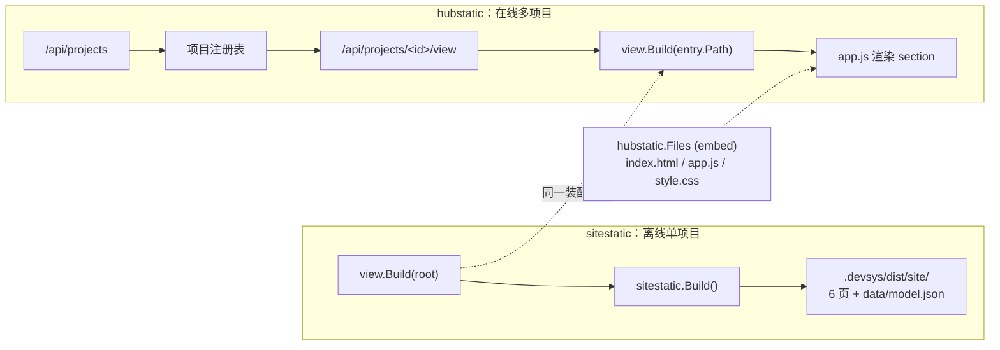

# 视图层 · Hub静态资源

`internal/hubstatic/` 是 Workloom 的**第二个渲染面**：Hub 多项目聚合网页的**前端资源包**。整个包只有 4 个文件（一个 Go 声明 + 一个 HTML 壳 + 一个 JS 应用 + 一张样式表），全部用 `go:embed` 打进二进制，**不含任何项目数据**——数据在运行时只来自 Hub HTTP API。

本批（`d07638c`→`9d7ed6c`，13 commit）**新增**了整个目录（4 个文件在 `git diff --name-status` 里全是 `A`），并在 `internal/view` 侧配套扩了模型与装配逻辑（见 [视图数据模型](视图数据模型.md)）。本页只讲这一个新包；`internal/view/**` 与 `internal/sitestatic/**` 的事实分别在那两张卡。

## 与 `sitestatic` 的区别（两个渲染面，不要混为一谈）

这是本模块最容易读错的一点：仓库里有两个「静态资源」包，形态相反、**没有任何共享代码**。

| 维度 | `internal/sitestatic/`（workspace 视图域） | `internal/hubstatic/`（Hub 聚合域，本批新增） |
|---|---|---|
| 服务方式 | **离线**：一次性把整站写到 `.devsys/dist/site/` | **在线**：`workloom hub serve` 起 HTTP 服务，逐请求从 embed 读 |
| 数据来源 | `view.Build` 一次性装配 → `data/model.json`（[static.go:439-443](file://internal/sitestatic/static.go#L439-L443)） | `fetch("/api/projects/<id>/view")` 拿 `view.Model`（[app.js:448-472](file://internal/hubstatic/app.js#L448-L472)） |
| JavaScript | **零 JS**，纯 `html/template` 静态页（[static.go:13](file://internal/sitestatic/static.go#L13)） | **有 JS**，`app.js`（578 行）是渲染主引擎 |
| 页面数 | 固定 **6 页**（`PageFiles`，[static.go:25-32](file://internal/sitestatic/static.go#L25-L32)） | 固定 **1 个 SPA 壳**，页内切 section（`render()`，[app.js:406-441](file://internal/hubstatic/app.js#L406-L441)） |
| 外部引用 | 零（无 CDN、无外部字体），另有 `assets/style.css` 落到输出目录 | 零（`index.html` 只引 `/assets/style.css` + `/assets/app.js`，[index.html:7](file://internal/hubstatic/index.html#L7)） |
| 多项目 | 否——**一次一个项目**，`Build(root, ...)` 只看一个根 | 是——项目注册表 → 项目切换器（`<select id="project">`，[index.html:16](file://internal/hubstatic/index.html#L16)） |
| 失败面 | 单次写盘失败即整体失败 | 单项目 API 失败只降级该项目的 section |

一句话区分：**`sitestatic` 是「一个项目的离线快照站，零 JS」；`hubstatic` 是「多个项目的在线聚合站，JS 驱动」**。两者唯一的共同点是都不引外部资源、都零第三方依赖。

*图表来源*：由 `internal/sitestatic/static.go`（`Build` 与 `PageFiles`）、`internal/cli/hub_serve.go`（`serveHTTP` 的路由分派）、`internal/hubstatic/index.html` 与 `app.js` 共同还原。

## 包内形状

| 文件 | 大小 | 形状 | 作用 |
|---|---|---|---|
| `assets.go` | 183 B / 8 行 | `//go:embed index.html app.js style.css` + `var Files embed.FS`（[assets.go:1-8](file://internal/hubstatic/assets.go#L1-L8)） | **唯一**的对外符号 `hubstatic.Files` |
| `index.html` | 979 B / 28 行 | 单页壳：`nav.collapsed` + `main#main`（[index.html:9-27](file://internal/hubstatic/index.html#L9-L27)） | 只提供挂载点，不含任何业务文案 |
| `app.js` | ~39.5 KB / 578 行 | 一个 IIFE 内的 SPA（[app.js:1-2](file://internal/hubstatic/app.js#L1-L2)） | 全部渲染与数据获取逻辑 |
| `style.css` | ~17.5 KB / 232 行 | `:root` CSS 变量 + 组件类（[style.css:1-3](file://internal/hubstatic/style.css#L1-L3)） | 全部视觉 |

`assets.go` 的注释就是契约（[assets.go:5](file://internal/hubstatic/assets.go#L5)）：

> Files contains the single-page Hub shell. Runtime data comes only from the Hub API.

这条注释划清了边界：**embed 里只有壳，没有任何项目数据**——数据 100% 来自运行时 API。这与 `sitestatic` 把 `model.json` 落到输出目录的做法正好相反，也是两张卡里最容易混淆的一点。

## 资源契约：embed 名 ↔ HTTP 路由 ↔ HTML 引用

三处必须保持一致，改动任何一处都会白屏：

| embed 名 | HTML 里的引用 | 宿主提供的路由 | MIME |
|---|---|---|---|
| `index.html` | （入口） | `/` 与 `/index.html` | `text/html; charset=utf-8` |
| `style.css` | `<link rel="stylesheet" href="/assets/style.css">`（[index.html:7](file://internal/hubstatic/index.html#L7)） | `/assets/style.css` | `text/css; charset=utf-8` |
| `app.js` | `<script src="/assets/app.js">`（[index.html:26](file://internal/hubstatic/index.html#L26)） | `/assets/app.js`，另有兼容别名 `/app.js` | `text/javascript; charset=utf-8` |

路由实现在**本模块 scope 之外**（`internal/cli/hub_serve.go`，由「项目接入」模块负责），本卡只记录 `hubstatic` 这一侧必须满足的契约。`asset` 方法统一 `hubstatic.Files.ReadFile(name)` 再显式写 `Content-Type`，读不到就 500 `asset unavailable`。

> **为什么 CSS/JS 走 `/assets/` 而 HTML 走根路径**：`index.html` 只引 `/assets/*`，根路径因此不与 API 冲突。`/app.js` 别名的存在是为了容忍 `index.html` 被改成相对引用等情况。宿主对非 GET/HEAD 一律 405 `read-only`（`POST /api/projects` 是唯一例外），所以本包**没有任何写路径**。

## `app.js` 的数据契约

`app.js` 直接消费 `view.Model` 的 JSON 字段名（`html/template` 侧的 `.M.` 前缀在 JS 里不存在）。全部派生访问器集中在 [app.js:86-107](file://internal/hubstatic/app.js#L86-L107)：

| JS 访问 | 对应 `view.Model` 字段 | 用途 |
|---|---|---|
| `d().project` | `Model.Project`（[view.go:128-150](file://internal/view/view.go#L128-L150)） | 蓝图、里程碑、目标、范围、约束 |
| `d().project.blueprint` | `Project.Blueprint`（**本批新增**，[view.go:152-161](file://internal/view/view.go#L152-L161)） | 蓝图 artifact 元信息 + 正文；`content` / `contentError` 二选一（[app.js:280](file://internal/hubstatic/app.js#L280)） |
| `d().progress.items[]` | `Model.Progress.Items` | 任务列表、活跃计数（[app.js:97](file://internal/hubstatic/app.js#L97)） |
| `it.workflow` | `Item.Workflow` | 关联到哪条工作流（[app.js:345](file://internal/hubstatic/app.js#L345)） |
| `d().workflows[]` | `Model.Workflows`（**本批新增**，[view.go:68](file://internal/view/view.go#L68)） | 流程页的 `wf.steps` / `wf.transitions` |
| `d().trust.state` | `Model.Trust.State` | `pending_transaction` / `advisory_unlocked` 分支（[app.js:93-94](file://internal/hubstatic/app.js#L93-L94)） |
| `d().records.artifacts` | `Model.Records.Artifacts` | 记录页**只读 artifacts**（[app.js:362-373](file://internal/hubstatic/app.js#L362-L373)） |

**`records.artifacts` 是唯一被读的记录子列表**——与本批 `view.records()` 停止读 `decisions/`、`findings/` 的改动同向（见 [架构设计](架构设计.md)）。两个渲染面在这一点上重新对齐了。

### 加载、轮询与降级

| 机制 | 位置 | 行为 |
|---|---|---|
| 启动序列 | `boot` IIFE（[app.js:562-577](file://internal/hubstatic/app.js#L562-L577)） | `bind()` → `loadProjects()` → 渲染项目选择器 → `applyHash()` 或选第一个项目 → `startPolling()` |
| 数据拉取 | `loadModel`（[app.js:448-472](file://internal/hubstatic/app.js#L448-L472)） | `GET /api/projects/<encID>/view`；`modelLoading` 布尔闸防重入 |
| ETag | `apiGet`（[app.js:64-73](file://internal/hubstatic/app.js#L64-L73)） | 带 `If-None-Match`，`304` 视为 `notModified` 直接返回——**轮询不重传 body** |
| 轮询 | `startPolling`（[app.js:486-491](file://internal/hubstatic/app.js#L486-L491)） | 每 **2000 ms** 一次；`document.hidden` 或无选中项目或 `unavailable()` 时跳过；`preserveScroll=true` 保住滚动位置 |
| 上次好值 | `state.lastGood[id]`（[app.js:459](file://internal/hubstatic/app.js#L459-L459)、[app.js:465](file://internal/hubstatic/app.js#L465)） | 刷新失败时继续显示上次成功的模型，并置 `refreshError` |
| 目录缺失 | `missing()`（[app.js:89-92](file://internal/hubstatic/app.js#L89-L92)） | 项目注册表里有记录但路径不存在；每个 section 各自出 `degradedBanner`（[app.js:412-425](file://internal/hubstatic/app.js#L412-L425)） |
| 深链 | `applyHash`（[app.js:551-561](file://internal/hubstatic/app.js#L551-L561)） | `#/<pid>/<section>/<taskId>` 三段式，可直接跳到某项目的某 section 某任务 |

**`lastGood` 与 `view` 的信任态是两个独立机制**：前者是前端为「网络抖动」留的显示缓冲，后者是 `view.Trust` 为「`.devsys/` 状态可信度」做的判决。前者**不**放宽后者的渲染禁令——`pending()` 为真时各 section 仍走降级分支（[app.js:93](file://internal/hubstatic/app.js#L93)）。

### 渲染与安全

- 所有 `render*` 函数以 `main()` 取容器、以 `innerHTML` 整块替换，**不做 DOM diff**——每次刷新重建节点（这也解释了 `preserveScroll` 的必要性）。
- `esc`（[app.js:23](file://internal/hubstatic/app.js#L23)）对 `& < > " '` 五字符做实体转义，所有插入 HTML 的项目字段都必须过它。蓝图正文用 `<pre class="blueprint-content">` 包 `esc(bp.content)`，**不进 Markdown 渲染器**——零第三方库、零 `innerHTML` 注入面。
- `flowTrack`（[app.js:150-194](file://internal/hubstatic/app.js#L150-L194)）是手写 SVG 流程轨道：`wf.transitions` 的显式邻接 + 步骤顺序的隐式线性链合并成边集，没有图布局库。

## 与宿主命令的耦合

`hubstatic` 自己不知道 `workloom` 的存在，它只被 `internal/cli/hub_serve.go` 消费。本卡只记录耦合点，不展开宿主实现（那属另一模块）：

| 耦合 | 事实 |
|---|---|
| 入口命令 | `workloom hub serve`（[cli.go:394-395](file://internal/cli/cli.go#L394-L395)） |
| 缺省监听 | `127.0.0.1:18080`（[hub_serve.go:32-33](file://internal/cli/hub_serve.go#L32-L33)）——**loopback only**，需显式 `--allow-remote` 才外放 |
| 唯一 embed 消费点 | `hubstatic.Files.ReadFile(name)`（[hub_serve.go:122-130](file://internal/cli/hub_serve.go#L122-L130)） |
| 与 `view` 的关系 | 宿主在每个 `/api/projects/<id>/view` 请求上调 `view.Build(ctx, entry.Path, view.Options{Limit: h.limit})`，把 `view.Model` 直接 JSON 化返回——**Hub 与 workspace serve 复用同一个装配函数** |

**页面视觉口径以 `docs/hub-v1-prototype.html` 为准**（该文件属别的模块，此处仅作背景参考，未纳入本卡引注）。`hubstatic` 的 CSS 变量（[style.css:1-3](file://internal/hubstatic/style.css#L1-L3)，如 `--bg: #efece6`、`--rail`、`--card`）与 `sitestatic` 内联的 `styleCSS`（[static.go:266-284](file://internal/sitestatic/static.go#L266-L284)）是两套**各自独立**的调色板，不共享变量、不承诺一致。

## 本批新增/变化要点

- **新增 `internal/hubstatic/`**（4 文件全 `A`）：Hub 多项目聚合网页的前端资源包，`go:embed` 打包，`workloom hub serve`（缺省 `127.0.0.1:18080`）提供。
- **`view.Model` 配套扩展**：`Workflows` 顶层节与 `Project.Blueprint` / `BlueprintWarnings`——`app.js` 的流程页与蓝图页正是消费这两处新字段（`wf.steps` / `wf.transitions` / `bp.content` / `bp.contentError`）。
- **`view.records()` 不再读 `decisions/`、`findings/`**，只留 `artifacts`；`app.js` 的记录页也只读 `records.artifacts`——两侧一致。
- **`sitestatic` 首页模板**：「目标」块换成「绑定蓝图 + 警告」块（`static.go:335-336`），与 Hub 蓝图页对齐。
- 三个前端约定：`esc` 五字符转义、2 秒轮询 + ETag、`lastGood` 兜底。

## 与其他卡的关系

- [概述](概述.md) — 模块定位（只读聚合层）与两个渲染面的分工
- [视图数据模型](视图数据模型.md) — `Model.Workflows`、`Project.Blueprint`/`BlueprintWarnings` 的 JSON 契约（`app.js` 的消费方）
- [架构设计](架构设计.md) — `Build` 主入口与各节装配流程；`records()` 收敛为 artifacts 的理由
- [编码规范](编码规范.md) — 列表先定序后截断、JSON 字段名约定（`app.js` 直接依赖这些 snake_case 名）
- [技术栈](技术栈.md) — 两个渲染面的技术选型差异（零 JS 模板 vs 手写 SPA）
- [特殊配置与命令](特殊配置与命令.md) — `workloom hub serve` 的参数与缺省端口
