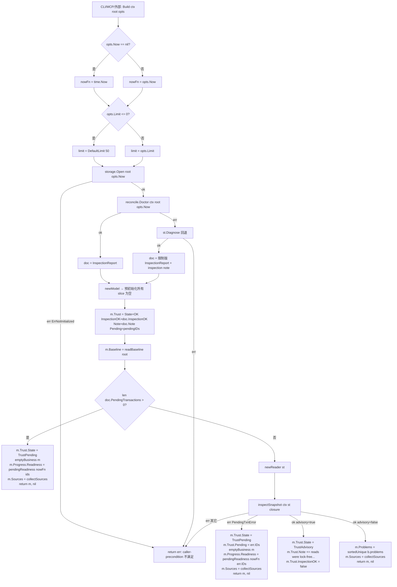
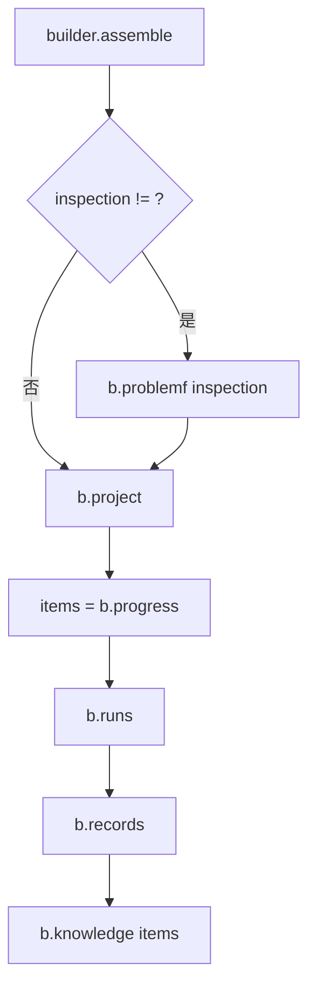
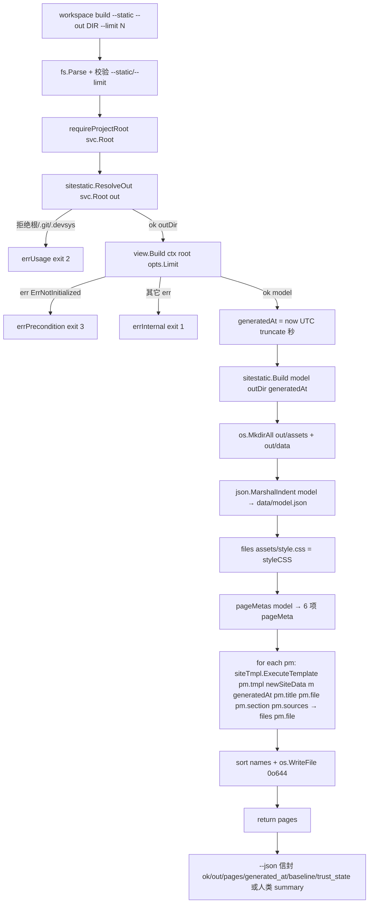

# 视图层 · 架构设计

视图域 `workloom workspace`（方案 §17）三段式：**装配**（`internal/view`）→ **离线渲染**（`internal/sitestatic`）→ **本地服务**（`internal/cli/workspace_serve.go`）。三段只通过 `*view.Model` 解耦：装配层从不渲染，服务层从不落盘，`sitestatic` 只在 `Build` 时落盘、`RenderPage` 时复用同一份模板。

## 内部结构

```text
cmd/workloom/main.go                  # 进程入口（不变）
   ↓
internal/cli/
   ├── cli.go                       # 路由：case "workspace" → runWorkspace（[cli.go:315-316](file://internal/cli/cli.go#L315-L316)）；帮助文本："workspace     view [--limit N] | build --static [--out DIR] [--limit N] | serve [--host 127.0.0.1] [--port N] read-only project view / offline site / local service (方案 §17)"（[cli.go:84](file://internal/cli/cli.go#L84)）
   ├── workspace.go                 # runWorkspace 子命令路由（`workspace` 必须带子命令：view | build | serve；未知子命令 → usage err）；runWorkspaceView（--limit 缺省 view.DefaultLimit，--json 走稳定信封）；renderWorkspaceView 一行一事实人类输出
   ├── workspace_serve.go           # M7.3 本地只读服务：serveHandler/serveHTTP/newServeMux（loopback 默认，非环回须 --allow-remote，405 + Allow: GET, HEAD）；isLoopbackHost；runWorkspaceServe（--host/--port/--allow-remote/--limit，Ctrl+C 退出）
   └── …                            # 既有 M4/M5/M6 接线（不变）
   ↓
internal/view/                      # M7.1 新增主模块（仅 read-only）
   ├── view.go                      # 数据契约：SchemaVersion / DefaultLimit / Trust 三态常量 / Knowledge 四态常量 / Options / Model / Provenance / Baseline / Trust / Project / Progress / Item / Runs / RunEntry / Records / RecordRef / Knowledge / PageEntry
   ├── collect.go                   # 读端原语：inspectSnapshot / reader{read,list,exists,mark,since,noteDevsys,noteDevsysDir,noteRel,noteRelDir} / sortedUnique / (*builder).problem + problemf
   ├── build.go                     # 装配核心：Build / newModel / emptyBusiness / pendingReadiness / builder{assemble,project,progress,metadataProblems,policyFacts,defaultPolicy,policyOf,pendingApprovals,runs,runEntry,streamTorn,attemptSignals,streamLineCount,records,knowledge,knowledgeState,generator,pageRoots} / relatedTexts / relatedItems / readBaseline / collectSources / pendingIDs / capList / itemFrom / timePtr / shortCommit
   └── view_test.go                 # 测试夹具 + 10 个测试：AssemblesEverySection / IsDeterministic / WritesNothing / WithoutLockFileStaysReadable / OnAReadOnlyCopy / PendingTransactionRendersNoBusinessFacts / DegradesOneSectionOnly / CapsLists / ReportsTornRunStream / WithoutProject
   ↓
internal/sitestatic/                # M7.2 离线渲染 + M7.4 freshnessHint
   ├── static.go                    # 渲染核心：PageFiles（6 页导航序） / DefaultOutRel=".devsys/dist/site" / ResolveOut（拒根/.git/状态目录） / kv + sortedCounts / workflowGroup / siteData / freshnessHint（K→派生字段） / newSiteData / short12 / ftime / dirtyStr / siteFuncs / styleCSS / siteTemplates / siteTmpl / pageMeta + pageMetas / Build（落 8 文件）
   ├── render.go                    # 内存渲染：RenderPage（PageFiles 任一 → 与 Build 字节一致）/ ModelJSON（带尾换行）/ Stylesheet（直接返 styleCSS）
   ├── static_test.go               # ResolveOut / DefaultOutDir / freshnessHint / siteData / Build 落盘验证
   ├── render_test.go               # RenderPage / ModelJSON / Stylesheet 与 Build 字节一致验证
   └── freshness_test.go            # freshnessHint 各知识态覆盖
   ↓
internal/view/ + internal/sitestatic/ 仅依赖下列包（全部只读读取面，不写 .devsys/.cache/、不建锁、不恢复、不修断尾、不起进程）：
   ├── internal/storage             # Open / Inspect / InspectUnlocked / Diagnose / ErrNotInitialized / ErrLockUnavailable / PendingTxnError / PendingTxn / InspectJSONL / DevsysDirName
   ├── internal/reconcile           # Doctor（事务与租约诊断）+ InspectionReport{PendingTransactions,ExpiredLeases,OrphanLeases,UnreadableLeases,InspectionOK,Note}
   ├── internal/next                # Evaluate（§7.4 就绪判定复用，siteData.PendingApprovals 也由此过滤）+ Report / Risk / PendingApproval / VerdictPass/Concerns/Fail + ClassifyAttempts（attemptSignals 复用其僵死/在飞分类）
   ├── internal/run                 # Run + RunAgent + Workspace + Verification + RunResult（领域模型）
   ├── internal/record              # Decision / Finding / Artifact（领域模型）
   ├── internal/domain              # WorkItem / Milestone / Approval / Scope / Approval.Status / DecodeYAML
   ├── internal/knowledge           # LoadSnapshot / Scan / LoadState / Head / Changes / Evaluate / ExistingRoots / DefaultRoots / AdapterByName / MergeStates / MissingState / TriggerHit / WorkItemText
   ├── internal/workflow            # Load（policy 校验，只读）+ Result + SeverityError
   ├── internal/config              # Diagnose（metadata 校验）+ ManagedFiles + CurrentStateFile + MilestonesFile + Metadata
   └── internal/approval            # StatusPending（审批状态判断）
   ↓
外部 git（经 internal/knowledge.Head/Changes 间接调用，仅 `git rev-parse` / `git status --porcelain` / `git diff` 类只读子命令）：
```

## 关键流程

### 视图装配（`Build` 主入口）



**关键节点**：
- `newModel`（[build.go:117-140](file://internal/view/build.go#L117-L140)）预初始化**每一个** slice 为空——这样「没找到」是 `[]` 而不是 `null`，保证两次构建 marshal 出来逐字节相同。
- `pendingReadiness`（[build.go:159-165](file://internal/view/build.go#L159-L165)）走 `next.Evaluate(next.Input{Now, PendingTxns, RecoverCommand: recoverCommand})`，产出 `Verdict=VerdictFail` + 修复项里 `workloom recover --actor operator --reason "recover interrupted state"`（[build.go:25](file://internal/view/build.go#L25)）——与 `workloom next` 的产出同形。
- `inspectSnapshot`（[collect.go:23-29](file://internal/view/collect.go#L23-L29)）的核心两行：`st.Inspect(ctx, fn)` → 若 `errors.Is(err, storage.ErrLockUnavailable)` 则降级 `st.InspectUnlocked(ctx, fn)` 并返回 `advisory=true`。**不创建**锁文件。
- `pendingReadiness` 与 `inspectSnapshot.PendingTxnError` 分支**同样处理**：同一套 `emptyBusiness` + `m.Trust.State = TrustPending`，只是 pending 来源一个是 `reconcile.Doctor`，另一个是 `storage.Inspect` 路径上的写者抢先。
- 缺 `project.yaml`（Doctor 与 `storage.Diagnose` 都失败）→ 整体报错；单节损坏只降级该节（`reconcile.Doctor` 失败时退 `storage.Diagnose` 不解码工作项，[build.go:51-66](file://internal/view/build.go#L51-L66)）。

### 各节装配（`builder.assemble` → 顺序子流程）



**project**（[build.go:199-248](file://internal/view/build.go#L199-L248)）：`config.Diagnose` 走 metadata 校验 → 各 `config.ManagedFiles` 检查存在性记录 sources → `current.yaml` + `state/milestones.yaml` 填 summary/risks/blockers/next_focus/milestones；任一失败入 `problems` 并 `Degraded=true`。**只有缺 `project.yaml` 整次装配失败**（`storage.ErrNotInitialized` 在 `Build` 入口已判），其余问题只降级该节。

**progress**（[build.go:250-305](file://internal/view/build.go#L250-L305)）：`workitems/*.yaml` 列表 → 逐项解码失败只 `problem` 不中断 → 列表按 `id` 升序 → `Counts[status]++` → `facts := policyFacts(items)` 装好 ids/parsed/problems 与 `defaultPolicy()` → `dead, inflight := b.attemptSignals(items)`（复用 `next.ClassifyAttempts`，对每个工作项取最新 run 并按事件流行数分类）→ `next.Evaluate` 传入 `WorkItems/Milestones/PendingTxns/ExpiredLeases/OrphanLeases/UnreadableLeases/InspectionOK/InspectionNote/MetadataProblems/PolicyProblems/PendingApprovals/RecoverCommand` + `PolicyIDs`（声明的策略 id 排序）+ `DefaultPolicy`（项目级默认策略）+ `HasBlueprint`（project.yaml 是否声明 blueprint artifact，供空项目风险判定）+ `DeadAttempts/InFlight`（僵死领取与在飞尝试，与 `workloom next` 同一份分类）+ `QualityBlocks: next.QualityBlocks(items, facts.policyOf(default))`（与 `workitem claim` 同源判定的、被质量门拒掉的 ready 工作项）。任一工作项文件解码失败 → `pr.Degraded=true`。
**runs**（[build.go:425-455](file://internal/view/build.go#L425-L455)）：`runs/*.yaml` 列表 → 按 `StartedAt` 倒序再 `ID` 升序 → **直接按 `b.limit` 截断**（与 `capList` 等价但内联）→ `runEntry` 含 `StreamTorn`（`storage.InspectJSONL`）→ `Truncated=true` 当 `len > limit`。

**records**（[build.go:542-635](file://internal/view/build.go#L542-L635)）：decisions/artifacts 按 `CreatedAt` 倒序再 `ID` 升序；findings 按 `ID` 升序（领域模型无时间戳，M1.5）；逐节 `capList`；任一节截断则 `rec.Truncated=true`。

**knowledge**（[build.go:637-740](file://internal/view/build.go#L637-L740)）：`generator` 来自 `config.Metadata.Config.KnowledgeGenerator` → `knowledge.LoadSnapshot`（失败非 fs.ErrNotExist → `problem`）→ `pageRoots`（配置覆盖默认 `knowledge.DefaultRoots`，剔除不存在项）→ `knowledge.Scan` → `knowledgeState`（合并本地 state + 适配器 imported state）→ 分情况：`pages == 0` → `KnowledgeMissing` + 「方案 §12.6」原因；`pages > 0` → `knowledge.Evaluate`，git 失败 → `KnowledgeUnavailable`；否则 `KnowledgeFresh/Stale` 由 `Affected`/`Unverifiable` 裁决。

### 读端原语（`internal/view/collect.go`）

- `inspectSnapshot(ctx, st, fn)`（[collect.go:23-29](file://internal/view/collect.go#L23-L29)）：唯一调 `storage.Inspect` 的入口。**不创建**锁文件；锁文件不存在（`ErrLockUnavailable`）→ `storage.InspectUnlocked` + `advisory=true`。`PendingTxnError`（写者抢在 Doctor 之后开事务）由上层 `Build` 单独处理。
- `reader.read/list/exists` 走 `storage.Reader.Read` / `os.ReadDir` / `os.Stat`——**只用** storage 层暴露给「读路径」的接口，不调 `storage.Read`（会建锁并写缓存）。
- `reader.noteDevsys/noteDevsysDir/noteRel/noteRelDir`（[collect.go:96-123](file://internal/view/collect.go#L96-L123)）：所有来源路径以项目相对 slash 形式追加；目录强制以 `/` 结尾。`sortedUnique`（[collect.go:127-139](file://internal/view/collect.go#L127-L139)）保证 `Sources` 与各节 `Provenance.Sources` 都是排序去重后的——这是「两次构建字节相同」的基础。
- `(*builder).problem/problemf`（[collect.go:142-152](file://internal/view/collect.go#L142-L152)）：非致命缺陷入 `m.Problems`（顶层 `problems` JSON 字段），不阻断装配。

### git 基线（`readBaseline`）

`internal/view/build.go:805-821`：

```text
git rev-parse HEAD             → commit（经 internal/knowledge.Head）
git rev-parse --abbrev-ref HEAD → branch
git status --porcelain / diff  → changed files（经 internal/knowledge.Changes "HEAD"）
```

失败语义：
- `Head` 失败（无 git / 非仓库）→ `Available=false`，`Reason=err.Error()`。
- `Changes` 失败 → `Reason="working tree state unavailable: ..."`，`Dirty` 留 `nil`（不假装 false）。

**视图从不因 git 失败而整体报错**——这是「快照非判决」的体现。

### 运行事件流断尾（`streamTorn`）

`internal/view/build.go:489-499`：

```text
runs/<run-id>.jsonl 存在 → storage.InspectJSONL 绝对路径 → status.Complete == false → StreamTorn = true
```

不调用任何「补完」动作；写入侧的 `storage.RepairTornTail`（M6.1）不归本层。`runs/<id>.jsonl` 文件名同时追加进 `Runs.Sources`（`noteDevsys`），便于审计回放。

### 静态构建（`sitestatic.Build` 落盘流程，M7.2）



**关键节点**：
- `ResolveOut`（[static.go:53-88](file://internal/sitestatic/static.go#L53-L88)）统一收口「输出目录安全网」：空串 → `DefaultOutDir(root)` = `<root>/.devsys/dist/site`（已被 [.gitignore:9](file://.gitignore#L9) 忽略）；相对路径以 root 为基准；绝对路径（含跨卷 Windows）原样接受。**显式拒绝**三种位置：项目根本身（`rel == "."`，[static.go:80](file://internal/sitestatic/static.go#L80)）、`.git` 及其下（[static.go:81-82](file://internal/sitestatic/static.go#L81-L82)）、`.devsys/` 除 `.devsys/dist/` 外的所有子路径（[static.go:83-85](file://internal/sitestatic/static.go#L83-L85)）。以 `..` 开头的相对路径（显式逃出项目）允许；与状态目录判定不冲突。
- `pageMetas`（[static.go:427-436](file://internal/sitestatic/static.go#L427-L436)）固定 6 页：`index.html` / `tasks.html` / `workflows.html` / `runs.html` / `records.html` / `knowledge.html`，每页绑定 `pm.title / pm.tmpl / pm.section / pm.sources`；文件顺序与 `PageFiles` 一致。
- `newSiteData`（[static.go:187-215](file://internal/sitestatic/static.go#L187-L215)）是**所有**页面的唯一模板输入：把 `m.Trust` 展开成 `ShowBanner / IsPending / TrustState / TrustNote / Pending`，把 `m.Knowledge` 经 `freshnessHint`（[static.go:174-185](file://internal/sitestatic/static.go#L174-L185)）展开成 `ShowFreshness / FreshnessTitle / FreshnessText / FreshnessReason / FreshnessCmd`，并预先 `sortedCounts / head5 / groupWorkflows` 排好序——模板零分支、零 map 迭代、零墙钟。
- 模板用 `html/template`（[static.go:13](file://internal/sitestatic/static.go#L13)），**所有**插值自动转义；样式表 `styleCSS`（[static.go:266-285](file://internal/sitestatic/static.go#L266-L285)）手写、零 `@import`、零 `url()`、零外部资源。
- `Build`（[static.go:442-483](file://internal/sitestatic/static.go#L442-L483)）落盘文件清单：6 个页面（`*.html`）+ `assets/style.css` + `data/model.json` = **8 个**文件，写入顺序按 `sort.Strings(names)`——`Build` 与 `RenderPage`（见下）共用同一份 `siteTmpl + siteFuncs + newSiteData`，保证「同一 model + 同一 generatedAt → 落盘字节与内存字符串逐字节一致」。
- CLI `runWorkspaceBuild`（[workspace.go:44-108](file://internal/cli/workspace.go#L44-L108)）参数：`--static` 必传（其它形态尚未启用，缺则 `errUsage`）；`--out` 缺省走 `DefaultOutRel`；`--limit <= 0` / 位置参数 / `--static` 缺省 → 退出码 2。`--json` 信封 `{ok, out(项目相对), pages, generated_at, baseline, trust_state}`；人类输出 `site: <rel> (<n> pages) — baseline <short12>(<branch>)`，`trust != OK` 加一行 `trust: <state> — <note>`。

### 本地服务（`workspace serve` 请求流程，M7.3）

```mermaid
flowchart TD
    A[workspace serve --host 127.0.0.1 --port 8080 --allow-remote --limit N] --> B[fs.Parse + 校验 --limit/--port + 拒 --json/--quiet]
    B --> C{isLoopbackHost host?}
    C -- false + !allow-remote --> X1[errUsage 'refusing non-loopback bind without --allow-remote' exit 2]
    C -- true 或 allow-remote --> D[requireProjectRoot svc.Root]
    D --> E[view.Build 预热一次 失败 → exit 3/1]
    E --> F[net.Listen tcp host:port]
    F --> G[banner 'serving http://addr/ (read-only) — Ctrl+C to stop' + ' REMOTE ACCESS ENABLED' 条件追加]
    G --> H[http.Server Handler=newServeMux root limit]
    H --> I[srv.Serve ln + signal.NotifyContext SIGINT/SIGTERM → 5s Shutdown]

    H -. 请求到来 .-> J[serveHTTP w r]
    J --> K{r.Method == GET or HEAD?}
    K -- 否 --> K1[w.WriteHeader 405 + Allow: GET, HEAD + 'read-only: METHOD not allowed']
    K -- 是 --> L[w Header X-Content-Type-Options: nosniff + Cache-Control: no-store]
    L --> M{switch r.URL.Path}
    M -- / 或 /index.html --> N1[servePage index.html]
    M -- 五个 tasks/workflows/runs/records/knowledge.html --> N2[servePage TrimPrefix / file]
    M -- /assets/style.css --> N3[w Content-Type text/css + io.WriteString sitestatic.Stylesheet]
    M -- /data/model.json --> N4[buildView → sitestatic.ModelJSON → w Content-Type application/json]
    M -- /api/view --> N5[buildView → json.Encode ok/generated_at/Model]
    M -- /healthz --> N6[io.WriteString '{"ok":true}\n']
    M -- default --> N7[WriteHeader 404 'not found\n']

    N1 --> P1[buildView w ctx → *view.Model]
    N2 --> P1
    N4 --> P1
    N5 --> P1
    P1 --> Q[buildView 内 view.Build ctx root opts.Limit 失败 → serveReadError 500]
    Q --> R[generatedAt = now UTC truncate 秒]
    R --> S1[RenderPage m generatedAt file → strings.Builder → w Content-Type text/html + io.WriteString body]
```

**关键节点**：
- `serveHandler`（[workspace_serve.go:34-37](file://internal/cli/workspace_serve.go#L34-L37)）只持 `root` + `limit`，**零**可变状态、**零**快照缓存：每个请求现装 `view.Build`（[workspace_serve.go:114-121](file://internal/cli/workspace_serve.go#L114-L121)），共享锁只在读取者路径上加（不创建锁文件），并发安全（`http.ServeMux` + 无共享写状态）。
- 路由（[workspace_serve.go:57-96](file://internal/cli/workspace_serve.go#L57-L96)）：
  - `/`、`/index.html` 与 5 个具体 `*.html` → `servePage` → `sitestatic.RenderPage`；
  - `/assets/style.css` → `sitestatic.Stylesheet()`（直接返 `styleCSS` 常量）；
  - `/data/model.json` → `sitestatic.ModelJSON(m)`（与 `Build` 落 `data/model.json` 的字节一致）；
  - `/api/view` → `{ok, generated_at, ...view.Model}`，给 agent 走 JSON 信封消费；
  - `/healthz` → 固定字符串 `{"ok":true}\n`，**不**调 `view.Build`；
  - 其它路径 → 404 `not found\n`。
- 方法白名单（[workspace_serve.go:46-54](file://internal/cli/workspace_serve.go#L46-L54)）：非 `GET` / `HEAD` 直接 `405 Method Not Allowed` + `Allow: GET, HEAD` + `Content-Type: text/plain; charset=utf-8` + `X-Content-Type-Options: nosniff` + `Cache-Control: no-store` + `read-only: <METHOD> not allowed\n`；**路由前**就拒绝，路径再匹配也没用。
- 通用响应头（[workspace_serve.go:55-56](file://internal/cli/workspace_serve.go#L55-L56)）：GET / HEAD 也带 `X-Content-Type-Options: nosniff` + `Cache-Control: no-store`——服务版视图每次都是 fresh，不让中间层缓存旧 `Model`。
- `isLoopbackHost`（[workspace_serve.go:131-134](file://internal/cli/workspace_serve.go#L131-L134)）只识别 `127.0.0.1` / `::1` / `localhost`（大小写无关、去 `[]` 与空白），其它（含空串、`0.0.0.0`）一律视为非环回；非环回须 `--allow-remote` 才允许 `net.Listen`，否则 `errUsage` 退出码 2。
- `runWorkspaceServe`（[workspace_serve.go:140-195](file://internal/cli/workspace_serve.go#L140-L195)）：`--host` 缺省 `127.0.0.1`（`serveDefaultHost`）、`--port` 缺省 `8080`（`serveDefaultPort`，允许 `0` 让 OS 分配）；`--json` / `--quiet` 拒绝（退出码 2）；预热 `view.Build` 失败则退出码 3 / 1；`signal.NotifyContext(SIGINT/SIGTERM)` + 5 秒 `srv.Shutdown`，`http.ErrServerClosed` 不算错。

### 知识过期提示（`freshnessHint`，M7.4）

`freshnessHint`（[static.go:174-185](file://internal/sitestatic/static.go#L174-L185)）只读 `m.Knowledge.Status`，产出 5 个派生字段拼进 `siteData`（[static.go:147-154](file://internal/sitestatic/static.go#L147-L154)）：

| `Knowledge.Status` | `ShowFreshness` | `FreshnessTitle` | `FreshnessText` | `FreshnessCmd` | 颜色基调 |
|---|---|---|---|---|---|
| `KnowledgeFresh` | `false` | `""` | `""` | `""` | 不显示 |
| `KnowledgeStale` | `true` | `知识已过期` | `执行以下命令重新生成受影响页面：` | `workloom knowledge refresh` | 命令 = refresh（受影响子集） |
| `KnowledgeMissing` | `true` | `知识页面层缺失` | `配置 knowledge_generator 后执行：` | `workloom knowledge refresh --full` | 命令 = refresh --full（全量） |
| `KnowledgeUnavailable` | `true` | `知识新鲜度不可判` | `""` | `""` | 命令 = 空（refresh 找不到根因，提示无操作） |

`FreshnessReason` 透传 `m.Knowledge.Reason`——模板层只 `{{if .ShowFreshness}}` 切换，**不**做状态字符串判定。`newSiteData` 是 fresh/未过期场景下唯一**不**显示提示的入口；CLI 文本面只追加提示行（`trust != OK` 类似分支，见 [workspace.go:99-105](file://internal/cli/workspace.go#L99-L105)），**不动** `--json` 信封字段与退出码。判定**复用** `internal/knowledge.Evaluate`（`view.Knowledge.Status` 已含裁决结果），`freshnessHint` 只做渲染侧的字符串裁决。

## 依赖方向

视图层（含装配 / 离线渲染 / 本地服务）**只读**消费下列包；没有任何反向引用：

| 被依赖包 | 读取面 | 不做 |
|---|---|---|
| `internal/storage` | `Open` / `Inspect` / `InspectUnlocked` / `Diagnose` / `InspectJSONL` / `PendingTxn{ID}` / `ErrNotInitialized` / `ErrLockUnavailable` / `DevsysDirName` / `PendingTxnError` | 不调 `Read`（建锁）、不调 `Commit`（写）、不调 `RecoverPending`、不调 `RepairTornTail`、不写 `.devsys/.cache/` |
| `internal/reconcile` | `Doctor` + `InspectionReport{PendingTransactions,ExpiredLeases,OrphanLeases,UnreadableLeases,InspectionOK,Note}` | 不调 `Recover` / `Repair` / 任何写动作 |
| `internal/next` | `Evaluate` + `Input{WorkItems,Milestones,PendingTxns,ExpiredLeases,OrphanLeases,UnreadableLeases,InspectionOK,InspectionNote,MetadataProblems,PolicyProblems,PendingApprovals,RecoverCommand,Now,DefaultPolicy,PolicyIDs,QualityBlocks,HasBlueprint,DeadAttempts,InFlight}` + `Report` + `Risk`（含 `RiskQualityBlocked`） + `PendingApproval` + `PolicySource`（视图用其让 `QualityBlocks` 与 `claim` 走同源判定） + `QualityBlock`（`sitestatic.newSiteData` 用 `Risk.Kind == next.RiskPendingApproval` 过滤出待审批列表） + `ClassifyAttempts`（`attemptSignals` 复用） | 不修改 next 模块；就绪判定 = `workloom next` 同算；`QualityBlocks` 由视图层用 `policyFacts.policyOf(defaultPolicy())` 现算；`DeadAttempts/InFlight` 由 `attemptSignals` 取每工作项最新 run + 事件流行数后分类，与 CLI 同一份 |
| `internal/knowledge` | `LoadSnapshot` / `Scan` / `LoadState` / `Head` / `Changes` / `Evaluate` / `ExistingRoots` / `DefaultRoots` / `AdapterByName` / `MergeStates` / `MissingState` / `TriggerHit` / `WorkItemText` / `Baseline{Commit,Branch}` / `StateSchemaVersion` / `PageState{Sources,ContentHash,SourceCommit}`（`sitestatic.freshnessHint` 复用 `Evaluate` 产出的 `Knowledge.Status`，不二次判定） | 不调 `BuildSnapshot` / `WriteState` / `WriteSnapshot` / `Refresh` / `LockRefresh`；不起生成器进程 |
| `internal/workflow` | `Load` + `FileResult{File, Policy, Issues}` + `SeverityError`（plain parse，不锁、不写 LKG；解析后 `parsed[id]` 喂 `next.PolicySource`，`issues.error` 喂 `PolicyProblems`） | 不调 `Resolve`（会刷新 `.devsys/.cache/workflows/<id>.md`）、不调 `refreshLastKnownGood`（写 LKG 快照）；写路径留给 `workitem claim`/`next` |
| `internal/config` | `Diagnose` + `ManagedFiles` + `CurrentStateFile` + `MilestonesFile` + `Metadata` + `Problem` | 不调任何写入口；不修改 metadata |
| `internal/run` / `internal/record` / `internal/domain` / `internal/approval` | 纯领域类型 | — |
| `internal/sitestatic` | `PageFiles` / `DefaultOutRel` / `DefaultOutDir` / `ResolveOut` / `Build` / `RenderPage` / `ModelJSON` / `Stylesheet`（仅 `internal/cli/workspace_serve.go` 调；`internal/view` 不调——视图层是数据面，渲染面归 sitestatic） | 不写 `.devsys/`、不建 `.devsys/.cache/`、不发网络请求（CLI 内 `net.Listen` 不算反向依赖，CLI 是调用面） |

**新增只读边**：`internal/sitestatic → internal/view`（`newSiteData(m *view.Model, ...)`、`pageMetas(m *view.Model)`、`freshnessHint` 接 `view.Knowledge`、`RenderPage(m *view.Model, ...)`），**只读 `*view.Model`**，不调 `view.Build`（避免在渲染层再起一次共享锁读取，`Build` 由装配层统一起，CLI 一次性 `view.Build` → 渲染）；`internal/view → internal/sitestatic` **不存在**（sitestatic 是 view 的消费者）。

`internal/view` 与 `internal/sitestatic` 都**不**反向引用 `internal/cli` / `internal/app` / `internal/mcp` / `internal/harness` / `internal/workspace` / `internal/dispatch`；视图层是「数据面」，CLI/MCP 是「调用面」，二者解耦。

## 模块边界

**视图层（M7.1 新增）的内部边界**：

| 文件 | 依赖 | 不依赖 | 角色 |
|---|---|---|---|
| `view.go` | `time`、`internal/domain`、`internal/next`（仅 `Report` 类型） | `storage`、`knowledge`、`reconcile` | 纯数据契约；零运行时副作用 |
| `collect.go` | `context` / `errors` / `fmt` / `os` / `filepath` / `sort` / `strings` / `time` / `internal/approval` / `internal/config` / `internal/domain` / `internal/knowledge` / `internal/next` / `internal/reconcile` / `internal/storage` / `internal/workflow` | `internal/cli`、`internal/app`、`internal/mcp`、`internal/sitestatic` | 读端原语 + 路径规范化 + `sortedUnique` + 非致命问题收集 |
| `build.go` | `context` / `errors` / `fmt` / `os/exec` / `filepath` / `sort` / `strings` / `time` / `internal/approval` / `internal/config` / `internal/domain` / `internal/knowledge` / `internal/next` / `internal/reconcile` / `internal/storage` / `internal/workflow` | `internal/cli`、`internal/app`、`internal/mcp`、`internal/sitestatic` | 装配核心 |
| `view_test.go` | `context` / `crypto/sha256` / `encoding/hex` / `encoding/json` / `errors` / `fmt` / `io/fs` / `os` / `os/exec` / `path/filepath` / `reflect` / `strings` / `testing` / `time` / `internal/domain` / `internal/knowledge` / `internal/next` / `internal/project` / `internal/record` / `internal/run` / `internal/workitem` | — | 测试夹具 + 验收 |

**渲染层（M7.2 新增）的内部边界**：

| 文件 | 依赖 | 不依赖 | 角色 |
|---|---|---|---|
| `static.go` | `context` / `encoding/json` / `errors` / `fmt` / `html/template` / `os` / `path/filepath` / `sort` / `strings` / `time` / `internal/next`（仅 `Risk` 类型，过滤 `RiskPendingApproval`）/ `internal/view` | `internal/cli`、`internal/app`、`internal/mcp`、`internal/storage` | 离线渲染核心：`ResolveOut` 安全网 + `siteData` 派生 + `siteTmpl` + `Build` 落 8 文件 |
| `render.go` | `encoding/json` / `fmt` / `strings` / `time` / `internal/view` | `internal/cli`、`internal/app`、`internal/mcp`、`internal/storage`、`os`、`html/template`（复用 `static.go` 的 `siteTmpl`） | 内存渲染：`RenderPage` / `ModelJSON` / `Stylesheet`——与 `Build` 字节一致 |
| `static_test.go` / `render_test.go` / `freshness_test.go` | 同上 + `testing` / `os`（测试用临时目录）/ `path/filepath` | — | 落盘 / 字节一致性 / 各知识态验收 |

**CLI / MCP 双入口（调用面，不修改 view 包）**：
- CLI：`runWorkspaceView`（[workspace.go:114-147](file://internal/cli/workspace.go#L114-L147)）调 `view.Build`，把 `*view.Model` 包进 `{OK, Model}` 信封走 `--json`；人类输出走 `renderWorkspaceView`（[workspace.go:147-228](file://internal/cli/workspace.go#L147-L228)）一行一事实。
- CLI：`runWorkspaceBuild`（[workspace.go:44-108](file://internal/cli/workspace.go#L44-L108)）走 `view.Build` → `sitestatic.ResolveOut` → `sitestatic.Build`，**一次性**装配、**一次性**落盘，过程里 `Build` 不再被调。
- CLI：`runWorkspaceServe` + `serveHandler`（[workspace_serve.go:30-195](file://internal/cli/workspace_serve.go#L30-L195)）：启动时预热一次 `view.Build` 验前置；运行期每个 HTTP 请求现装 `view.Build` → `sitestatic.RenderPage` / `ModelJSON` / `Stylesheet`，**运行期零写入**。
- MCP：M7.1 **未新增** `workspace_view` 工具（方案 §17 未要求；agent 入口走 `agent_session_start` + `context_*`，这是 M7.1 验收时记录的偏差之一，原始依据见 git 历史中的 docs/开发记录.md）；MCP 客户端要消费 `view.Model` 时通过 CLI `--json` 信封。M7.3 `serveHandler` 的 `/api/view` 端点（[workspace_serve.go:77-88](file://internal/cli/workspace_serve.go#L77-L88)）提供 JSON 模型视图，但属 HTTP 服务面，非 MCP 协议。
- 退出码契约只在 CLI 用：成功 0、用例错误 2（[workspace.go:51](file://internal/cli/workspace.go#L51)、[workspace.go:54](file://internal/cli/workspace.go#L54)、[workspace.go:57](file://internal/cli/workspace.go#L57)、[workspace.go:118-123](file://internal/cli/workspace.go#L118-L123)、[workspace_serve.go:170-172](file://internal/cli/workspace_serve.go#L170-L172)）、缺项目或前置不满足 3（[workspace.go:70](file://internal/cli/workspace.go#L70)、[workspace_serve.go:179-181](file://internal/cli/workspace_serve.go#L179-L181)）。

## 关键决策

- **`Build` 是聚合层，不是渲染层**：视图层不引入任何模板/渲染依赖——CLI 的人类输出是 `fmt.Fprintf` 一行一事实，`--json` 是 `encoding/json` 直出；离线渲染由 M7.2 `internal/sitestatic` 通过 `view.Model` JSON 信封独立演化。
- **`advisory_unlocked` 仍渲染业务事实**：这是与 `workloom next` 的差别（`next` 更严格：无锁文件即不渲染）——M7.1 验收要求「只读副本也能出完整视图」（M7.1 验收时记录的偏差之一，原始依据见 git 历史中的 docs/开发记录.md）；视图是快照不是判决。
- **`progress()` 喂 `next.Evaluate` 的入参扩展 = 视图与就绪判定同源**：视图把声明的策略 id (`PolicyIDs`)、项目级默认 (`DefaultPolicy`)、按 ready 工作项算出的 `QualityBlocks` 都传给 `next.Evaluate`；`QualityBlocks` 由 `next.QualityBlocks(items, facts.policyOf(default))` 算得，与 `workitem claim` 走同一份 `workflow.ScoreQuality` + `policy.QualityGateBlocks` 判定——视图的 readiness `rep.Risks` 出现 `RiskQualityBlocked` 时，对应的 ready 工作项一定是 `claim` 也会拒收的；判断口径「视图判放过 vs 实际拒收」从此不再分叉。
- **`policyFacts` / `policyOf` / `defaultPolicy` 是只读路径**：[build.go:321-400](file://internal/view/build.go#L321-L400) 三件套把 `workflow.Load` 明文解析的产物（`ids` 排序 + `parsed map[id]*workflow.Policy` + 三类 `problems`）转成 `next.PolicySource` 给 `next.QualityBlocks`——`workflow.Resolve`（会刷 `.devsys/.cache/workflows/`）绝不调；任何 ready 工作项对缺策略的引用 + 项目 `default_policy` 指向缺失文件都会进 `PolicyProblems` → `RiskInvalidPolicy`。
- **共享锁降级 `InspectUnlocked` 而不是「建锁再读」**：锁文件只在该项目**曾经写过状态**时存在；强行建锁会把「只读副本/新检出」变成「写过的项目」，破坏只读契约。
- **`Options.Now` 注入而非直接 `time.Now()`**：测试通过 `Options{Now: fixedClock}` 控制时钟；模型本身不携带 `Now`——这是「无墙钟字段」的源头。离线构建（[workspace.go:74](file://internal/cli/workspace.go#L74)）与 serve（[workspace_serve.go:82](file://internal/cli/workspace_serve.go#L82)、[workspace_serve.go:104](file://internal/cli/workspace_serve.go#L104)）的 `generatedAt` 都是 `time.Now().UTC().Truncate(time.Second)`——秒级精度足够「两次构建字节一致」在同秒内可复现，且保留跨秒人类可读的版本号。
- **列表「先定序后截断」**：`capList`（[build.go:844-849](file://internal/view/build.go#L844-L849)）与 `runs` 的内联截断都遵循「排序在前、截断在后」；`Truncated` 标志告诉调用方「后面还有」。
- **`Sources` 是路径 not 内容**：每节 `Provenance.Sources` 与顶层 `Sources` 只列**项目相对路径**（目录以 `/` 结尾）；不列文件内容、不带 hash——审计靠「回到这些路径重读」。
- **`DefaultOutRel = .devsys/dist/site/`**（[static.go:39](file://internal/sitestatic/static.go#L39)）：生成 HTML **不能**污染 git freshness 信号——`knowledge.Changes("HEAD")` 数 untracked 文件，把站点直接放在仓库根会让 `Dirty=true` 永真、`Knowledge.Affected` 永远命中，进而让 `KnowledgeEvaluate` 误判 `Stale`。把默认输出放到 `.devsys/dist/` 子树下，并由 [.gitignore:9](file://.gitignore#L9) 忽略，等价于「生成产物走本地派生目录」，不污染 git 状态；想发布就显式 `--out` 到受跟踪的目录。
- **`ResolveOut` 拒绝 `.devsys/` 除 `dist/` 外所有子路径**（[static.go:83-85](file://internal/sitestatic/static.go#L83-L85)）：状态目录（`project.yaml` / `state/` / `runs/` / `workitems/` / `decisions/` / `findings/` / `artifacts/` / `approvals/` / `workflows/` / `knowledge/` / `local/` / `workspaces/` / `.cache/`）一旦被覆盖，`view.Build` 会读到「混合状态」并以 `problems` 渲染，但更糟的是 `Build` 后的下一次 `view.Build` 因索引错位可能整体报错或返回空事实。`ResolveOut` 在 CLI 入口一次性把这类 `--out` 拒掉，调用方映射到退出码 2。
- **`RenderPage` 与 `Build` 逐字节一致**：M7.3 `serve` 必须能返回与离线站点相同的字节，否则「同一份 model 的两种形态」会出现差异——客户端 `curl` 站点与 `curl` 服务，渲染却不同，等于把视图层从单态数据面撕成双态。实现保证：`RenderPage`（[render.go:17-33](file://internal/sitestatic/render.go#L17-L33)）与 `Build`（[static.go:442-483](file://internal/sitestatic/static.go#L442-L483)）走**同一** `pageMetas` / `siteTmpl` / `siteFuncs` / `newSiteData` / 同一份 `styleCSS`；`ModelJSON`（[render.go:37-46](file://internal/sitestatic/render.go#L37-L46)）与 `Build` 写 `data/model.json` 同样 `json.MarshalIndent(m, "", "  ")` + 尾随 `\n`；`Stylesheet`（[render.go:49](file://internal/sitestatic/render.go#L49)）直接返 `styleCSS` 常量。任何在 `Build` 里加的「写盘细节」都不得影响输出字节——`sort.Strings(names)` 只决定**写盘顺序**，不决定文件内容。
- **serve 不缓存快照**：每个 HTTP 请求都现装 `view.Build`（[workspace_serve.go:114-121](file://internal/cli/workspace_serve.go#L114-L121)）。理由有三：(1) 视图层有强一致性要求（advisory_unlocked / pending_transaction 都要按请求时刻重新裁决，缓存会让 trust 状态过期）；(2) 视图层读取面已经够轻（共享锁 + 一次 git 调用），没有性能动机加缓存；(3) 加缓存会引入「缓存失效」语义，进而引入「写动作」或后台 goroutine，与「运行期零写入」的硬契约冲突——`serveHandler` 持 `root + limit` 两字段，无 mutex、无 channel、无定时器（[workspace_serve.go:34-37](file://internal/cli/workspace_serve.go#L34-L37)）。
- **serve 默认 loopback + 非环回显式 `--allow-remote`**（[workspace_serve.go:26-28](file://internal/cli/workspace_serve.go#L26-L28)、[workspace_serve.go:131-134](file://internal/cli/workspace_serve.go#L131-L134)、[workspace_serve.go:159-161](file://internal/cli/workspace_serve.go#L170-L172)）：视图层读的是项目状态（含 git 基线 commit、workitems、decisions、findings、artifacts），非环回监听等于把项目内部状态广播给同一网段——开发机误开就泄露。`--allow-remote` 把「明确知情」推到操作员手里。
- **405 + `Allow: GET, HEAD`（[workspace_serve.go:46-54](file://internal/cli/workspace_serve.go#L46-L54)）**：视图层只读，POST/PUT/DELETE/PATCH 没有语义；提前返回 405 比让请求进入路由再 404 更诚实，且 `Allow` 头告诉客户端白名单——HTTP 语义层的标准约定。
- **`freshnessHint` 不二次判定知识状态**（[static.go:174-185](file://internal/sitestatic/static.go#L174-L185)）：裁决由 `internal/knowledge.Evaluate` 在装配层完成，`view.Knowledge.Status` 已是 `Fresh / Stale / Missing / Unavailable` 之一；`freshnessHint` 只把状态映射成**人类可读的渲染字符串**与**可执行的修复命令**。这保证：CLI 文本面的「知识已过期」提示（[workspace.go:99-105](file://internal/cli/workspace.go#L99-L105) 同样规则扩展）、离线 HTML 横幅、serve JSON 三处提示内容**同源**——任何一处改了阈值，三处都跟着变。
- **`freshnessHint` 三态命令分级**：stale 用 `workloom knowledge refresh`（受影响子集增量刷新，最便宜）；missing 用 `workloom knowledge refresh --full`（生成器未配置或页面层缺失，必须全量）；unavailable 不给命令（git 不可用时 refresh 找不到根因，给命令等于误导）。`fresh` 直接 `ShowFreshness=false`，连横幅都不渲染——「新鲜的事不需要提示」。
- **本批（v0.1.9，ca58d27→19b9149）**：主命令改名 `workloom`（入口 `cmd/workloom/main.go`），`devsys` 保留为**同一二进制的兼容别名**（入口 `cmd/devsys/main.go`，install 脚本同时装两个名字，[scripts/install.sh:92-98](file://scripts/install.sh#L92-L98)）；视图层内部输出串随之同步——`recoverCommand` / `pendingReason`（[build.go:25-28](file://internal/view/build.go#L25-L28)）、`project.Reason`（[build.go:214](file://internal/view/build.go#L214)）、freshness 横幅与 `workloom workspace view --json` meta 行（[static.go:177-179](file://internal/sitestatic/static.go#L177-L179)、[static.go:314](file://internal/sitestatic/static.go#L314)），装配流程、只读依赖面、JSON 契约与退出码 0/2/3 都不变。另：`internal/cli/cli.go` 本轮净增 3 行，`case "workspace"` 路由锚点已下移到 [cli.go:315-316](file://internal/cli/cli.go#L315-L316)，`render` 的 JSON 信封在 [cli.go:357-380](file://internal/cli/cli.go#L357-L380)。