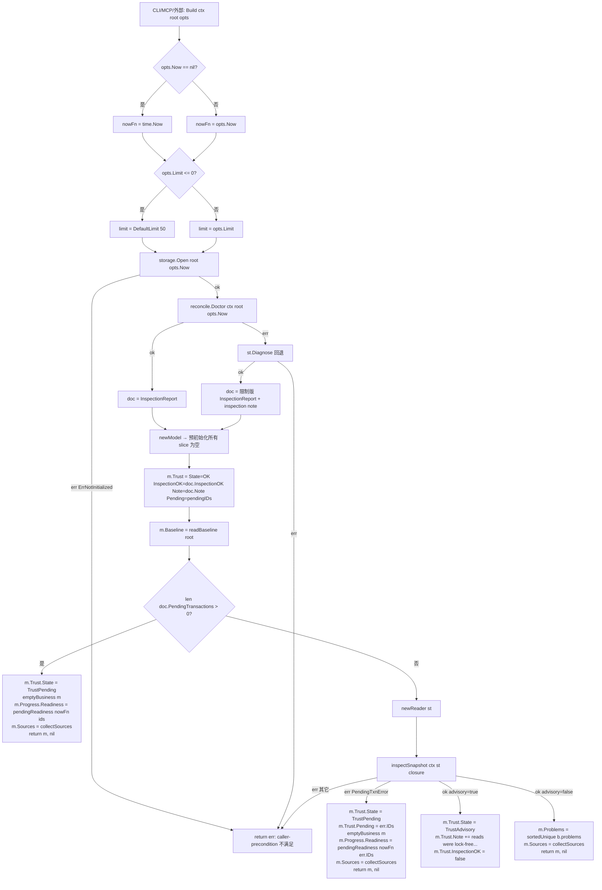
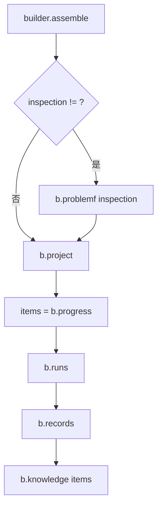

# 视图层 · 架构设计

## 内部结构

```text
cmd/devsys/main.go                  # 进程入口（不变）
   ↓
internal/cli/
   ├── cli.go                       # 路由：case "workspace" → runWorkspace（[cli.go:306-307](file://internal/cli/cli.go#L306-L307)）；帮助文本："workspace     view [--limit N] read-only project view: blueprint, progress, runs, records, knowledge (方案 §17)"（[cli.go:81](file://internal/cli/cli.go#L81)）
   ├── workspace.go                 # runWorkspace 子命令路由（`workspace` 必须带子命令；未知子命令 → usage err）；runWorkspaceView（--limit 缺省 view.DefaultLimit，--json 走稳定信封）；renderWorkspaceView 一行一事实人类输出
   └── …                            # 既有 M4/M5/M6 接线（不变）
   ↓
internal/view/                      # M7.1 新增主模块（仅 read-only）
   ├── view.go                      # 数据契约：SchemaVersion / DefaultLimit / Trust 三态常量 / Knowledge 四态常量 / Options / Model / Provenance / Baseline / Trust / Project / Progress / Item / Runs / RunEntry / Records / RecordRef / Knowledge / PageEntry
   ├── collect.go                   # 读端原语：inspectSnapshot / reader{read,list,exists,mark,since,noteDevsys,noteDevsysDir,noteRel,noteRelDir} / sortedUnique / (*builder).problem + problemf
   ├── build.go                     # 装配核心：Build / newModel / emptyBusiness / pendingReadiness / builder{assemble,project,progress,metadataProblems,policyProblems,pendingApprovals,runs,runEntry,streamTorn,records,knowledge,knowledgeState,generator,pageRoots} / relatedTexts / relatedItems / readBaseline / collectSources / pendingIDs / capList / itemFrom / timePtr / shortCommit
   └── view_test.go                 # 测试夹具 + 10 个测试：AssemblesEverySection / IsDeterministic / WritesNothing / WithoutLockFileStaysReadable / OnAReadOnlyCopy / PendingTransactionRendersNoBusinessFacts / DegradesOneSectionOnly / CapsLists / ReportsTornRunStream / WithoutProject
   ↓
internal/view/ 仅依赖下列包（全部只读读取面，不写 .devsys/.cache/、不建锁、不恢复、不修断尾、不起进程）：
   ├── internal/storage             # Open / Inspect / InspectUnlocked / Diagnose / ErrNotInitialized / ErrLockUnavailable / PendingTxnError / PendingTxn / InspectJSONL / DevsysDirName
   ├── internal/reconcile           # Doctor（事务与租约诊断）+ InspectionReport{PendingTransactions,ExpiredLeases,OrphanLeases,UnreadableLeases,InspectionOK,Note}
   ├── internal/next                # Evaluate（§7.4 就绪判定复用）+ Report / Risk / PendingApproval / VerdictPass/Concerns/Fail
   ├── internal/run                 # Run + RunAgent + Workspace + Verification + RunResult（领域模型）
   ├── internal/record              # Decision / Finding / Artifact（领域模型）
   ├── internal/domain              # WorkItem / Milestone / Approval / Scope / Approval.Status / DecodeYAML
   ├── internal/knowledge           # LoadSnapshot / Scan / LoadState / Head / Changes / Evaluate / ExistingRoots / DefaultRoots / AdapterByName / MergeStates / MissingState / TriggerHit / WorkItemText
   ├── internal/workflow            # Load（policy 校验，只读）+ Result + SeverityError
   ├── internal/config              # Diagnose（metadata 校验）+ ManagedFiles + CurrentStateFile + MilestonesFile + Metadata
   └── internal/approval            # StatusPending（审批状态判断）
   ↓
外部 git（经 internal/knowledge.Head/Changes 间接调用，仅 `git rev-parse` / `git status --porcelain` / `git diff` 类只读子命令）：
   /usr/bin/git                      # git 二进制（POSIX）/ git.exe（Windows）；通过 exec.Command，argv 直通
```

## 关键流程

### 视图装配（`Build` 主入口）



**关键节点**：
- `newModel`（[build.go:117-140](file://internal/view/build.go#L117-L140)）预初始化**每一个** slice 为空——这样「没找到」是 `[]` 而不是 `null`，保证两次构建 marshal 出来逐字节相同。
- `pendingReadiness`（[build.go:159-165](file://internal/view/build.go#L159-L165)）走 `next.Evaluate(next.Input{Now, PendingTxns, RecoverCommand: recoverCommand})`，产出 `Verdict=VerdictFail` + 修复项里 `devsys recover --actor operator --reason "recover interrupted state"`（[build.go:25](file://internal/view/build.go#L25)）——与 `devsys next` 的产出同形。
- `inspectSnapshot`（[collect.go:23-29](file://internal/view/collect.go#L23-L29)）的核心两行：`st.Inspect(ctx, fn)` → 若 `errors.Is(err, storage.ErrLockUnavailable)` 则降级 `st.InspectUnlocked(ctx, fn)` 并返回 `advisory=true`。**不创建**锁文件。
- `pendingReadiness` 与 `inspectSnapshot.PendingTxnError` 分支**同样处理**：同一套 `emptyBusiness` + `m.Trust.State = TrustPending`，只是 pending 来源一个是 `reconcile.Doctor`，另一个是 `storage.Inspect` 路径上的写者抢先。
- 缺 `project.yaml`（Doctor 与 `storage.Diagnose` 都失败）→ 整体报错；单节损坏只降级该节（`reconcile.Doctor` 失败时退 `storage.Diagnose` 不解码工作项，[build.go:51-66](file://internal/view/build.go#L51-L66)）。

### 各节装配（`builder.assemble` → 顺序子流程）



**project**（[build.go:198-246](file://internal/view/build.go#L198-L246)）：`config.Diagnose` 走 metadata 校验 → 各 `config.ManagedFiles` 检查存在性记录 sources → `current.yaml` + `state/milestones.yaml` 填 summary/risks/blockers/next_focus/milestones；任一失败入 `problems` 并 `Degraded=true`。**只有缺 `project.yaml` 整次装配失败**（`storage.ErrNotInitialized` 在 `Build` 入口已判），其余问题只降级该节。

**progress**（[build.go:251-295](file://internal/view/build.go#L251-L295)）：`workitems/*.yaml` 列表 → 逐项解码失败只 `problem` 不中断 → 列表按 `id` 升序 → `Counts[status]++` → `next.Evaluate` 传入 `WorkItems/Milestones/PendingTxns/ExpiredLeases/OrphanLeases/UnreadableLeases/InspectionOK/InspectionNote/MetadataProblems/PolicyProblems/PendingApprovals/RecoverCommand`（与 `devsys next` 同一份输入）。任一工作项文件解码失败 → `pr.Degraded=true`。

**runs**（[build.go:371-401](file://internal/view/build.go#L371-L401)）：`runs/*.yaml` 列表 → 按 `StartedAt` 倒序再 `ID` 升序 → **直接按 `b.limit` 截断**（与 `capList` 等价但内联）→ `runEntry` 含 `StreamTorn`（`storage.InspectJSONL`）→ `Truncated=true` 当 `len > limit`。

**records**（[build.go:448-537](file://internal/view/build.go#L448-L537)）：decisions/artifacts 按 `CreatedAt` 倒序再 `ID` 升序；findings 按 `ID` 升序（领域模型无时间戳，M1.5）；逐节 `capList`；任一节截断则 `rec.Truncated=true`。

**knowledge**（[build.go:543-643](file://internal/view/build.go#L543-L643)）：`generator` 来自 `config.Metadata.Config.KnowledgeGenerator` → `knowledge.LoadSnapshot`（失败非 fs.ErrNotExist → `problem`）→ `pageRoots`（配置覆盖默认 `knowledge.DefaultRoots`，剔除不存在项）→ `knowledge.Scan` → `knowledgeState`（合并本地 state + 适配器 imported state）→ 分情况：`pages == 0` → `KnowledgeMissing` + 「方案 §12.6」原因；`pages > 0` → `knowledge.Evaluate`，git 失败 → `KnowledgeUnavailable`；否则 `KnowledgeFresh/Stale` 由 `Affected`/`Unverifiable` 裁决。

### 读端原语（`internal/view/collect.go`）

- `inspectSnapshot(ctx, st, fn)`（[collect.go:23-29](file://internal/view/collect.go#L23-L29)）：唯一调 `storage.Inspect` 的入口。**不创建**锁文件；锁文件不存在（`ErrLockUnavailable`）→ `storage.InspectUnlocked` + `advisory=true`。`PendingTxnError`（写者抢在 Doctor 之后开事务）由上层 `Build` 单独处理。
- `reader.read/list/exists` 走 `storage.Reader.Read` / `os.ReadDir` / `os.Stat`——**只用** storage 层暴露给「读路径」的接口，不调 `storage.Read`（会建锁并写缓存）。
- `reader.noteDevsys/noteDevsysDir/noteRel/noteRelDir`（[collect.go:96-123](file://internal/view/collect.go#L96-L123)）：所有来源路径以项目相对 slash 形式追加；目录强制以 `/` 结尾。`sortedUnique`（[collect.go:127-139](file://internal/view/collect.go#L127-L139)）保证 `Sources` 与各节 `Provenance.Sources` 都是排序去重后的——这是「两次构建字节相同」的基础。
- `(*builder).problem/problemf`（[collect.go:142-152](file://internal/view/collect.go#L142-L152)）：非致命缺陷入 `m.Problems`（顶层 `problems` JSON 字段），不阻断装配。

### git 基线（`readBaseline`）

`internal/view/build.go:711-726`：

```text
git rev-parse HEAD             → commit（经 internal/knowledge.Head）
git rev-parse --abbrev-ref HEAD → branch
git status --porcelain / diff  → changed files（经 internal/knowledge.Changes "HEAD"）
```

失败语义：
- `Head` 失败（无 git / 非仓库）→ `Available=false`，`Reason=err.Error()`。
- `Changes` 失败 → `Reason="working tree state unavailable: ..."`，`Dirty` 留 `nil`（不假装 false）。

**视图从不因 git 失败而整体报错**——这是「快照非判决」的体现。

### 运行事件流断尾（`streamTorn`）

`internal/view/build.go:435-443`：

```text
runs/<run-id>.jsonl 存在 → storage.InspectJSONL 绝对路径 → status.Complete == false → StreamTorn = true
```

不调用任何「补完」动作；写入侧的 `storage.RepairTornTail`（M6.1）不归本层。`runs/<id>.jsonl` 文件名同时追加进 `Runs.Sources`（`noteDevsys`），便于审计回放。

## 依赖方向

视图层**只读**消费下列包；没有任何反向引用：

| 被依赖包 | 读取面 | 不做 |
|---|---|---|
| `internal/storage` | `Open` / `Inspect` / `InspectUnlocked` / `Diagnose` / `InspectJSONL` / `PendingTxn{ID}` / `ErrNotInitialized` / `ErrLockUnavailable` / `DevsysDirName` / `PendingTxnError` | 不调 `Read`（建锁）、不调 `Commit`（写）、不调 `RecoverPending`、不调 `RepairTornTail`、不写 `.devsys/.cache/` |
| `internal/reconcile` | `Doctor` + `InspectionReport{PendingTransactions,ExpiredLeases,OrphanLeases,UnreadableLeases,InspectionOK,Note}` | 不调 `Recover` / `Repair` / 任何写动作 |
| `internal/next` | `Evaluate` + `Input{WorkItems,Milestones,PendingTxns,ExpiredLeases,OrphanLeases,UnreadableLeases,InspectionOK,InspectionNote,MetadataProblems,PolicyProblems,PendingApprovals,RecoverCommand,Now}` + `Report` + `Risk` + `PendingApproval` | 不修改 next 模块；就绪判定 = `devsys next` 同算 |
| `internal/knowledge` | `LoadSnapshot` / `Scan` / `LoadState` / `Head` / `Changes` / `Evaluate` / `ExistingRoots` / `DefaultRoots` / `AdapterByName` / `MergeStates` / `MissingState` / `TriggerHit` / `WorkItemText` / `Baseline{Commit,Branch}` / `StateSchemaVersion` / `PageState{Sources,ContentHash,SourceCommit}` | 不调 `BuildSnapshot` / `WriteState` / `WriteSnapshot` / `Refresh` / `LockRefresh`；不起生成器进程 |
| `internal/workflow` | `Load` + `Result{Issues,SeverityError}` | 不调 `Resolve`（会写 LKG 缓存） |
| `internal/config` | `Diagnose` + `ManagedFiles` + `CurrentStateFile` + `MilestonesFile` + `Metadata` + `Problem` | 不调任何写入口；不修改 metadata |
| `internal/run` / `internal/record` / `internal/domain` / `internal/approval` | 纯领域类型 | — |

`internal/view` **不**反向引用 `internal/cli` / `internal/app` / `internal/mcp` / `internal/harness` / `internal/workspace` / `internal/dispatch`；视图层是「数据面」，CLI/MCP 是「调用面」，二者解耦。

## 模块边界

**视图层（M7.1 新增）的内部边界**：

| 文件 | 依赖 | 不依赖 | 角色 |
|---|---|---|---|
| `view.go` | `time`、`internal/domain`、`internal/next`（仅 `Report` 类型） | `storage`、`knowledge`、`reconcile` | 纯数据契约；零运行时副作用 |
| `collect.go` | `context` / `errors` / `fmt` / `os` / `filepath` / `sort` / `strings` / `time` / `internal/approval` / `internal/config` / `internal/domain` / `internal/knowledge` / `internal/next` / `internal/reconcile` / `internal/storage` / `internal/workflow` | `internal/cli`、`internal/app`、`internal/mcp` | 读端原语 + 路径规范化 + `sortedUnique` + 非致命问题收集 |
| `build.go` | `context` / `errors` / `fmt` / `os/exec` / `filepath` / `sort` / `strings` / `time` / `internal/approval` / `internal/config` / `internal/domain` / `internal/knowledge` / `internal/next` / `internal/reconcile` / `internal/storage` / `internal/workflow` | `internal/cli`、`internal/app`、`internal/mcp` | 装配核心 |
| `view_test.go` | `context` / `crypto/sha256` / `encoding/hex` / `encoding/json` / `errors` / `fmt` / `io/fs` / `os` / `os/exec` / `path/filepath` / `reflect` / `strings` / `testing` / `time` / `internal/domain` / `internal/knowledge` / `internal/next` / `internal/project` / `internal/record` / `internal/run` / `internal/workitem` | — | 测试夹具 + 验收 |

**CLI / MCP 双入口（调用面，不修改 view 包）**：
- CLI：`runWorkspaceView`（[workspace.go:36-69](file://internal/cli/workspace.go#L36-L69)）调 `view.Build`，把 `*view.Model` 包进 `{OK, Model}` 信封走 `--json`；人类输出走 `renderWorkspaceView`（[workspace.go:73-132](file://internal/cli/workspace.go#L73-L132)）一行一事实。
- MCP：M7.1 **未新增** `workspace_view` 工具（方案 §17 未要求；agent 入口走 `agent_session_start` + `context_*`，见 [开发记录.md:364](file://docs/开发记录.md#L364) 的偏差 ③）；MCP 客户端要消费 `view.Model` 时通过 CLI `--json` 信封。
- 退出码契约只在 CLI 用：成功 0、用例错误 2（[workspace.go:39](file://internal/cli/workspace.go#L39)、[workspace.go:45](file://internal/cli/workspace.go#L45)）、缺项目或前置不满足 3（[workspace.go:54-57](file://internal/cli/workspace.go#L54-L57)）。

## 关键决策

- **`Build` 是聚合层，不是渲染层**：视图层不引入任何模板/渲染依赖——CLI 的人类输出是 `fmt.Fprintf` 一行一事实，`--json` 是 `encoding/json` 直出；TS/React 渲染（M7.2/M7.3）通过 `view.Model` JSON 信封独立演化。
- **`advisory_unlocked` 仍渲染业务事实**：这是与 `devsys next` 的差别（`next` 更严格：无锁文件即不渲染）——M7.1 验收要求「只读副本也能出完整视图」（[开发记录.md:364](file://docs/开发记录.md#L364) 偏差 ①）；视图是快照不是判决。
- **`pending_transaction` 不渲染业务事实**（方案 §15.4）：`emptyBusiness` 清空 `Project.Goals/Scope/...`、`Progress.Items/Runs.Entries`、`Records.Decisions/Findings/Artifacts`，并把 `Knowledge.Status` 设为 `KnowledgeUnavailable`——避免「半应用事务」被当作可信业务状态。`git 基线`照常给出（基线不属于 `.devsys/` 状态）。
- **共享锁降级 `InspectUnlocked` 而不是「建锁再读」**：锁文件只在该项目**曾经写过状态**时存在；强行建锁会把「只读副本/新检出」变成「写过的项目」，破坏只读契约。
- **`Options.Now` 注入而非直接 `time.Now()`**：测试通过 `Options{Now: fixedClock}` 控制时钟；模型本身不携带 `Now`——这是「无墙钟字段」的源头。
- **列表「先定序后截断」**：`capList`（[build.go:750-755](file://internal/view/build.go#L750-L755)）与 `runs` 的内联截断都遵循「排序在前、截断在后」；`Truncated` 标志告诉调用方「后面还有」。
- **`Sources` 是路径 not 内容**：每节 `Provenance.Sources` 与顶层 `Sources` 只列**项目相对路径**（目录以 `/` 结尾）；不列文件内容、不带 hash——审计靠「回到这些路径重读」。
