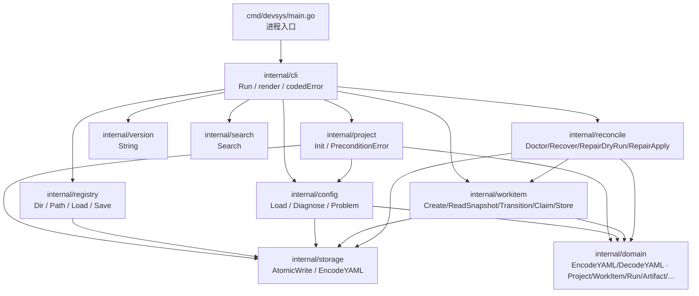
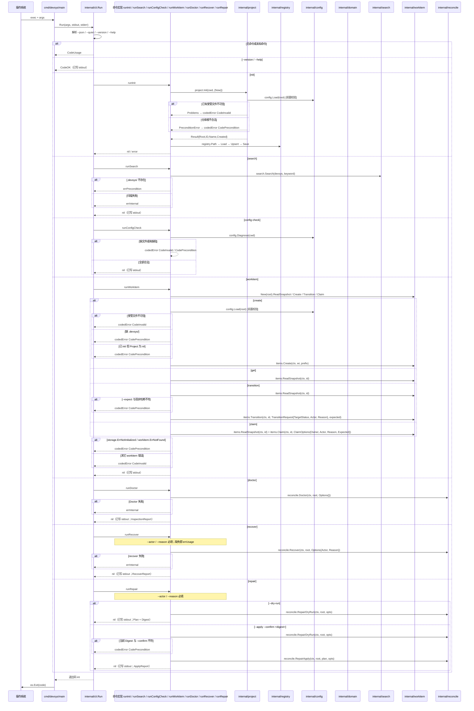
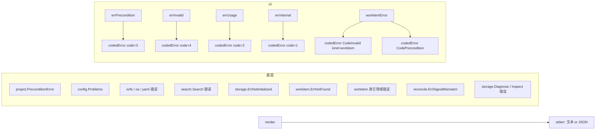

# 架构设计

## 分层与依赖方向

依赖方向严格自上而下，**没有反向引用**：

- `cmd` 只依赖 `internal/cli`，把 `os.Args[1:]` 转交出去并 `os.Exit(cli.Run(...))`（[`cmd/devsys/main.go:12-14`](../../../cmd/devsys/main.go#L12-L14)）。
- `internal/cli` 是唯一编排层：解析全局开关 → 选命令 → 调下层 → 把结果/错误渲染并返回进程退出码。M1 起命令分发多了 `search` 分支（[`internal/cli/cli.go:153-154`](../../../internal/cli/cli.go#L153-L154)），M2 起再增 `workitem` / `doctor` / `recover` / `repair` 四个分支（[`internal/cli/cli.go:155-162`](../../../internal/cli/cli.go#L155-L162)）。
- `internal/project` 与 `internal/registry` 互不依赖；它们都依赖 `internal/config`（写前置校验）或 `internal/storage`（原子写）；M1 起 `project.Init` 还通过 `domain.EncodeYAML` 序列化占位文件。
- `internal/config` 是**纯读取层**，不发起任何写操作；M1 起 `parseProject` 通过 `domain.DecodeYAML` 反序列化为 `*domain.Project`（[`internal/config/config.go:142-152`](../../../internal/config/config.go#L142-L152)）。
- `internal/domain`（M1 新增）是统一记录层：所有受管领域记录的 struct + YAML/JSON 编解码，自身只依赖 `internal/storage` 的 `EncodeYAML` / `DecodeYAML` 与 `CheckSchemaVersion`（[`internal/domain/serialize.go:16-30`](../../../internal/domain/serialize.go#L16-L30)）。
- `internal/workitem`（M2 新增）是工作项状态机与租约层：暴露 `Create` / `ReadSnapshot` / `Transition` / `Claim` / `Release` / `ApplyRepair` 等写操作与 `Store` 句柄；同样依赖 `internal/storage` 与 `internal/domain`。
- `internal/reconcile`（M2 新增）是**对账与修复层**，由 `internal/cli` 直接调用：只读路径走 `storage.Inspect`，写路径走 `storage.Recover` + `workitem.Release` / `workitem.ApplyRepair`（[`internal/reconcile/reconcile.go:1-20`](../../../internal/reconcile/reconcile.go#L1-L20)）。CLI 转发到 reconcile 的边界在 [`internal/cli/cli.go:155-162`](../../../internal/cli/cli.go#L155-L162) 与 `runDoctor` / `runRecover` / `runRepair` 中显式存在（[`internal/cli/cli.go:511-682`](../../../internal/cli/cli.go#L511-L682)）。
- `internal/version` 是无依赖的字符串常量包。

## 命令分发链

关键设计点：

1. **分发在 `cli.Run` 内集中**（[`internal/cli/cli.go:144-165`](../../../internal/cli/cli.go#L144-L165)）。命令实现只关心业务正确性，不关心渲染与退出码；M2 在 switch 中追加 `workitem` / `doctor` / `recover` / `repair` 四个分支。
2. **`render` 是唯一的错误出口**（[`internal/cli/cli.go:170-200`](../../../internal/cli/cli.go#L170-L200)）。它接收任意 `error`，非 `codedError` 一律视作内部错误（`CodeInternal`），从而保证退出码与错误类别一致。
3. **`codedError` 携带 `config.Problem` 列表**（[`internal/cli/cli.go:80-87`](../../../internal/cli/cli.go#L80-L87)），使 `--json` 输出结构化问题列表，避免调用方再做文本解析。
4. **workitem 错误二分**（[`internal/cli/cli.go:477-482`](../../../internal/cli/cli.go#L477-L482)）：`storage.ErrNotInitialized` 与 `workitem.ErrNotFound` 经 `workitemError` 升为 `CodePrecondition`；其它领域错误一律升为 `CodeInvalid`，并以独立 `kind="workitem"` 区分。
5. **repair 双跑守门**（[`internal/cli/cli.go:614-628`](../../../internal/cli/cli.go#L614-L628)）：`--apply` 路径**先**重跑 `RepairDryRun`、**再**覆盖 `plan.Digest = --confirm`、**再**调 `RepairApply`；摘要不匹配由 `RepairApply` 内部 `reconcile.ErrDigestMismatch` 上浮，`runRepair` 再升为 `CodePrecondition`。

## 错误传递链

- `project.Init` 通过自定义 `*PreconditionError`（[`internal/project/init.go:23-25`](../../../internal/project/init.go#L23-L25)）把"环境侧错误"传给 cli；`cli.runInit` 用 `errors.As` 判定后包成 `codedError{Code: CodePrecondition}`（[`internal/cli/cli.go:193-196`](../../../internal/cli/cli.go#L193-L196)）。
- `config.Load` 在 init / workitem create 前置校验时直接返回 `Problems`（实现了 `error`），`cli` 用 `errors.As` 取出并交给 `errInvalid`（[`internal/cli/cli.go:189-192`](../../../internal/cli/cli.go#L189-L192)）。
- `runSearch` 自身的错误（`search.Search` 失败、缺 `.devsys/`）分别归到 `errInternal` / `errPrecondition`（[`internal/cli/cli.go:258-269`](../../../internal/cli/cli.go#L258-L269)）；`runSearch` 不涉及受管文件校验，因此**不会**产生 `CodeInvalid`。
- `runWorkitem` 的 `--expect` 不匹配与"项目未初始化/工作项不存在"统一归到 `CodePrecondition`（[`internal/cli/cli.go:493-506`](../../../internal/cli/cli.go#L493-L506) 与 [`internal/cli/cli.go:477-482`](../../../internal/cli/cli.go#L477-L482)）；其它 workitem 领域错误归到 `CodeInvalid` 并携带 `kind="workitem"`。
- `runRecover` / `runRepair` 的 `--actor` / `--reason` 缺失、未知操作、必填参数缺失走 `errUsage`（退出码 2）。
- `runRepair --apply` 收到的 `--confirm` 与当前干跑摘要不一致时，`reconcile.ErrDigestMismatch` 上浮，由 `runRepair` 包装为 `CodePrecondition` 并提示重跑 `repair --dry-run`（[`internal/cli/cli.go:629-635`](../../../internal/cli/cli.go#L629-L635)）。
- 其它一切非分类错误都归到 `CodeInternal`（1）。脚本文档可以**只信任退出码**，不必解析 stderr。

## 读写严格分离

`config.Load` 与 `config.Diagnose` 的选择是命令语义的体现：

| 命令 | 写？ | 入口 | 期望产物 |
|---|---|---|---|
| `devsys init` | 是 | `config.Load` | 缺失文件 = 正常；既有文件必须合法 |
| `devsys config check` | 否 | `config.Diagnose` | 缺失文件 = 问题（提示运行 init） |
| `devsys search <keyword>` | 否 | — | 缺 `.devsys/` = `CodePrecondition`；本身不做 schema 校验 |
| `devsys workitem create` | 是 | `config.Load` | 缺失 `.devsys/` = `CodePrecondition`；既有文件必须合法 |
| `devsys workitem get` | 否 | `workitem.ReadSnapshot` | 缺 `.devsys/` / 工作项不存在 = `CodePrecondition` |
| `devsys workitem transition` | 是 | `workitem.ReadSnapshot` + `Transition` | `--expect` 不匹配 / 缺 `.devsys/` = `CodePrecondition`；其它领域错误 = `CodeInvalid` |
| `devsys workitem claim` | 是 | `workitem.ReadSnapshot` + `Claim` | 同上 |
| `devsys doctor` | 否 | `reconcile.Doctor`（仅 `storage.Inspect`） | 仅在 Doctor 自身执行失败时 `CodeInternal` |
| `devsys recover` | 是 | `reconcile.Recover`（`storage.Recover` + `workitem.Release`） | `storage.Recover` 失败 / `Release` 失败 = `CodeInternal` |
| `devsys repair --dry-run` | 否 | `reconcile.RepairDryRun`（仅 `storage.Inspect`） | 同 doctor |
| `devsys repair --apply --confirm <digest>` | 是 | `RepairDryRun` 重算 + `RepairApply` | `--confirm` 不匹配 = `CodePrecondition`；其它 reconcile 失败 = `CodeInternal` |

`init` 与 `config check` 两者共享 `load(root, reportMissing bool)`（[`internal/config/config.go:106-140`](../../../internal/config/config.go#L106-L140)）。这保证"写拒绝"与"读仍可诊断"的语义来自**同一个解析器**，避免出现读通过但写命令误改的状态。

M1 起 `parseProject` 把通过的字节交给 `domain.DecodeYAML`，再用 `*domain.Project` 暴露给 `Metadata.Project`（[`internal/config/config.go:142-152`](../../../internal/config/config.go#L142-L152)）；任何 `projectSpec` 之外的字段都会先在 `validate` 阶段被拒绝，不会进入解码路径。

M2 起 `reconcile` 与 `config` 互不调用：`doctor` / `repair --dry-run` 的只读路径全部走 `storage.Inspect`，**不**经过 `config.Load` / `config.Diagnose`，从而避免只读检查意外创建项目锁文件或触发事务恢复。

## 注册表覆盖点

`internal/registry.Dir` 提供唯一的环境变量入口 `DEVSYS_CONFIG_DIR`（[`internal/registry/registry.go:37-46`](../../../internal/registry/registry.go#L37-L46)）。这意味着：

- **测试**：`cli_test.go` 全部用例都用 `t.Setenv("DEVSYS_CONFIG_DIR", t.TempDir())` 把注册表隔离到临时目录，不污染用户目录。
- **便携安装**：用户可显式把 `registry.yaml` 放到 U 盘或自定义位置而不影响系统配置目录。
- **空环境变量被 trim 后视为未设置**（[`internal/registry/registry.go:38-40`](../../../internal/registry/registry.go#L38-L40)），避免误把当前目录当成用户级配置根。

## 平台分支点

接入层目前没有平台特定代码——所有平台分支都下沉到 `internal/storage`（Windows 走 `LockFileEx`、POSIX 走 `flock`）。接入层唯一与平台相关的隐式分支是 `registry.samePath` 在 Windows 上对路径大小写不敏感（[`internal/registry/registry.go:148-154`](../../../internal/registry/registry.go#L148-L154)），从而保证同一个 Windows 项目路径（不同大小写）只占一条注册条目。