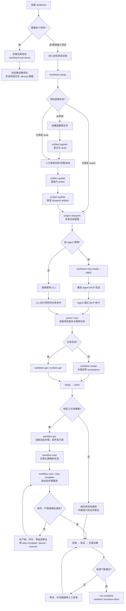

# Workloom 使用手册（15 分钟上手）

> 基线：`1ac4d56`；二进制 `go build -ldflags "-s -w" -o /tmp/workloom.exe ./cmd/workloom`
> （发布构建加 `-X workloom/internal/version.Version=… -X …/version.Commit=$(git rev-parse --short HEAD)`）。
> 本手册每条命令都在隔离临时 Git 项目亲手跑过；凡写命令都要 `--actor` + `--reason`（审计），
> 其中 `workitem update` 与 `artifact register` 已强制要求两者并写审计事件，缺了直接 exit 2。
> Windows：Git Bash 跑 `.sh` 口径，PowerShell 跑 `.ps1` 口径；`bash.exe` 指向 WSL 时用 Git Bash。
> 首次安装与项目接入的权威步骤（含校验与回退）见仓库根 INSTALL.md；本文是逐命令详解。
> 烟囱测试：`scripts/smoke-m1..m8.{sh,ps1}`（`--keep`/`-Keep` 保留现场并打印 `KEPT_PROJECT`）。

## 0. 准备（2 分钟）

```sh
go build -o bin/workloom.exe ./cmd/workloom   # 或 bin/workloom（按平台）；Windows 无 make，直接 go build
# 已装 Go 的用户也可：go install github.com/JAYY513/Workloom/cmd/workloom@v0.1.11
# （公开模块，不要设 GOPRIVATE；那只用于私有 fork，且会跳过校验和数据库）
# 机器安装的权威步骤见 INSTALL.md §1。npm 已发布但只有 Windows x64（`npm install -g @kaki317/workloom`，§1d）；其他平台用上面两条
bin/workloom.exe --version                  # git 树内构建显示 pseudo-version + VCS 短哈希（如 workloom v0.1.8-0.2026…-abc (1a2b3c4)）
bin/workloom.exe --help
export DEVSYS_CONFIG_DIR=/tmp/my-cfg      # 隔离用户注册表；冒烟/试用必设
# Windows（PowerShell）：$env:DEVSYS_CONFIG_DIR = "C:/temp/my-cfg"
cd /path/to/your/project               # 在目标项目目录 init；已是 git 仓则建议仓库根
```

### 作者 dogfood：使用 npm 目录承载本地开发版

如果需要一边开发 Workloom 一边在其他项目中使用，作者可以保留标准命令 `workloom`，只把源码编译结果覆盖到 npm 全局包的平台二进制：

```powershell
npm install -g @kaki317/workloom
$npmRoot = npm root -g
$npmExe = Get-ChildItem -Path $npmRoot -Filter workloom.exe -Recurse -File |
  Where-Object FullName -match "workloom-win32-x64" |
  Select-Object -First 1 -ExpandProperty FullName

cd C:\Source\CodeSource\ai\Workloom
go test ./...
go build -o $npmExe .\cmd\workloom
```

目标项目和 Agent 继续使用 `workloom`，无需 `wld` 别名。修改后重新构建并重启 MCP 客户端；恢复正式版时执行 `npm install -g @kaki317/workloom --force`。此方式只适用于作者本地试用，npm 更新会覆盖开发版，不要修改 wrapper 或 `package.json`。
如果安装后提示 `platform package ... is not installed`，重跑 `npm install -g @kaki317/workloom --force --include=optional`；不要使用 `--omit=optional`。

## 使用流程：CLI 和 MCP 是同一条路

不要维护两套使用顺序。**CLI 与 MCP 只是入口不同，最终都进入同一个 Workloom Core，规则、门禁、审批、版本守卫和 `.devsys/` 状态完全相同。**

- 人直接操作、脚本、CI、排障：用 **CLI**。
- 编码 Agent 日常执行任务：用 **MCP**；先用 CLI 完成安装、项目接入和 MCP 注册。
- 多项目浏览：用 **Hub**；它只负责项目切换、状态查看和登记路径，不替代 CLI/MCP 的业务写入。



**关键顺序：**`安装 → 目标项目 setup → 检查蓝图 → draft 审核并晋级 active → 绑定并复核蓝图 →（需要 Agent 时）MCP 注册并重启会话 → 读取 prime/next → 创建或领取任务 → 实例化动态 workflow → 按条件/产物/审批推进 → 验证并完成`。Hub 可以随时启动，不改变这条任务执行顺序。

### 蓝图与动态工作流不是可跳过的“装饰步骤”

- **蓝图**描述项目要做什么：未声明时先创建源文件并 `artifact register --status draft`；审核目标、范围、约束和验收后，用 `artifact update --status active` 确认，再用 `project update --blueprint-artifact` 绑定，最后 `project blueprint` 复核。`draft` 可以临时绑定，但只表示草稿，页面会告警，不能当作已确认蓝图。
- **Blueprint 导入**使用严格的 `product-blueprint.yaml` 字段：`name`、`description`、`goals`、`scope.in/out`、`constraints`、`tech_stack`、`milestones`。已有 artifact 可通过 `project import-blueprint --artifact <id> --actor <a> --reason <r> --latest` 导入；缺失字段保持项目原值，格式错误不会写入部分项目元数据。

| 命令 | 做什么 | 不做什么 |
|---|---|---|
| `project import-blueprint --artifact <id> --actor <a> --reason <r> [--expect <hash> \| --latest]` | 按 `product-blueprint.yaml` 已声明字段写入项目元数据，并绑定该 artifact | 不补齐缺失字段（保持项目原值）；格式错误不写部分元数据 |
| `project update --blueprint-artifact <id> --actor <a> --reason <r> [--expect <hash> \| --latest]` | 只绑定（或空值解除绑定）已注册 artifact | 不导入蓝图字段 |

- **动态工作流**描述当前任务怎么做：先用 `workflow get` 读取定义，再用 `workflow start` 为任务实例化策略；之后用 `workflow next` / `step-complete` 按当前步骤推进。条件、必需产物、评论和审批未满足时不能越过门；可以 `pause` / `resume`，分支和回退由工作流定义决定，不要把它简化成固定的“计划→实施→完成”。

### 什么时候用哪条入口

| 场景 | 推荐入口 | 典型动作 |
|---|---|---|
| 首次安装、`setup`、MCP 注册、诊断 | CLI | `workloom setup`、`workloom mcp install --apply`、`workloom doctor` |
| Agent 领取任务、读取上下文、推进工作流 | MCP | Agent 调用 `prime`、`next`、`context`、`workitem`、`workflow` 工具 |
| 没有 MCP 的 Agent 或人工操作 | CLI | `workloom prime`、`workloom next`、`workloom workitem …` |
| CI、脚本、可复制验收 | CLI + `--json` | `workloom --json …`，解析结构化输出 |
| 多项目浏览和切换 | Hub | `workloom hub serve --port 18080` |
| 单项目只读网页 | workspace | `workloom workspace serve --port 8080` |

**关键顺序：**`安装 → 目标项目 setup →（需要 Agent 时）MCP 注册并重启会话 → 读取 prime/next → 创建或领取任务 → 按 workflow 推进 → 验证并完成`。Hub 可以随时启动，不改变这条任务执行顺序。

## 1. 初始化与校验（2 分钟）

```sh
bin/workloom.exe init            # 创建 .devsys/（当前目录本身是 git toplevel 时写 .gitattributes：
                               # .devsys/** 与 .agents/** 固定 LF；非 Git 或 git 子目录跳过。
                               # 新建路径清单看输出的 created 列表），幂等：只补缺失不动已有
bin/workloom.exe config check    # config ok: 4 metadata files checked（project.yaml / config.yaml /
                               # state/current.yaml / state/milestones.yaml；范围仅这 4 个元数据档，
                               # 不含 workitems 等业务文件。exit 0；版本/字段问题 exit 4；未 init exit 3）
bin/workloom.exe --json config check   # 结构化 problems 数组
```

`bin/workloom.exe setup` 把上面整段串成一条命令（init → 装起手工作流 → wire →
config check → wire --check → prime → 蓝图检查 → doctor），任一步硬失败即停，
重跑安全；已存在的策略文件一律保留。逐步执行或换模板时仍用上面这些单条命令。

`setup` 不写 MCP 客户端配置。注册是另一步，默认只预览：

```sh
bin/workloom.exe mcp install                  # 预览，不写。注册名保持 devsys
bin/workloom.exe mcp install --apply          # 写入检测到的客户端（user scope；--scope project 写项目文件）
bin/workloom.exe mcp install --apply --force  # 只替换已有 devsys 条目
```

JSONC，或 Codex 行内 `mcp_servers` 表，即使用 `--force` 也拒绝。改用
`workloom wire --print-mcp <codex|claude|opencode>` 手贴。

`--apply` 之后会现场起一次 `mcp serve`：完成 MCP 握手并列工具面，报告 `probe: ok (N tools in Tms)`；
起不来则 `probe: failed: …` 且命令以退出码 3 结束（配置已写入，注册的服务器起不来）。沙箱/CI 里
不允许起子进程时用 `DEVSYS_MCP_PROBE=0` 显式跳过，报告写 `skipped`。

`.devsys/` 即事实来源（YAML/JSON/JSONL，可 diff 可合并）；`local/` 与 `.cache/` 不提交；
clone 到新机器后补一次 `workloom init`（重建被忽略的 `local/` 等目录；`local/lock` 由首次写操作
自动创建，不用手管；不动元数据）。

新项目的 `.devsys/workflows/` 是空的：没有工作流时任务照常推进，但派发给 Agent 的轮次提示词里不会有流程约束。用内嵌模板装一份起手并按项目改写（模板命令对纯二进制用户同样可用）：

```sh
bin/workloom.exe workflow init --template quick-fix            # 最简起手；完整模板列表见该命令的用法输出
bin/workloom.exe workflow init --template reference-template   # 参考级模板：姿态 / 步骤 / 证据 / 停止条件 / 上报协议
bin/workloom.exe workflow check          # workflow ok: N policies checked（校验全部策略文件）
```

## 2. 第一个任务（5 分钟）

```sh
bin/workloom.exe workitem create --title "上手任务" --actor me --reason "first task" \
  --description "- 背景：…" --acceptance "验收点 1,验收点 2"   # 验收标准可在 create 直接给（见下方质量门）
# 重复 --description 是 usage 错误（exit 2），不会创建半成品；长文用 --description-file <项目内路径>，不要传两次 --description。
# workitem update --description 仍是整段替换，语义不变。
# WLM-1	draft	上手任务 / version: <64-hex>
bin/workloom.exe --json workitem get WLM-1   # 取 version（后写命令的 --expect 凭据）
V=$(bin/workloom.exe --json workitem get WLM-1 | python -c "import json,sys;print(json.load(sys.stdin)['version'])")
bin/workloom.exe workitem transition --id WLM-1 --to ready --actor me --reason go --expect $V
# WLM-1: ready
bin/workloom.exe --json workitem claim --id WLM-1 --owner me --reason start
# {"ok":true,"run_id":"run-<日期>-1","token":"<32hex>","status":"in_progress"}
```

> 门禁与策略绑定的关系：**质量门与阶段门只在工作项有生效策略时才参与判定**。策略来源有两个：工作项绑定的实例（`workflow start --id WLM-1 --policy quick-fix`），或项目级默认策略 `.devsys/config.yaml: default_policy: quick-fix`（未绑定实例的工作项按它判定，用来堵「先 claim 再绑策略」的绕过）。两者都没有时 `claim` 不拦，但会打印一行 `warning:` 说明质量门与阶段门未生效（项目里有策略文件才提示）。绑上之后同一任务会按策略判定（`quality gate not satisfied: score 0 is below min_score 40` 之类，exit 4）。按 README 顺序（create → ready → claim）跑的人，请先 `workflow start` 或先配 `default_policy`。

取 token 稳法（token 不落库：`scheduling/WLM-1.yaml` 自 v0.1.4 起不再含 token——它只存在本机 `.devsys/local/leases/`，不进 git；跨设备看不到租约 token 是特性不是故障）：

```sh
TOK=$(cat .devsys/local/leases/WLM-1.token)
bin/workloom.exe workitem release --id WLM-1 --owner me --token $TOK --actor me --reason pause
bin/workloom.exe workitem block --id WLM-1 --actor me --reason blocked
bin/workloom.exe workitem transition --id WLM-1 --to in_progress --actor me --reason resume
# blocked 的恢复：目标状态必须等于工作项里记录的 previous_status（本例 in_progress），无需额外 flag；
# 其它目标会被拒绝并提示 repair。恢复同样要过该阶段的门禁（如 in_progress 需要新的未消费审批）。
bin/workloom.exe workitem transition --id WLM-1 --to review --actor me --reason review
bin/workloom.exe workitem transition --id WLM-1 --to verification --actor me --reason verify
bin/workloom.exe workitem complete --id WLM-1 --actor me --reason done
# WLM-1	done
```

> 租约未释放时 `workitem transition` / `block` / `complete` 会拒绝，且这些命令没有 `--token`。先 `workitem release`（owner + 侧车 token），或改走 holder API（`workitem start`、`workflow step-complete|pause|resume|cancel` 才接受 `--owner` 与 `--token`）。不要给 transition 补 token 参数。

`--expect` 是旧快照防覆盖：mismatch 即 `version mismatch … rerun workitem get`（exit 4 族）。
写命令撞上并发写（例如 `run fail` 时 dispatch 子进程正在写同一 run 文件）报
`storage: version conflict`（exit 4）并提示出路：重新读取后重试，或改用 `--latest` 直接基于当前版本写入（§15.2 乐观并发）。


## JSON envelope（workitem / project / record）

不引入第二套版本化输出。`--json` 仍是唯一机器契约；已有字段不搬家、不改名，避免静默打断现有脚本。

| 位置 | 含义 | 命令 |
|---|---|---|
| 顶层 `version`（64-hex 字符串） | 内容哈希，`--expect` 凭据 | `workitem get`、`project get` / `update` / `import-blueprint`、`decision` / `finding` / `artifact` / `run` 的 get 与写回 |
| 记录体 `artifact.version`（整数） | 不可变版本链序号，不是 `--expect` | `artifact get` / `history` |
| 顶层 `count`（整数） | 本次返回的集合长度 | `workitem list`、`decision list`、`finding list`、`event list`、`artifact list`、`artifact history`、`run list` |
| `project status` 的 `counts`（map） | 按状态计数，不是列表长度，保持原字段名 | `project status` |

`artifact list --json` 的 `artifacts` 仍是整条不可变版本链（`count` = 其长度）。`latest` / `latest_count` 是未被后继取代的头版本。`--jsonl` 同样逐行输出全部版本。人类输出默认只打印头版本；被取代的版本用 `artifact list --history` 查看。`artifact update` 的 `--expect` / `--latest` 守卫不变，旧文件不改写。

## 3. 记录与上下文（3 分钟）

```sh
bin/workloom.exe decision create --title D1 --decision "选用统一方案" --by me --related WLM-1
bin/workloom.exe finding create --title F1 --description "注意点" --related WLM-1
bin/workloom.exe event record --type note --subject WLM-1 --actor me --content "进展"
# subject 传裸 id（--subject-type 缺省 workitem）
bin/workloom.exe artifact register --name "设计稿" --source manual --workitem WLM-1 --actor me --reason 设计定稿
# 产物门按**名称**匹配，并认主归属或关联：--workitem 写入 workitem_id（主归属），
# --related 写入 related_workitems（关联）。任一命中当前工作项即满足 require_artifacts。
# --type 只是分类，不参与门禁判定；`artifact register --name decision --workitem WLM-1` 最稳妥。
# 已有主归属时用 `--related WLM-2` 追加关联，不改写主归属。
bin/workloom.exe search 上手            # 1 match(es) in .devsys/
bin/workloom.exe context get --task WLM-1
# task: WLM-1 … / decision://… / finding://… / artifact://… / knowledge: …（无生成器时降级）
bin/workloom.exe next                   # readiness + 下一步建议（只读；成功恒 exit 0，受管状态不可信——
                                      # 如 workitem YAML 损坏——exit 4 并点名坏文件）
# 就绪判定与 claim 同源：ready 任务过不了质量门时 verdict 是 CONCERNS，risk 里给 quality_blocked，
# 推荐原因直接写补救命令；有待重试（retry_queued）时 risk 给 retry_pending 且不再报「无事可做」。
bin/workloom.exe project status         # 计数随任务联动
bin/workloom.exe project blueprint      # 未声明蓝图 = 结果（exit 0，`no blueprint declared`），不是错误
```

## 4. 只读视图（1 分钟）

```sh
bin/workloom.exe workspace view                       # 摘要：蓝图/进度/就绪/运行/记录/知识/来源
bin/workloom.exe workspace build --static --out tmp/site --limit 10   # 离线站 6 页（--out 用项目内相对路径）
bin/workloom.exe workspace serve --port 8080          # 本地只读（缺省 127.0.0.1，Ctrl-C 停）
```

只读保证：`workspace view/build` 不改 `.devsys/`（指纹 `find .devsys -path ./local -prune …sha256sum`
前后 `diff` 一致）。

## 5. 审批与派发（进阶，5 分钟）

策略示例 `docs/examples/workflows/`（`quick-fix` 最简）。门禁示例（`require_approval`）：

```sh
# .devsys/workflows/approval-flow.md 声明 stages.in_progress.require_approval: true 后：
bin/workloom.exe workflow start --id WLM-1 --policy approval-flow --actor me --reason begin --expect $V
bin/workloom.exe workitem transition --id WLM-1 --to in_progress …   # 无审批即拒绝并定位策略行
bin/workloom.exe approval request --id WLM-1 --stage in_progress --actor me --reason "变更说明"
bin/workloom.exe approval approve --id approval-1 --by reviewer --comment ok
bin/workloom.exe approval list          # 第二列是有效状态：pending / approved / consumed / invalidated / rejected
bin/workloom.exe workitem transition --id WLM-1 --to in_progress --actor me --reason go --expect $V
# 同一事务消费（approval_consumed）；复用/离 status /旧快照一律拒绝
# 离开 requested_status 即作废（§4.9）：审批被 invalidated 后需重新申请，恢复同一阶段也要新审批
```

调度（`dispatch_command` 必须是**字符串**，数组即 exit 4；项目须有 git HEAD）：

```sh
# .devsys/config.yaml: dispatch_command: "echo dispatched"
bin/workloom.exe dispatch --once --actor me --reason tick     # 恢复→计划→启动；tick 不等待尝试结束
bin/workloom.exe dispatch --dry-run --actor me --reason dry   # 只计划，.devsys/ 零变化
bin/workloom.exe dispatch --watch --interval 30s --actor me --reason loop  # 前台循环，Ctrl-C 停
```

完成校验：Git 工作区 `run complete` 先比分支是否推进（claim head vs 当前 head），无证据即拒绝
（`completion_refused` + 工作项转 review）。非 Git / 目录工作区跳过该证据。`--force` 必须配 `--by <reviewer>` 留名。

## 6. 交接与归档（备查）

`scheduling/`（租约）随仓库提交：跨设备靠它检测租约分叉（sync status 的
unreadable/orphan/expired 判定）。租约里的 **token 不落库**（本机
`.devsys/local/leases/`，已被 gitignore），所以 clone 下来的租约只有元数据没有凭证。

```sh
bin/workloom.exe sync status        # 只读接力 verdict；阻塞仍 exit 0，环境失败 exit 3
# 剧本：旧设备停 --watch → recover → 释放领取 → chore(workloom): 提交推送 → 新设备 sync status ready 再接手
bin/workloom.exe archive events --before <YYYY-MM> --actor me --reason r   # 保守归档（不删只移）
bin/workloom.exe archive runs --id <run-id,...> --actor me --reason r      # 仅终态流
```

退出码速查：0 成功 / 1 内部 / 2 用法 / 3 前置条件 / 4 受管状态不可信 / 10 stale / 11 missing
（后两者专属 `knowledge status`）。

## 目录结构（节选）

```
cmd/workloom/  internal/cli/  internal/storage/  internal/config/  internal/domain/
internal/project/  internal/registry/  internal/view/  internal/sitestatic/
internal/mcp/  internal/version/  vendor/  docs/design.md  docs/使用手册.md（本文件）  docs/迁移指南.md
scripts/smoke-m*.{sh,ps1}  scripts/contrabass/  docs/examples/workflows/
```

## 7. 排障速查（症状 → 处置）

| 症状 | 处置 |
|---|---|
| 装完 `workloom: command not found` | 重开终端（PATH 刷新）；install.ps1 安装查 `%LOCALAPPDATA%\workloom` 是否已进 User PATH |
| `--version` 报 `0.1.0-dev` | 旧版或源码裸构建的标记；release 安装的应报 `vX.Y.Z (hash)`，go install 的报 `vX.Y.Z` |
| install.sh 报 “go is not installed” | 多半在 WSL bash 里跑了 Linux 分支；改用 Git Bash（INSTALL.md §1a 有说明） |
| 下载 404 / 鉴权失败 | 公开仓库应能匿名下载。先核对 tag 与资产名；私有 fork 才先 `gh auth login`。两者都失败时脚本回退源码构建（本机需 Go + Git） |
| Git Bash 里 `sha256sum -c` 全报 FAILED | 已知个案：改用逐项比对——`sha256sum <file>` 对清单里的哈希（发布流程 §5） |
| 提交时刷 LF→CRLF 警告 | 新项目 init 已生成 .gitattributes；老项目补两行 `.devsys/** text eol=lf` 与 `.agents/** text eol=lf` |
| 租约活跃时 transition/block/complete 被拒 | 这些命令不接受 `--token`。先 `workloom workitem release --id <id> --owner <owner> --token "$(cat .devsys/local/leases/<id>.token)" --actor <you> --reason <why>`，或改用 holder API（`workitem start`、`workflow step-complete`）。token 不在 scheduling yaml 里 |
| `lease token mismatch` | 只出现在已经提交了 token 的 holder 调用（release/start/heartbeat/workflow 写）。token 从本机侧车取：`cat .devsys/local/leases/<id>.token`；owner 也必须一致 |
| `quality gate not satisfied` | 按改进提示补：标题/描述（中日韩文字按双倍计长）、`--acceptance`、`--actor/--reason`；仍不够再在策略里降 `min_score` |
| transition 被 `require_comment` 拦 | 错误自带命令：`workloom workitem comment --id <id> --text "…" --actor <you>`，补完再转 |
| `run complete` 拒绝并提到 review 门 | 先补 comment（上一条）；确认无证据要接受则 `--force --by <reviewer>` 留名 |
| next / doctor / project status exit 4 并点名文件 | 受管 YAML 损坏：doctor 的 `INVALID` 行列出全部坏文件，修完再跑；成功恒 exit 0 |
| `mcp serve` 报 “profile … has no tools” | 该 profile×tier 过滤后为空：加 `--tier standard` |
| `mcp install --apply` 拒绝并指向 `wire --print-mcp` | 配置不是严格 JSON/TOML（JSONC，或 Codex 行内表）。不要 `--force`；用手贴片段 |
| `workspace serve` 报端口占用 | 换 `--port <n>` 或释放端口（提示会给出） |
| `workitem update` / `artifact register` exit 2 提 audit | 审计强制：补 `--actor <you> --reason <why>` |
| 想释放 dispatch/别人持有的租约 | 等 5 分钟 TTL 过期，或 `workloom recover --actor <you> --reason <why>`（只放过期/孤儿，不动活动 claim） |

拿不准就先跑 `workloom doctor`（只读）与 `workloom wire --check`（环境八项），两者都不会写状态。
